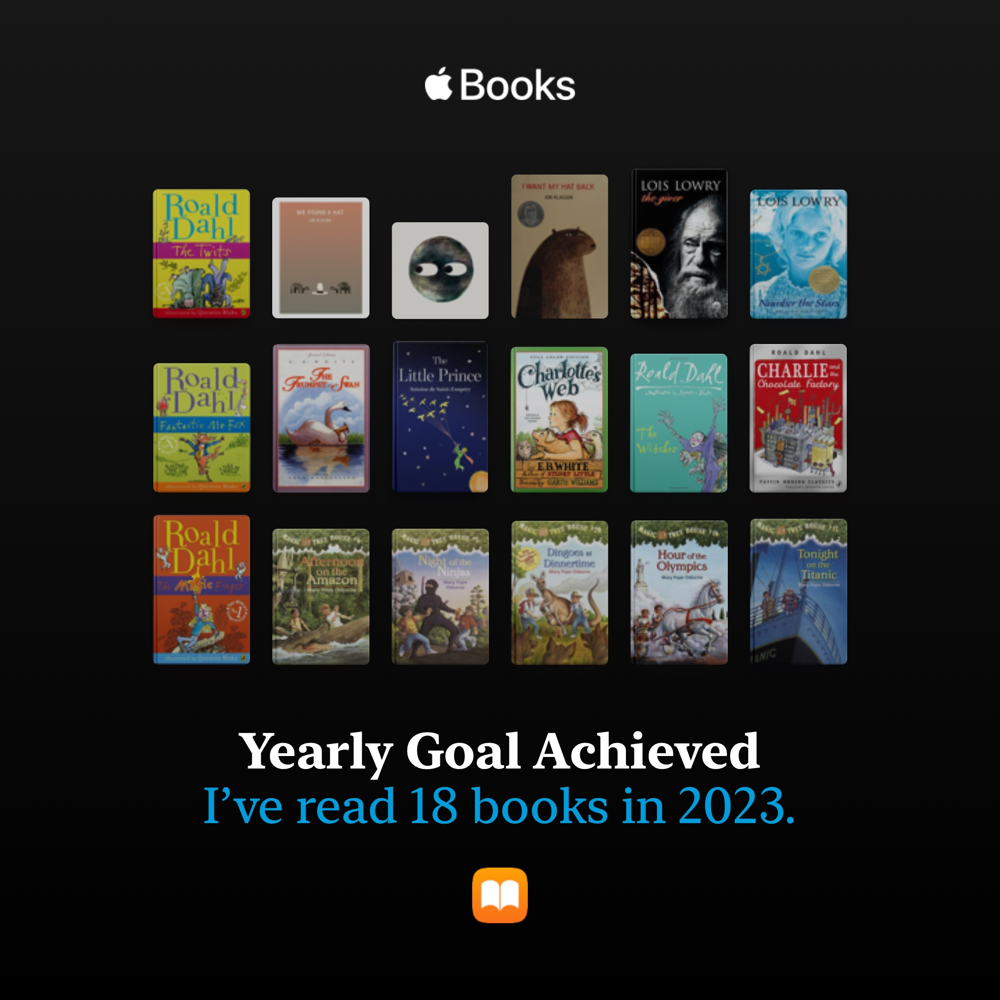
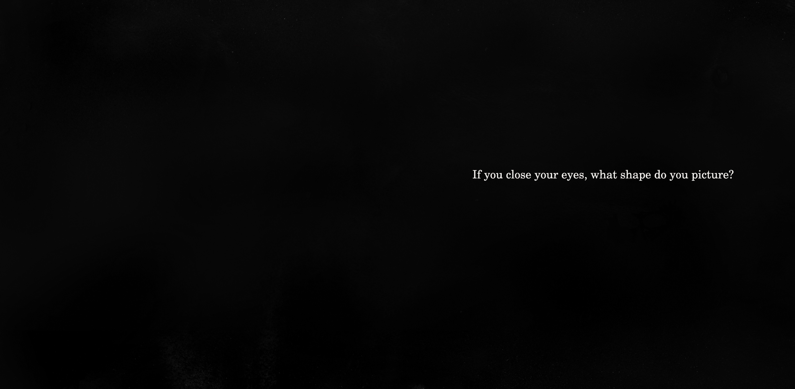

​	

​	现在回过头来看，真的很神奇。一开始我甚至是连神奇树屋都看不懂的。那些简单的单词，组成的句子我竟然看不懂。以前只记得每个单词的意思，做题的话在脑海里翻译成中文就能做了。现在看书上这些口语话的表达这招就不管用了，真的是单纯认识却不知道意思了，更何况这些句子都是一些简单句，也不存在语法障碍。看来是真的缺少native那种儿童口语化英语英文输入了。
<!-- more -->
​	后来慢慢的也适应了，陆陆续续看了十几本神奇树屋，虽说是给小孩子看的，但内容还算有趣，更何况领会到了很多简单的单词组合在一起所传达的意思我开始能够体会了，也能去想象这些动作的发生。后来又读了the Magic finger 很薄一本，不到一百页，还有插画，读起来非常轻松。极大的给我了自信，便去挑战*查理与巧克力工厂*了，给了我很大的打击，好多生词啊。不过最终还是慢慢读完了。没啥感觉的书，可能因为大部分我还不是很理解吧。

从*神奇树屋*系列到*The giver*

最喜欢的是

- number the star,  

​	坐船逃走的那一夜真的看得自己好紧张，作者文字好优美，没什么很难得单词却能让人身临其境。

- the giver, 

  第一部读的反乌托邦小说，很好读。作者选词真的很完美啊，用release来代替杀人，strring形容爱情。要不是作者说这个世界没有颜色，我都完全没注意到。虽然是一本反乌托邦小说，但我感觉里面的世界真的蛮好的，人们都很幸福。

- 夏洛特的网。

  夏洛特去世那一段真的有点感动到我了，自然的衰老死亡，却让人感到悲凉。

- 绘本:Circle 

  好羡慕那些小孩子能看到这么有趣的绘本，要是我小时候也有绘本看就好了。

  If you close your eyes, what shape do you picture?

  好喜欢这句话。

  

  

## 去长白山旅游——第一次教训

- 没能看到天池
- 车被擦了，赔了好多钱。
- 最破费的一次，再也不想旅游了呜呜呜呜
- 不过也算是难忘的记忆

## Her 

- 朋友 or 暗恋对象
  - 时而发疯的喜欢她，时而平淡？我不知道如何形容这种感情。
- 有时候和她聊天有一种恋爱的感觉，好幸福
- 关于她的梦终于美好起来了，以前的梦感觉自己像个loser...
- Confess  love ?
  - 有时非常想告诉她，不过以我对自己的认知来说，我是不可能告白的
- 她的JK照真的很好看！不过平时的化妆风格我是有点欣赏不来了，感觉眼影画得太浓了，有一点吓人。还是喜欢画得自然一点的她。
- 鼓起勇气送了她圣诞礼物，她不收的话我真的会伤心的。因为生日礼物我感觉自己好敷衍哈哈哈

​	恋爱，有时候还是很向往的的啊，不过就这样吧，大部分时间还是觉得一个人蛮好的。有时候聊聊天也有在恋爱的感觉。

## Animation

今年真的好多好看的番剧啊

第一次体会到最原创番的乐趣，是**MyGo It's my dream!!!!!**  求求你再让我看一集MyGO吧，我什么都会做的。

笑的最开心的番剧：**别当欧尼酱**。要觉醒femboy了

最舒适的感看体验：**葬送的芙莉莲** ，看着真的好舒服，和相合之物一样，那种平静的生活气息。看着身心都放松了。

个人最佳op：**innocent arrogance** 

最佳ED：**Anytime Anywhere** 葬送的芙莉莲的ed，不过勇者现在听来也蛮好听的，越听越顺耳了。第一次听真的感觉很这个番很不搭，不如无职转身的spiral。无职转生也好可惜，第一季是真的好看，第二季真的感觉差了好多。作为爱丽丝和

## 考研

​	没复习完，还是我开始得太晚了。听信了网上说暑假开始准备考研完全来得急，没想到11408内容这么多啊啊啊啊。二战，会怎么样呢？ 为自己担忧啊。到家置办了好多东西，想着要在家学习，买了手冲咖啡套装，买了自己喜欢的图书馆的那种桌子花了700，想着要去楼平弄烧烤吃花了露营座椅套装花了150，要猫猫买了各种猫猫用品又花了很多钱，2000块没了，真的感觉自己花钱好吓人。不敢找父母要钱了，受制于人好难受。

​	如果今年依旧考不上的话，自己真的会接受吗？好难啊，虽说父母一直说没关系，考不上也没事。但走了了考研这条路，事到如今再去找工作真的不好办了啊，自己已经好久没有敲过代码了。真的很想继续读书，感觉自己是个废物一样，只有知识能让我安心了。

