狂神说JavaWeb快速入门笔记
<!-- more -->

## 静态web和动态web


静态Web是由静态网页组成的Web应用程序，网页的内容在页面请求时已经存在，并且不会随着用户的请求而发生变化。网页内容通常是由HTML、CSS、JavaScript等静态文件组成的，这些文件都是在服务器端预先生成的，当用户访问这些网页时，服务器只需将这些文件发送给用户的浏览器，浏览器将文件解析并显示给用户即可。静态Web通常包含少量的网页，内容不会发生频繁变化，适合于展示企业宣传网站、个人博客等简单的网站。

动态Web是由动态网页组成的Web应用程序，网页内容是在用户请求时根据请求参数和服务器端的处理生成的。网页内容可以根据用户的不同请求参数、数据库查询结果等实时生成。动态Web需要使用服务器端脚本语言（如Java、PHP、Python Servlet/JSP等）来生成HTML页面内容，通常使用数据库来存储和管理数据。动态Web可以实现更复杂的功能，例如在线商城、社交网络、新闻门户等。

总的来说，静态Web适合于内容不会频繁变化，网站规模较小的场景，可以使用简单的HTML、CSS、JavaScript等前端技术来实现；而动态Web适合于内容需要频繁变化、网站规模较大的场景，需要使用服务器端脚本语言和数据库来实现。


## web服务器


### Tomcat


Web服务器是一种软件程序，主要用于处理客户端和服务器之间的HTTP请求和响应。它可以接收来自客户端（通常是Web浏览器）的HTTP请求，并返回处理后的HTTP响应。Web服务器通常运行在互联网上，提供各种各样的服务，例如Web网站、电子邮件服务、文件传输等。


[Tomcat](https://tomcat.apache.org/)是一种流行的开源Web服务器，它实现了Java Servlet和JavaServer Pages (JSP) 规范。Tomcat支持多种操作系统，包括Windows、Linux和Mac OS等，它提供了一个简单的、易于使用的管理界面，允许管理员对服务器进行配置和管理。

Tomcat的主要特点包括：

1. 支持Java Servlet和JSP规范：Tomcat可以运行和处理Java Web应用程序，例如Java Servlet、JSP和JavaServer Faces (JSF) 等。

2. 可扩展性：Tomcat支持各种插件和扩展，可以根据需要添加新功能或修改现有功能。

3. 易于配置和管理：Tomcat提供了一个简单的管理界面，允许管理员轻松地配置和管理Web服务器，包括添加或删除Web应用程序、配置访问权限等。

4. 开源免费：Tomcat是一个开源项目，可以免费使用和修改。这意味着用户可以根据自己的需要进行定制和修改，而不需要支付高昂的授权费用。

总的来说，Tomcat是一种功能强大的Web服务器，非常适合运行Java Web应用程序。它具有可扩展性、易于配置和管理、开源免费等优点，因此在企业和个人用户中非常受欢迎。


#### Tomcat文件结构


```shell
cd ~/tomcat //tomcart 安装目录
```

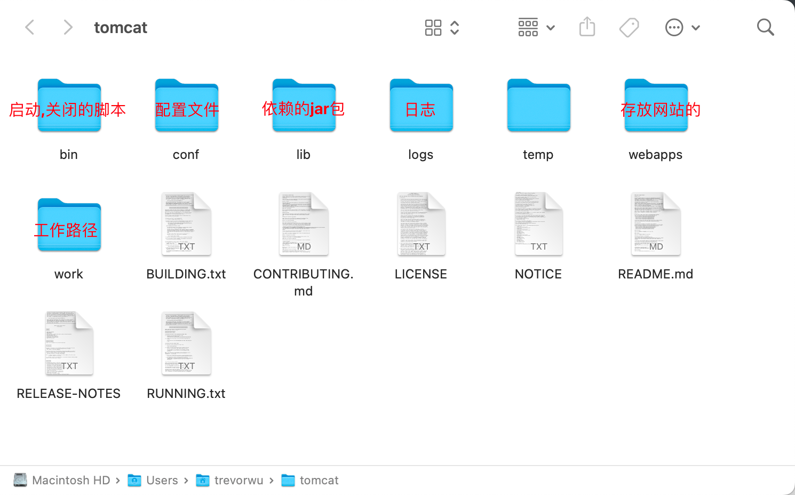

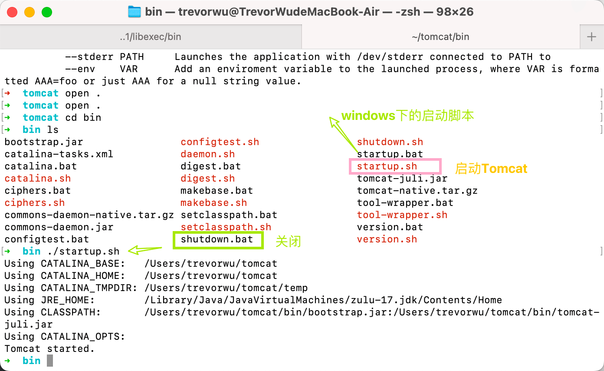

访问测试：http://localhost:8080

默认端口8080


#### 配置文件


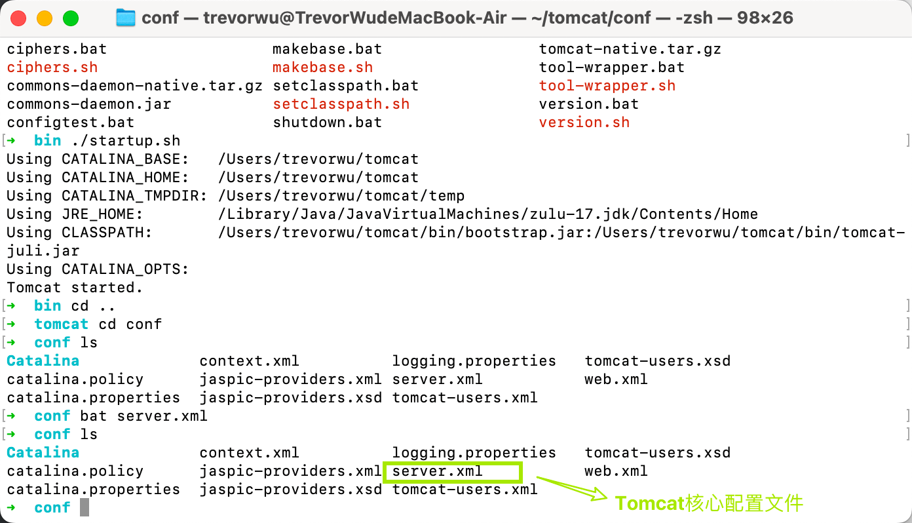

- 可以修改配置的启动端口号, 默认为8080

```xml
    <Connector port="8080" protocol="HTTP/1.1"
               connectionTimeout="20000"
               redirectPort="8443" />
```

- 可以配置主机的名称, 默认网站的存放位置

  - name="locahost" 默认主机名对于的ip地址 127.0.0.1
  - 默认网站存放地址: webapps

  ```xml
   <Host name="localhost"  appBase="webapps"
              unpackWARs="true" autoDeploy="true">
  ```


#### 发布一个网站

- 将自己写的网站，放到服务器(Tomcat)中指定的web应用的文件夹（webapps）下，就可以访问了。


### HTTP

HTPP 请求


```json
Request URL:https://www.baidu.com/   请求地址
Request Method:GET    get方法/post方法
Status Code:200 OK    状态码：200
Remote（远程） Address:14.215.177.39:443
Accept:text/html  客户端可以接受的语言
Accept-Encoding:gzip, deflate, br 编码
Accept-Language:zh-CN,zh;q=0.9    语言
Cache-Control:max-age=0 是否设置缓存
Connection:keep-alive 是否为持续性链接
```


## Servlet


### 简介

- Servlet就是sun公司开发动态web的一门技术。
- Sun在这些API中提供一个接口叫做：Servlet，如果你想开发一个Servlet程序，只需要完成两个小步骤：
  - 编写一个类，实现Servlet接口。
  - 把开发好的Java类部署到web服务器中。
- **把实现了Servlet接口的Java程序叫做，Servlet**。

### 第一个Servlet程序 HelloServlet

1. 修改web.xml为最新的

```xml
<?xml version="1.0" encoding="UTF-8"?>
<web-app xmlns="http://xmlns.jcp.org/xml/ns/javaee"
         xmlns:xsi="http://www.w3.org/2001/XMLSchema-instance"
         xsi:schemaLocation="http://xmlns.jcp.org/xml/ns/javaee
                      http://xmlns.jcp.org/xml/ns/javaee/web-app_4_0.xsd"
         version="4.0"
         metadata-complete="true">

</web-app>
```

2. 编写一个Servlet程序。

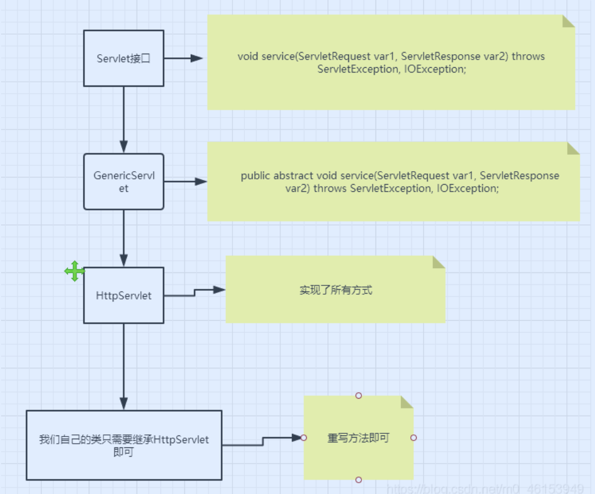

3. 编写一个普通类Bean

4. 实现servlet接口, 这里我们直接继承HttpServlet

   ```java
   public class HelloServlet extends HttpServlet {
       // 由于get或post只是请求实现的不同的方式，可以相互调用，业务逻辑都是一样；
     //HttpServletRequest代表客户端的请求，用户通过Http协议访问服务器，
   //HTTP请求中的所有信息会被封装到HttpServletRequest，
   //通过这个HttpServletRequest的方法，获得客户端的所有信息；
       @Override
       protected void doGet(HttpServletRequest req, HttpServletResponse resp) throws ServletException, IOException {
           PrintWriter writer = resp.getWriter();  // 响应流
           writer.print("Hello,Serlvet");
   	      writer.flush()
       }
   ```

#### write( )和println( )

`servletResponse.getWriter().write()``servletResponse.getWriter().println()`都是用于将字符串写入到HTTP响应中的方法，但是它们之间有一些关键的区别。

`servletResponse.getWriter().write()`方法是将指定的字符串写入到HTTP响应输出流中，它不会在字符串末尾添加任何换行符或其他字符。如果需要在输出的字符串后面添加换行符或其他字符，就需要在字符串后面显式添加这些字符。

`servletResponse.getWriter().println()`方法也是将指定的字符串写入到HTTP响应输出流中，但是它会在字符串末尾自动添加一个换行符。这个换行符的样式和操作系统相关，通常是`\n`或`\r\n`。使用`println()`方法可以让每个输出的字符串都独占一行，使得输出更易于阅读和处理。

因此，`write()`方法适合于需要将多个字符串写入到同一行的情况，例如输出CSV格式的数据或者HTML代码的片段。而`println()`方法适合于需要输出多行字符串的情况，例如输出日志信息或HTML代码的整个页面。

需要注意的是，无论使用哪种方法，都需要在使用完之后调用`servletResponse.getWriter().flush()`方法将输出流刷新并将数据发送到客户端。如果不调用`flush()`方法，可能会导致响应数据无法正常发送到客户端。

5. 编写Servlet的映射

   - 为什么需要映射：我们写的是JAVA程序，但是要通过浏览器访问，而浏览器需要连接web服务器，所以我们需要再web服务中注册我们写的Servlet，还需给他一个浏览器能够访问的路径；

   ```xml
       <!--注册Servlet-->
       <servlet>
           <servlet-name>hello</servlet-name>
           <servlet-class>cn.loulan.servlet.HelloServlet</servlet-class>
       </servlet>
       <!--Servlet的请求路径-->
       <servlet-mapping>
           <servlet-name>hello</servlet-name>
           <url-pattern>/hello</url-pattern>
       </servlet-mapping>
   ```


#### Servlet Mapping

1. 一个Servlet可以指定一个映射路径。

   ```xml
       <servlet-mapping>
           <servlet-name>hello</servlet-name>
           <url-pattern>/hello</url-pattern>
       </servlet-mapping>
   ```

2. 一个Servlet可以指定多个映射路径。

   ```xml
       <servlet-mapping>
           <servlet-name>hello</servlet-name>
           <url-pattern>/hello</url-pattern>
       </servlet-mapping>
       <servlet-mapping>
           <servlet-name>hello</servlet-name>
           <url-pattern>/hello2</url-pattern>
       </servlet-mapping>
       <servlet-mapping>
           <servlet-name>hello</servlet-name>
           <url-pattern>/hello3</url-pattern>
       </servlet-mapping>
       <servlet-mapping>
           <servlet-name>hello</servlet-name>
           <url-pattern>/hello4</url-pattern>
       </servlet-mapping>
       <servlet-mapping>
           <servlet-name>hello</servlet-name>
           <url-pattern>/hello5</url-pattern>
       </servlet-mapping>
   ```

3. 一个Servlet可以指定通用映射路径。

   ```xml
       <servlet-mapping>
           <servlet-name>hello</servlet-name>
           <url-pattern>/hello/*</url-pattern>
       </servlet-mapping>
   ```

4. 默认请求路径。

   ```xml
       <!--默认请求路径-->
       <servlet-mapping>
           <servlet-name>hello</servlet-name>
           <url-pattern>/*</url-pattern>
       </servlet-mapping>
   ```

5. 指定一些后缀或者前缀等等….

   ```xml
       <!-- 可以自定义后缀实现请求映射
            注意点，*前面不能加项目映射的路径
            hello/subei.github
           -->
       <servlet-mapping>
           <servlet-name>hello</servlet-name>
           <url-pattern>*.github</url-pattern>
       </servlet-mapping>
   ```

6. 优先级问题。

   - 指定了固有的映射路径优先级最高，如果找不到就会走默认的处理请求；

### Servlet Context


- web容器在启动的时候，它会为每个web程序都创建一个对应的ServletContext对象，它代表了当前的web应用(Application)；

ServletContext是Java Web应用程序的一个接口，它提供了一个Web应用程序的运行环境，可以访问应用程序的配置信息、资源、请求和会话等。每个Web应用程序都有一个ServletContext实例，可以通过getServletContext()方法获取。

ServletContext提供了以下功能：

1. 应用程序作用域：ServletContext对象是一个应用程序级别的对象，可以在整个应用程序范围内共享数据。

2. 应用程序配置信息：ServletContext对象提供了访问Web应用程序的配置信息的方法，例如Web.xml中配置的上下文参数，初始化参数等。

3. 资源访问：ServletContext对象提供了一些方法，例如getRealPath()和getResourceAsStream()，可以访问Web应用程序中的资源文件。

4. 请求转发：ServletContext对象提供了getRequestDispatcher()方法，可以将请求转发到其他Web组件，例如Servlet或JSP。

5. 会话管理：ServletContext对象提供了创建和管理会话的方法，例如getSession()和getSessionCookieConfig()。

ServletContex为Java Web应用程序提供了一个环境，使开发人员可以访问应用程序的配置信息、资源、请求和会话等，并且可以将请求转发到其他Web组件。这使得Java Web应用程序开发变得更加容易和灵活。

#### 利用servletContext实现不同Servlet之前的数据共享

- 在这个Servlet中保存的数据，可以在另外一个servlet中拿到；

```java
public class HelloServlet extends HttpServlet {
    @Override
    protected void doGet(HttpServletRequest req, HttpServletResponse resp) throws ServletException, IOException {
        ServletContext context = this.getServletContext();
        String name = "学习超好";   // 数据
        context.setAttribute("name",name);
    }
}
public class GetServlet extends HttpServlet {
    @Override
    protected void doGet(HttpServletRequest req, HttpServletResponse resp) throws ServletException, IOException {
        ServletContext context = this.getServletContext();
        String name = (String)context.getAttribute("name");
        resp.setContentType("text/html");
        resp.setCharacterEncoding("utf-8");
        resp.getWriter().print("名字:"+name);
    }
```

#### 利用Servlet获取初始化参数

```xml
<!-- 配置一些Web应用初始化参数 -->
    <context-param>
        <param-name>url</param-name>
        <param-value>jdbc:mysql://localhost:3306/mybatis</param-value>
    </context-param>

    <servlet>
        <servlet-name>gp</servlet-name>
        <servlet-class>com.github.servlet.ServletDemo03</servlet-class>
    </servlet>
    <servlet-mapping>
        <servlet-name>gp</servlet-name>
        <url-pattern>/gp</url-pattern>
    </servlet-mapping>
```

```java
public class ServletDemo03 extends HttpServlet {
    @Override
    protected void doGet(HttpServletRequest req, HttpServletResponse resp) throws ServletException, IOException {
        ServletContext context = this.getServletContext();
        String url = context.getInitParameter("url");
        resp.getWriter().print(url);
    }
```

#### 实现请求的转发

2. 利用ServletContext实现请求的转发

```java
public class ServletDemo04 extends HttpServlet {
    @Override
    protected void doGet(HttpServletRequest req, HttpServletResponse resp) throws ServletException, IOException {
        ServletContext context = this.getServletContext();
//        调用forward实现请求转发;
//        requestDispatcher.forward(req,resp);
      context.getRequestDispatcher("url").forward(req,resp);
    }
```

#### 用来读取资源文件

- 在resources目录下新建properties

- 思路：需要一个文件流；

```properties
username="楼兰"
```

```java
public class ServletDemo05 extends HttpServlet {
    @Override
    protected void doGet(HttpServletRequest req, HttpServletResponse resp) throws IOException {
       InputStream stream = this.getServletContext().getResourceAsStream("WEB-INF/classes/db.properties");
        Properties prop = new Properties();
        prop.load(is);
				 String user = prop.getProperty("username");
//        但是如果配置文件中如果包含中文，就会出现乱码，所以可以通过中转的形式优化一下：
        prop.load(new InputStreamReader(stream,"UTF-8"));
        resp.getWriter().print(user);
    }
```

### HttpServletResponse

- web服务器接收到客户端的http请求，针对这个请求，分别创建一个代表请求的HttpServletRequest对象，代表响应的一个HttpServletResponse；
  - 如果要获取客户端请求过来的参数：找HttpServletRequest；
  - 如果要给客户端响应一些信息：找HttpServletResponse。

#### 1.简单分类

- 负责向浏览器发送数据的方法。

```java
ServletOutputStream getOutputStream();
PrintWriter getWriter();
```

- 负责向浏览器发送响应头的方法。

```java
    void setCharacterEncoding(String var1);
    void setContentType(String var1);
```

- 响应的状态码。

```java
    int SC_OK = 200;
    int SC_MOVED_PERMANENTLY = 301;
    int SC_NOT_FOUND = 404;
    int SC_INTERNAL_SERVER_ERROR = 500;
```

- 200 - 请求成功
- 301 - 资源（网页等）被永久转移到其它URL
- 404 - 请求的资源（网页等）不存在
- 500 - 内部服务器错误

#### 2.下载文件

1. 向浏览器输出消息；
2. 下载文件：
   1. 要获取下载文件的路径；
   2. 下载的文件名是啥？
   3. 设置想办法让浏览器能够支持下载我们需要的东西；
   4. 获取下载文件的输入流；
   5. 创建缓冲区；
   6. 获取OutputStream对象；
   7. 将FileOutputStream流写入到buffer缓冲区；
   8. 使用OutputStream将缓冲区中的数据输出到客户端！

```java
public class FIleServlet extends HttpServlet {
    @Override
    protected void doGet(HttpServletRequest req, HttpServletResponse resp) throws ServletException, IOException {
//        1. 获取下载文件的路径；
    String url = "/Users/trevorwu/Maven_03/HelloServlet/src/main/resources/Peekaboo.png";
//        2. 获取文件名
        String fileName = "downFile.png";
//        3. 让浏览器能够支持下载我们需要的东西；
//        这段代码是用来设置 HTTP 响应头，将服务器返回的内容作为文件附件（attachment）下载，而非直接在浏览器中打开。
//        具体地，`resp.setHeader()` 方法设置了一个名为 "Content-Disposition" 的响应头，
//        其值为 "attachment;filename=xxxxx"，其中 "xxxxx" 是要下载的文件名。
//        这个文件名可以是服务器上的文件名，也可以是通过代码生成的文件名。
//        这个文件名决定了用户下载得到的文件名， 而非服务器上的文件名， 服务器的文件名在下载文件的地址中指定
        resp.setHeader("Content-Disposition","attachment;filename="
                + URLEncoder.encode(fileName,"UTF-8"));
//        4. 获取下载文件的输入流；
        FileInputStream in = new FileInputStream(url);
//        5. 创建缓冲区；
        int len = 0;
        byte buffer[] = new byte[1024];
//        6. 获取OutputStream对象；
        ServletOutputStream out = resp.getOutputStream();
//        7. 将FileOutputStream流写入到buffer缓冲区；
//        这段代码是将输入流 `in` 中的数据读取到缓冲区 `buffer` 中，再通过输出流 `out` 输出到目标位置。
//        具体地，循环读取操作会在输入流中读取数据，并将数据写入到缓冲区中，
//        当读取到的数据长度为0时，说明已经读取完毕，退出循环。
//在每次循环中，通过调用 `out.write(buffer, 0, len)` 方法，将缓冲区中的数据写入输出流中。
// 这里的 `buffer` 是一个字节数组，`len` 是每次读取的字节数。
// 第二个参数 `0` 表示从缓冲区的第一个字节开始写入，而不是从数组的第一个元素开始写入。
//通过这段代码，我们可以实现从输入流中读取数据，然后将数据输出到目标位置的操作，通常用于文件下载或数据传输等场景。
        while ((len=in.read(buffer)) > 0){
            out.write(buffer,0,len);
        }
//        close input output stream
        in.close();
        out.close();
    }
```

#### 3.验证码功能*

- 验证怎么来的？
  - 前端实现；
  - 后端实现，需要用到 Java 的图片类，生产一个图片。

```java
public class ImageServlet extends HttpServlet {
    @Override
    protected void doGet(HttpServletRequest req, HttpServletResponse resp) throws IOException {
//        如何让浏览器3秒自动刷新一次;
        resp.setHeader("refresh","3");
//        在内存中创建一个图片
        BufferedImage image = new BufferedImage(90,40,BufferedImage.TYPE_INT_RGB);
//        得到图片,笔
        Graphics2D g = (Graphics2D) image.getGraphics();
//        设置图片的背景颜色
        g.setColor(Color.white);
        g.fillRect(0,0,90,40);
//        给图片写数据
        g.setColor(Color.RED);
        g.setFont(new Font(null,Font.BOLD,20));
        g.drawString(makeNum(),8,30);

//        告诉浏览器，这个请求用图片的方式打开
        resp.setContentType("image/jpeg");
//        网站存在缓存，不让浏览器缓存
        resp.setDateHeader("expires",-1);
        resp.setHeader("Cache-Control","no-cache");
        resp.setHeader("Pragma","no-cache");

//        把图片写给浏览器
        ImageIO.write(image,"jpg", resp.getOutputStream());

    }

//    生成随机数
    private String makeNum(){
        Random random = new Random();
        String num = random.nextInt(9999999) + "";
        StringBuffer sb = new StringBuffer();
        for (int i = 0; i < 7-num.length() ; i++) {
            sb.append("0");
        }
        num = sb.toString() + num;
        return num;
    }
```

#### 4.实现重定向

之前我们学过利用Servlet实现请求的转发, 这里我们利用response来实现请求重定向

1. 重定向和转发的区别

重定向和转发是在Java Servlet编程中常用的两种将请求从一个Servlet转发到另一个Servlet或JSP的方式，它们有一些关键的区别。

重定向（Redirect）是指当一个Servlet收到一个请求时，它会发送一个HTTP响应告诉浏览器发送一个新的请求到指定的URL。这个URL可以是一个Servlet、JSP、HTML页面或其他任何类型的资源。因此，重定向会导致浏览器向指定的URL发起一个全新的请求，而这个新请求的路径是由浏览器在重定向时自动发送的，不再是原始请求的路径。在重定向中，所有请求参数都会丢失，因此需要通过查询字符串或Session等方式传递参数。重定向可以用于将用户重定向到一个新的页面，或者将用户从一个应用程序重定向到另一个应用程序。

转发（Forward）是指当一个Servlet收到一个请求时，它会将请求转发到另一个Servlet或JSP来处理。在转发中，请求和响应对象是同一个，只是Servlet容器将请求转发给了另一个资源来生成响应。因此，在转发中，所有请求参数都会保留，并且可以在目标Servlet或JSP中访问。转发通常用于将请求从一个Servlet传递到另一个Servlet或JSP来生成响应，以便可以在请求和响应之间共享数据。

因此，重定向和转发都可以将请求从一个Servlet转发到另一个Servlet或JSP来生成响应，但它们的区别在于重定向会发送一个新的请求到指定的URL，而转发则将请求转发到另一个Servlet或JSP来处理，响应由目标Servlet或JSP生成。重定向导致的性能开销比转发更高，因为它需要向浏览器发送一个新的请求，而转发则在服务器内部进行，无需向浏览器发送任何内容。

```java
public class RedirectServlet extends HttpServlet {
    @Override
    protected void doGet(HttpServletRequest req, HttpServletResponse resp) throws ServletException, IOException {
        resp.sendRedirect("/response/img");    // 重定向
    }

```

#### 5.简单实现登录重定向

```java
public class Log extends HttpServlet {
    @Override
    protected void doGet(HttpServletRequest req, HttpServletResponse resp) throws ServletException, IOException {
 this.getServletContext().getRequestDispatcher("/hello").forward(req, resp);
    }
```

这段代码用于Java Servlet编程中，将一个请求从一个Servlet转发到同一Web应用程序中的另一个Servlet或JSP（Java服务器页面）。

`getRequestDispatcher()`方法的参数是请求转发到的资源的相对或绝对路径。在本例中，路径为“/hello”，这是另一个Servlet.

然后调用`RequestDispatcher`对象的`forward()`方法，传递`req`和`resp`参数。这些是传递到原始Servlet的`doGet()`或`doPost()`方法中的`HttpServletRequest`和`HttpServletResponse`对象。`forward()`方法将这些对象发送到指定的资源，并允许该资源生成要发送回客户端的响应。

总之，这段代码将一个请求从当前Servlet转发到同一Web应用程序中的另一个Servlet或JSP，同时传递`HttpServletRequest`和`HttpServletResponse`对象。目标资源将生成要发送回客户端的响应。

### HttpServletRequest

- HttpServletRequest代表客户端的请求，用户通过Http协议访问服务器，HTTP请求中的所有信息会被封装到HttpServletRequest，通过这个HttpServletRequest的方法，获得客户端的所有信息；

```java
//        HttpServletRequest代表客户端的请求，用户通过Http协议访问服务器，
//        HTTP请求中的所有信息会被封装到HttpServletRequest，
//        通过这个HttpServletRequest的方法，获得客户端的所有信息；
        String username = req.getParameter("username");
        String password = req.getParameter("password");
        String host = req.getHeader("Host");
        resp.getWriter().println("username:"+username+" password:"+password+" host:"+host);
//        `req.getContextPath()` 是一个 Java Servlet API 中的方法，它返回当前 Servlet 的上下文路径。
//        上下文路径是指 Web 应用程序的 URL 中，主机名和端口号后的第一个路径。
//例如，如果 Web 应用程序的 URL 是 `http://example.com:8080/myapp/index.jsp`，
// 那么上下文路径就是 `/myapp`。
        resp.getWriter().println("Context path"+req.getContextPath());
       
```

### 保存会话的两种技术

#### Cookies


**HTTP cookie**，简称**cookie**，又称“**网站／浏览＋魔饼／魔片**”等，是浏览[网站](https://zh.wikipedia.org/wiki/网站)时由[网络服务器](https://zh.wikipedia.org/wiki/网络服务器)创建并由[网页浏览器](https://zh.wikipedia.org/wiki/网页浏览器)存放在用户计算机或其他设备的小文本文件。

Cookie使Web服务器能在用户的设备存储状态信息（如添加到在线商店购物车中的商品）或跟踪用户的浏览活动（如点击特定按钮、登录或记录历史.

cookie 是服务器在 HTTP 响应中发送的一段数据。客户端（可选）存储 cookie 并在后续请求中返回它。这允许客户端和服务器共享状态。要设置 cookie，服务器会在响应中包含一个 Set-Cookie 标头。cookie 的格式是名称-值对，带有可选属性。例如：

```powershell
Set-Cookie: session-id=1234567
```

这是一个带有属性的示例：

```powershell
Set-Cookie: session-id=1234567; max-age=86400; domain=example.com; path=/;
```

为了向服务器返回 cookie，客户端在以后的请求中包含一个 Cookie 标头。

```shell
Cookie: session-id=1234567
```

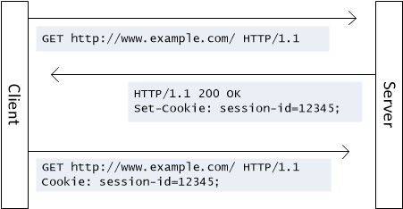

#### 利用Cookies记录用户上一次登录时间

```java
public class Cookie extends HttpServlet {
    @Override
    protected void doGet(HttpServletRequest req, HttpServletResponse resp) throws ServletException, IOException {
				//get all cookies
        javax.servlet.http.Cookie[] cookies = req.getCookies();
        for (javax.servlet.http.Cookie cookie : cookies) {
            String name = cookie.getName();
            if(name.equals("lastLoginTime")){
                String value = cookie.getValue();
                long parseLong = Long.parseLong(cookie.getValue());
                Date date = new Date(parseLong);
                resp.getWriter().println("lastLoginTime: "+date.toLocaleString());
            }
        }
        javax.servlet.http.Cookie cookie = new javax.servlet.http.Cookie("lastLoginTime", System.currentTimeMillis() + "");
        resp.addCookie(cookie);
    }
```


#### **session**

在[计算机科学](https://zh.wikipedia.org/wiki/计算机科学)领域来说，尤其是在[网络](https://zh.wikipedia.org/wiki/计算机网络)领域，**会话**（英语：session，[Microsoft Windows](https://zh.wikipedia.org/wiki/Microsoft_Windows)译作**工作阶段**、**连线阶段**）是一种持久网络协议，在用户（或用户代理）端和服务器端之间创建关联，从而起到交换数据包的作用机制，session在[网络协议](https://zh.wikipedia.org/wiki/网络协议)（例如[telnet](https://zh.wikipedia.org/wiki/Telnet)或[FTP](https://zh.wikipedia.org/wiki/FTP)）中是非常重要的部分。

在不包含[会话层](https://zh.wikipedia.org/wiki/会话层)（例如[UDP](https://zh.wikipedia.org/wiki/用户数据报协议)）或者是无法长时间驻留会话层（例如[HTTP](https://zh.wikipedia.org/wiki/HTTP)）的传输协议中，会话的维持需要依靠在传输数据中的高级别程序。例如，在浏览器和远程主机之间的HTTP传输中，HTTP cookie就会被用来包含一些相关的信息，例如session ID，参数和权限信息等。

- 服务器技术，利用这个技术，可以保存用户的会话信息？ 我们可以把信息或者数据放在Session中！

- 服务器会给每一个用户（浏览器）创建一个Seesion对象；
- 一个Seesion独占一个浏览器，只要浏览器没有关闭，这个Session就存在；
- 用户登录之后，整个网站它都可以访问！–> 保存用户的信息；保存购物车的信息……

#### Session和cookie的区别：

Cookie和Session是Web应用程序中常用的两种用于保存用户状态信息的机制。

相同点：

1. 都是用于在Web应用程序中保存用户状态信息的机制。

2. 都可以在多个请求之间保持用户的状态信息，使用户在浏览网站时能够保持状态的连续性。

3. 都可以在一定程度上提高Web应用程序的性能，减少对服务器的负载。

不同点：

1. 存储位置不同：Cookie保存在客户端的浏览器中，而Session保存在服务器端的内存或者硬盘中。

2. 存储容量不同：Cookie的存储容量比Session小。

3. 安全性不同：由于Session数据存储在服务器端，因此相对于Cookie更加安全，Cookie数据容易被篡改或盗用。

4. 过期时间不同：Session的过期时间可以由开发人员在代码中设置，而Cookie的过期时间可以在创建Cookie时设置，也可以在浏览器中手动删除。

5. 使用场景不同：Cookie适用于需要长期保存用户状态信息的场景，例如保存用户的登录状态、偏好设置等；而Session适用于需要在短时间内保存用户状态信息的场景，例如购物车、会话信息等。

#### 利用Session返回客户端一个Person对象, 并在浏览器上打印

```java
public class Session extends HttpServlet {
    @Override
    protected void doGet(HttpServletRequest req, HttpServletResponse resp) throws ServletException, IOException {
        HttpSession session = req.getSession();
        session.setAttribute("person",new Person("Alice", "Alice@gmail.com"));
        resp.getWriter().write("Session id"+session.getId());
        Person person = (Person) session.getAttribute("person");
        resp.getWriter().write("name"+person.toString());
    }
          //client 每次访问服务器都会在服务器端维护一个Session, 并向用户以Cookie的方式，发送Session id,
//        但是对于client而言， 这个Session id 是以Cookie的形式存储在浏览器上的， 所以更换浏览器访问后Cookie改变了
//        所以，服务器会认为这是一个新的Session.
//        下一次用户再次访问的时候就会拿着这个Session id 访问Serve， Server就知道这个客户的信息
//        1. 拿到Session， 这个Cookie是由客户端发送给服务器的

//        Session 可以使用setAttribute方法来保存信息
//        不同于Cookie，Session 可以保存一个对象(Object)， 而不是仅仅是一个String
```

**会话自动过期：web.xml配置**！

```xml
<!--设置Session默认的失效时间-->
<session-config>
    <!--15分钟后Session自动失效，以分钟为单位-->
    <session-timeout>15</session-timeout>
</session-config>
```

### JSP (Java Server Pages)

**JSP**（全称**J**akarta **S**erver **P**ages，曾称为**J**ava**S**erver **P**ages）是由[Sun Microsystems](https://zh.wikipedia.org/wiki/Sun_Microsystems)公司主导创建的一种动态网页技术标准。

**Java Server Pages ： Java服务器端页面，也和Servlet一样，用于动态Web技术！**

- 最大的特点：
  - 写JSP就像在写HTML；
  - 区别：
    - HTML只给用户提供静态的数据；
    - JSP页面中可以嵌入JAVA代码，为用户提供动态数据；

#### JSP原理

思路：JSP到底怎么执行的！

- 服务器内部工作：

  - tomcat中有一个work目录；

- IDEA中使用Tomcat的会在IDEA的tomcat中生产一个work目录；

  IDEA会为每个Tomcat Webapps创建一个文件夹,用来存放这个APP的配置文件, 工作路径, 在我的MAC路径`/Users/trevorwu/Library/Caches/JetBrains/IntelliJIdea2022.3/tomcat/47ad80c0-0fbd-41b1-a4ae-e036ca41705b`

  我们进入这个路径的最深处

  `cd Catalina/localhost/ROOT/org/apache/jsp 

  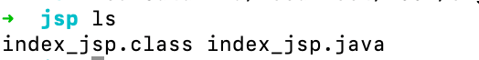

  可以看到这里面有两个文件, 一个是`index_jsp.class` 另一个是``index_jsp.java` 很明显, `index_jsp.class`就是``index_jsp.java` 编译生成的class文件. 

  这是只有一个这样的class, 也就是我们的主页index.jsp

  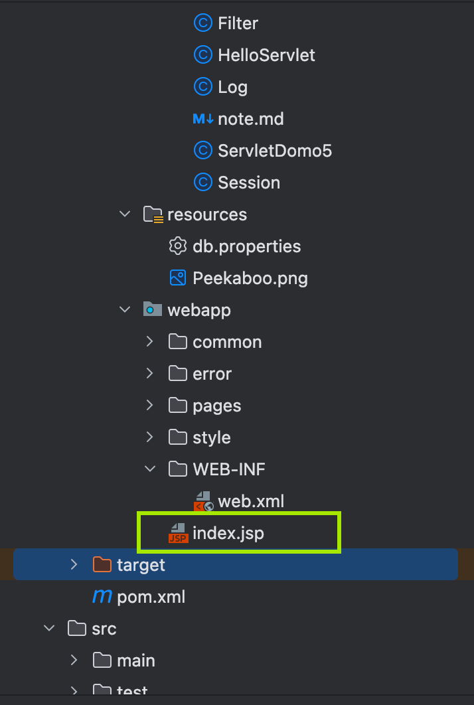

也就是说, 如果我们访问index.jsp, 相当于访问根目录`localhost:8080/` 服务器就会生成对应的.java文件, 以及.class文件用来处理请求. 这个.java文件本质上就是Servlet. 如果这时候我们访问别的页面, 就会生成新的Servlet. 

- **浏览器向服务器发送请求，不管访问什么资源，其实都是在访问Servlet！**
- JSP最终也会被转换成为一个Java类！
- **JSP 本质上就是一个Servlet**！

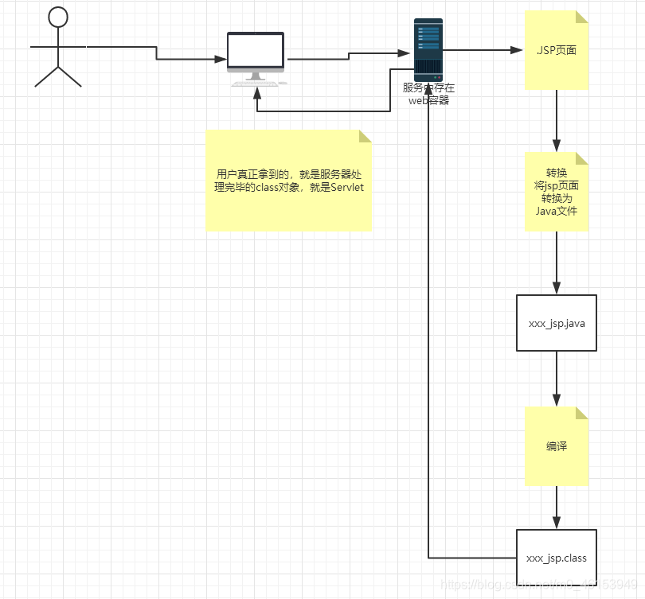

```java
// 初始化
  public void _jspInit() {
  }
// 销毁
  public void _jspDestroy() {
  }
// JSPService
  public void _jspService(final javax.servlet.http.HttpServletRequest request, final javax.servlet.http.HttpServletResponse response)
      throws java.io.IOException, javax.servlet.ServletException {   
```

1. 内置一些对象；

   ```java
   final javax.servlet.jsp.PageContext pageContext;  // 页面上下文
   javax.servlet.http.HttpSession session = null;    // session
   final javax.servlet.ServletContext application;   // applicationContext
   final javax.servlet.ServletConfig config;         // config
   javax.servlet.jsp.JspWriter out = null;           // out
   final java.lang.Object page = this;               // page：当前
   HttpServletRequest request                        // 请求
   HttpServletResponse response                      // 响应
   ```

2. 输出页面前增加的代码；

   ```java
   response.setContentType("text/html");       // 设置响应的页面类型
   pageContext = _jspxFactory.getPageContext(this, request, response,
                                             null, true, 8192, true);
   _jspx_page_context = pageContext;
   application = pageContext.getServletContext();
   config = pageContext.getServletConfig();
   session = pageContext.getSession();
   out = pageContext.getOut();
   _jspx_out = out;
   ```

3. 以上的这些个对象我们可以在JSP页面中直接使用！

- 在JSP页面中：
  - 只要是 JAVA代码就会原封不动的输出；
  - 如果是HTML代码，就会被转换为：

```java
      out.write("<html>\n");
      out.write("  <head>\n");
      out.write("    <title>$Title$</title>\n");
      out.write("  </head>\n");
      out.write("  <body>\n");
      out.write("  $END$\n");
      out.write("  </body>\n");
      out.write("</html>\n");
```

- 这样的格式，输出到前端！

#### JSP语法

- 任何语言都有自己的语法，JAVA中有，JSP 作为java技术的一种应用，它拥有一些自己扩充的语法（了解，知道即可！），Java所有语法都支持！
- 配置必需的maven环境：

```xml
<!--        JSP 依赖   -->
        <dependency>
            <groupId>javax.servlet.jsp</groupId>
            <artifactId>javax.servlet.jsp-api</artifactId>
            <version>2.3.3</version>
        </dependency>
<!--        JSTL表达式的依赖-->
        <dependency>
            <groupId>javax.servlet.jsp.jstl</groupId>
            <artifactId>jstl-api</artifactId>
            <version>1.2</version>
        </dependency>
<!--        standard标签库-->
        <dependency>
            <groupId>taglibs</groupId>
            <artifactId>standard</artifactId>
            <version>1.1.2</version>
        </dependency>
```

##### JSP表达式

```jsp
  <body>
  <%--JSP表达式
              作用：用来将程序的输出，输出到客户端
              <%= 变量或者表达式%>
  --%>
  <%= new java.util.Date()%>
  </body>
```

##### jsp脚本片段

```jsp
  <body>
  <%--jsp脚本片段--%>
  <%
    int sum = 0;
    for (int i = 1; i <=100 ; i++) {
      sum+=i;
    }
    out.println("<h1>Sum="+sum+"</h1>");
  %>
  </body>
```

- JSP声明
- <%! code %>

```jsp
  <body>
  <%!
    static {
      System.out.println("Loading Servlet!");
    }
    private int globalVar = 0;
    public void guo(){
      System.out.println("进入了方法guo！");
    }
  %>
  </body>
```

- JSP声明：会被编译到JSP生成Java的类中！其他的，就会被生成到_jspService方法中！

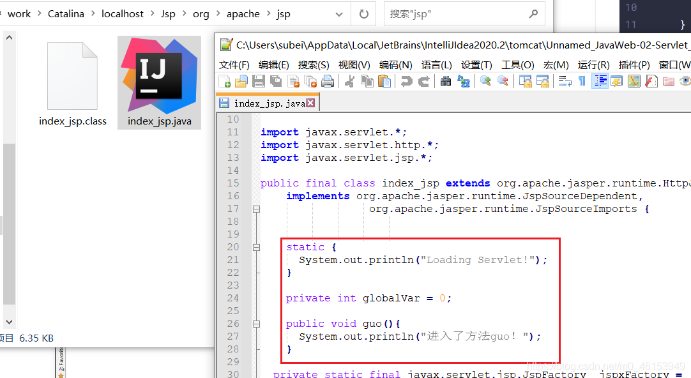

##### JSP指令: 404与500页面实现

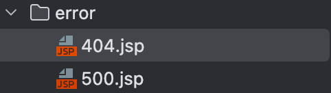

```xml
<!--    自定义错误页面-->
<!--    配置之后记得重启Tomcat服务， 修改tomcat配置文件web.xml热部署不生效-->
<!--    自由修改jsp文件才能热部署-->
    <error-page>
        <error-code>404</error-code>
        <location>/error/404.jsp</location>
    </error-page>
    <error-page>
        <error-code>500</error-code>
        <location>/error/500.jsp</location>
    </error-page>
```

###### 头部和尾部页面拼接

```jsp
<body>
    <%-- @include会将两个页面合二为一 --%>

    <%@include file="common/header.jsp"%>
    <h1>网页主体</h1>
    <%@include file="common/footer.jsp"%>

    <hr>

    <%--
        jsp标签
        jsp:include：拼接页面，本质还是三个
    --%>
    <jsp:include page="/common/header.jsp"/>
    <h1>网页主体</h1>
    <jsp:include page="/common/footer.jsp"/>

</body>
```

#### 内置对象

- PageContext 存东西
- Request 存东西
- Response
- Session 存东西
- Application 【SerlvetContext】 存东西
- config 【SerlvetConfig】
- out
- page ，不用了解
- exception

```java
<body>
<%--内置对象--%>
<%
    pageContext.setAttribute("name1","天启1号"); // 保存的数据只在一个页面中有效
    request.setAttribute("name2","天启2号"); // 保存的数据只在一次请求中有效，请求转发会携带这个数据
    session.setAttribute("name3","天启3号"); // 保存的数据只在一次会话中有效，从打开浏览器到关闭浏览器
    application.setAttribute("name4","天启4号");  // 保存的数据只在服务器中有效，从打开服务器到关闭服务器
%>

<%--
    脚本片段中的代码，会被原封不动生成到.jsp.java
    要求：这里面的代码，必须保证Java语法的正确性
--%>

<%
    // 从pageContent取出，我们通过寻找的方式来
    // 从底层到高层（作用域）:
    String name1 = (String) pageContext.findAttribute("name1");
    String name2 = (String) pageContext.findAttribute("name2");
    String name3 = (String) pageContext.findAttribute("name3");
    String name4 = (String) pageContext.findAttribute("name4");
    String name5 = (String) pageContext.findAttribute("name5"); // 作用域

%>

<%--使用EL表达式输出 ${} --%>
<h1>取出的值:</h1>
<h3>${name1}</h3>
<h3>${name2}</h3>
<h3>${name3}</h3>
<h3>${name4}</h3>
<h3> <%=name5%> </h3>

</body>
</html>
```

- request：客户端向服务器发送请求，产生的数据，用户看完就没用了，比如：新闻，用户看完没用的！
- session：客户端向服务器发送请求，产生的数据，用户用完一会还有用，比如：购物车；
- application：客户端向服务器发送请求，产生的数据，一个用户用完了，其他用户还可能使用，比如：聊天数据；

#### JSP标签.JSTL标签.EL表达式

- EL表达式： ${ }
  - **获取数据**
  - **执行运算**
  - **获取web开发的常用对象**

```jsp
<!-- JSTL表达式的依赖 -->
<dependency>
    <groupId>javax.servlet.jsp.jstl</groupId>
    <artifactId>jstl-api</artifactId>
    <version>1.2</version>
</dependency>
<!-- standard标签库 -->
<dependency>
    <groupId>taglibs</groupId>
    <artifactId>standard</artifactId>
    <version>1.1.2</version>
</dependency>
```

- **JSP标签**

- 利用JSP标签实现请求转发, 并设置参数

  <jsp:forward page="url">

```jsp
<body>
<%--jsp:include--%>
<jsp:forward page="/jspTag2.jsp">
    <jsp:param name="name" value="subeiLY"/>
    <jsp:param name="age" value="18"/>
</jsp:forward>
</body>
```

- 再转发的目标Servlet取参数

```jsp
<body>
<%--取出参数--%>
名字:<%=request.getParameter("name")%>
年龄:<%=request.getParameter("age")%>
</body>
```

- **JSTL表达式**
  - JSTL标签库的使用就是为了弥补HTML标签的不足；它自定义许多标签，可以供我们使用，标签的功能和Java代码一样！
- **格式化标签**
- **SQL标签**
- **XML 标签**
- ***核心标签** （掌握部分）*

- **JSTL标签库使用步骤**：
  - 引入对应的 taglib；
  - 使用其中的方法；
  - **在Tomcat 的lib目录下也需要引入 jstl-api-1.2.jar、standard-1.1.2.jar的包，否则会报错：JSTL解析错误**；

- c：if标签 EL表达式获取表单中的数据

  ```jsp
  <body>
  <form action="core-if.jsp" method="get">
      <%--
          EL表达式获取表单中的数据
          ${param.参数名}
      --%>
      <input type="text" name="username" value="${param.username}">
      <input type="submit" value="登录">
  </form>
  
  <%--判断如果提交的用户名是管理员，则登录成功--%>
  <c:if test="${param.username=='admin'}" var="isAdmin">
      <c:out value="管理员欢迎您！"/>
  </c:if>
    
  <c:out value="${isAdmin}"/>
  </body>
  ```

  

  - c:choose c:when 实现成绩判断(Switch case)

  ```jsp
  <body>
  
  <%--定义一个变量score，值为85--%>
  <c:set var="score" value="65"/>
  
  <c:choose>
      <c:when test="${score>=90}">
          你的成绩为优秀
      </c:when>
      <c:when test="${score>=80}">
          你的成绩为一般
      </c:when>
      <c:when test="${score>=70}">
          你的成绩为良好
      </c:when>
      <c:when test="${score<=60}">
          你的成绩为不及格
      </c:when>
  </c:choose>
  </body>
  ```

  - c:forEach

  ```jsp
  <body>
  <%
  
      ArrayList<String> people = new ArrayList<>();
      people.add(0,"Alice");
      people.add(1,"Bob");
      people.add(2,"楼兰");
      people.add(3,"Goobus");
      people.add(4,"Kris");
      request.setAttribute("list",people);
  %>
  
  <%--
  var , 每一次遍历出来的变量
  items, 要遍历的对象
  begin,   哪里开始
  end,     到哪里
  step,   步长 (i++)
  --%>
  <c:forEach var="people" items="${list}">
      <c:out value="${people}"/> <br>
  </c:forEach>
  
  <hr>
  
  <c:forEach var="people" items="${list}" begin="1" end="3" step="1" >
      <c:out value="${people}"/> <br>
  </c:forEach>
  
  </body>
  ```

## JavaBean

实体类，JavaBean有特定的写法：

- 必须要有一个无参构造
- 属性必须私有化
- 必须有对应的get/set方法；

一般用来和数据库的字段做映射 ORM；

ORM ：对象关系映射

- 表—>类
- 字段–>属性
- 行记录---->对象

```jsp
<jsp:useBean id="people" class="cn.loulan.Bean.People" />

<jsp:setProperty name="people" property="address" value="成都"/>
<jsp:setProperty name="people" property="id" value="1"/>
<jsp:setProperty name="people" property="age" value="2"/>
<jsp:setProperty name="people" property="name" value="哇哈哈AD钙"/>

姓名:<jsp:getProperty name="people" property="name"/>
 ID:<jsp:getProperty name="people" property="id"/>
年龄:<jsp:getProperty name="people" property="age"/>
地址:<jsp:getProperty name="people" property="address"/>
```

## MVC三层架构

- 什么是MVC： Model view Controller 模型.视图.控制器

### 1.早些年

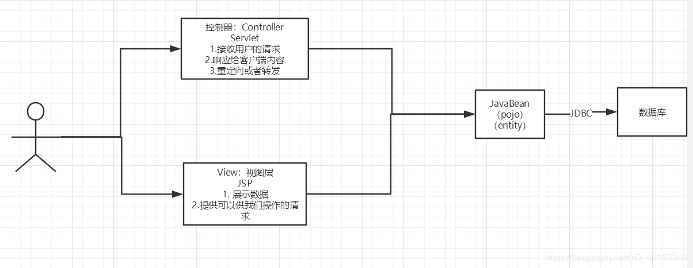

- 用户直接访问控制层，控制层就可以直接操作数据库；

```java
servlet--CRUD-->数据库
弊端：程序十分臃肿，不利于维护  
servlet的代码中：处理请求.响应.视图跳转.处理JDBC.处理业务代码.处理逻辑代码

架构：没有什么是加一层解决不了的！
程序猿调用
|
JDBC
|
Mysql Oracle SqlServer ....
```

### 2.MVC三层架构

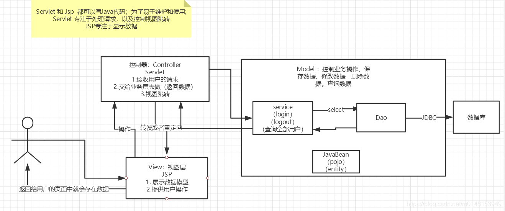

Model

- 业务处理 ：业务逻辑（Service）
- 数据持久层：CRUD （Dao）

View

- 展示数据
- 提供链接发起Servlet请求 （a，form，img…）

Controller （Servlet）

- 接收用户的请求 ：（req：请求参数.Session信息….）

- 交给业务层处理对应的代码

- 控制视图的跳转

  ```java
  登录--->接收用户的登录请求--->处理用户的请求（获取用户登录的参数，username，password）---->交给业务层处理登录业务（判断用户名密码是否正确：事务）--->Dao层查询用户名和密码是否正确-->数据库
  ```

## Filter(重点)

Filter：过滤器 ，用来过滤网站的数据；

- 处理中文乱码
- 登录验证….

Filter开发步骤：

1. 导包
2. 编写过滤器

```xml
        <!--   Servlet 依赖   -->
        <dependency>
            <groupId>javax.servlet</groupId>
            <artifactId>servlet-api</artifactId>
            <version>2.5</version>
        </dependency>
        <!--        JSP 依赖   -->
        <dependency>
            <groupId>javax.servlet.jsp</groupId>
            <artifactId>javax.servlet.jsp-api</artifactId>
            <version>2.3.3</version>
        </dependency>
        <!--        JSTL表达式的依赖-->
        <dependency>
            <groupId>javax.servlet.jsp.jstl</groupId>
            <artifactId>jstl-api</artifactId>
            <version>1.2</version>
        </dependency>
        <!--        standard标签库-->
        <dependency>
            <groupId>taglibs</groupId>
            <artifactId>standard</artifactId>
            <version>1.1.2</version>
        </dependency>
        <!--    连接数据库-->
        <dependency>
            <groupId>mysql</groupId>
            <artifactId>mysql-connector-java</artifactId>
            <version>5.1.47</version>
        </dependency>
```

3. 实现Filter接口，重写对应的方法即可；

使用Filter设置编码, 防止乱码

```java
public class Filter implements javax.servlet.Filter {
    @Override
    public void init(FilterConfig filterConfig) throws ServletException {
        //项目启动的时候被调用
        System.out.println("init filter");
    }
    @Override
    public void doFilter(ServletRequest servletRequest, ServletResponse servletResponse, FilterChain filterChain) throws IOException, ServletException {
        servletRequest.setCharacterEncoding("UTF-8");
        servletResponse.setCharacterEncoding("UTF-8");
        filterChain.doFilter(servletRequest,servletResponse);
    }
```

这段代码是Java Servlet中用于实现Filter的接口方法`doFilter()`的签名。

Filter是一种用于在Servlet容器中对请求和响应进行预处理和后处理的组件。Filter可以截取请求和响应，修改请求参数或响应内容，或者根据某些条件决定是否允许请求继续处理。

`doFilter()`方法接受三个参数：

`ServletRequest servletRequest`、
`ServletResponse servletResponse`
`FilterChain filterChain`

`ServletRequest`表示接收到的HTTP请求，`ServletResponse`表示将要发送的HTTP响应，`FilterChain`表示Filter链。

在`doFilter()`方法中，Filter可以对请求和响应进行任何必要的操作。

例如，可以检查请求参数、修改请求头、记录请求日志等。

然后，Filter必须调用`filterChain.doFilter()`方法，将请求传递给下一个Filter或目标Servlet来进行处理。

如果不调用`filterChain.doFilter()`方法，请求将不会传递到下一个组件，也不会生成响应。在最后一个Filter或目标Servlet中，必须生成响应并将其发送回客户端。

在Filter链中的每个Filter都必须调用`filterChain.doFilter()`方法，否则请求将停止在当前Filter，不会传递到后续的Filter或目标Servlet。

如果在Filter链中的某个Filter中调用了`filterChain.doFilter()`方法之前或之后生成了响应，或者没有调用`filterChain.doFilter()`方法，都会导致请求失败或无法正常响应。

4. 在web.xml中配置 Filter；

```xml
<!--mapping filter-->
    <filter>
        <filter-name>encode</filter-name>
        <filter-class>cn.loulan.servlet.Filter</filter-class>
    </filter>
    <filter-mapping>
        <filter-name>encode</filter-name>
       <!--只要是 /filter的任何请求，会经过这个过滤器-->
        <url-pattern>/filter</url-pattern>
    </filter-mapping>
```

## 监听器(Listener)

实现一个监听器的接口；（有N种）

1. 编写一个监听器；

   实现监听器的接口…

   ```java
   public class OnlineCountListener implements HttpSessionListener {
   //    我们使用一个Integer对象来表示当前在线用户数，
   //    并且在每次Session创建时，都将在线用户数加1。
   //    然后，我们将在线用户数存储在ServletContext中，
   //    以便在整个Web应用程序中共享和使用。
       @Override
       public void sessionCreated(HttpSessionEvent httpSessionEvent) {
           ServletContext servletContext = httpSessionEvent.getSession().getServletContext();
           Integer onlineCounter = (Integer) servletContext.getAttribute("onlineCounter");
           if(onlineCounter == null){
               onlineCounter = Integer.valueOf(1);
           } else {
               onlineCounter = Integer.valueOf(onlineCounter.intValue() + 1);
           }
           servletContext.setAttribute("onlineCounter", onlineCounter);
       }
   
       @Override
       public void sessionDestroyed(HttpSessionEvent httpSessionEvent) {
           Integer onlineCounter = (Integer) httpSessionEvent.getSession().getServletContext().getAttribute("onlineCounter");
           if(onlineCounter == null){
               onlineCounter = Integer.valueOf(0);
           }else {
               onlineCounter = Integer.valueOf(onlineCounter.intValue()- 1);
           }
           httpSessionEvent.getSession().setAttribute("onlineCounter", onlineCounter);
       }
   }
   
   ```

   2. 注册监听器

      ```xml
      <!--    Listener-->
          <listener>
              <listener-class>cn.loulan.servlet.OnlineCountListener</listener-class>
          </listener>
      ```


### 过滤器.监听器常见应用

- #### **监听器：GUI编程中经常使用；**

  ```java
  public class TestPanel {
      public static void main(String[] args) {
          // 新建一个窗体
          Frame frame = new Frame("Happy Day");
          // 面板
          Panel panel = new Panel(null);
          // 设置窗体的布局
          frame.setLayout(null);
          frame.setBounds(300,300,500,500);
          // 设置背景颜色1
          frame.setBackground(Color.lightGray);
          // 设置背景颜色2
          panel.setBackground(Color.orange);
          panel.setBounds(frame.getX()/2, frame.getY()/2, frame.getWidth()/2, frame.getHeight()/2);
          frame.add(panel);
          frame.setVisible(true);
          // 监听事件，监听关闭事件
          frame.addWindowListener(new WindowAdapter() {
              @Override
              public void windowClosing(WindowEvent e) {
                      frame.dispose();
              }
          });
      }
  }
  ```

  #### 过滤器：用户登录之后才能进入主页！用户注销后就不能进入主页了

  1. 用户登录之后，向Sesison中放入用户的数据
  2. 进入主页的时候要判断用户是否已经登录；要求：在过滤器中实现！

  ```java
  public class Log extends HttpServlet {
      @Override
      protected void doGet(HttpServletRequest req, HttpServletResponse resp) throws ServletException, IOException {
          String username = req.getParameter("username");
          String password = req.getParameter("password");
          HttpSession session = req.getSession();
          if("admin".equals(username) && "root".equals(password)) {
              session.setAttribute(Constants.USER_SESSION,new Person(username,password));
              resp.sendRedirect("/pages/success.jsp");
          } else {
              resp.sendRedirect("/");
          }
      }
  ```

  LoginFilter

  ```java
  public class LoginFilter extends Filter{
      @Override
      public void doFilter(ServletRequest servletRequest, ServletResponse servletResponse, FilterChain filterChain) throws IOException, ServletException {
  // ServletRequest 转化为 HttpServletRequest 
  // 目的是拿到Session, 以便获取Attribute
          HttpServletRequest request = (HttpServletRequest) servletRequest;
          HttpServletResponse response = (HttpServletResponse) servletResponse;
          Object o = request.getSession().getAttribute(Constants.USER_SESSION);
          if(o == null) {
              response.sendRedirect("/");
          }
          filterChain.doFilter(servletRequest, servletResponse);
      }
  }
  
  ```

  LogoutServlet

  ```java
  ,public class Logout extends HttpServlet {
      @Override
      protected void doGet(HttpServletRequest req, HttpServletResponse resp) throws ServletException, IOException {
       req.getSession().setAttribute(Constants.USER_SESSION,null);
          resp.sendRedirect("/");
      },
  }
  ```

  通过设置Session的Attribute(Constants.USER_SESSION)值为空来实现用户的登录, 这种方式不需要服务器重复创建和销毁Session就可以实现用户的注销, 减轻了服务器负担. 

  

## JDBC

- 什么是JDBC ： Java连接数据库！
- 需要jar包的支持：
  - java.sql
  - javax.sql
  - mysql-connecter-java… 连接驱动（必须要导入）

1. ~~加载驱动~~
2. 连接数据库,代表数据库
3. 编写SQL （根据业务，不同的SQL）
4. 预编译
5. 执行SQL
6. 关闭连接

```java
public static void main(String[] args) throws ClassNotFoundException, SQLException {
    // 配置信息
    // useUnicode=true&characterEncoding=utf-8 解决中文乱码
    String url="jdbc:mysql://localhost:3307/JDBC?useUnicode=true&characterEncoding=utf-8";
    String username = "root";
    String password = "";
    // 2.连接数据库,代表数据库
    Connection connection = DriverManager.getConnection(url, username, password);
    // 3.编写SQL
    String sql = "select * from user";
//     4. 预编译
    PreparedStatement preparedStatement = connection.prepareStatement(sql);
    // 5.执行查询SQL，返回一个 ResultSet  ： 结果集
    ResultSet rs = preparedStatement.executeQuery(sql);
    while (rs.next()) {
        System.out.println(rs.getObject("name"));
        System.out.println(rs.getObject("email"));
        System.out.println(rs.getObject("password"));
        System.out.println(rs.getObject("role"));
    }
    // 6.关闭连接，释放资源（一定要做） 先开后关
    rs.close();
    preparedStatement.close();
    connection.close();
}
```

#### 预编译: 使用占位符

在 JDBC 中，预编译 SQL 的主要目的是**提高执行 SQL 语句的效率**。当一个 SQL 语句被预编译后，JDBC 驱动程序会将该语句存储在数据库中，并将其与一个预定义的执行计划关联起来。这样，在执行该 SQL 语句时，JDBC 驱动程序可以直接使用预定义的执行计划，而**不必重新解析 SQL 语句和生成执行计划**，从而提高了执行效率。

另外，预编译 SQL 还可以提高代码的**可维护性**和**安全性**。通过使用预编译 SQL，我们可以将 SQL 语句与 Java 代码分离开来，使得代码更易于维护。此外，预编译 SQL 可以避免 **SQL 注入**等安全问题。

具体地，预编译 SQL 的过程包括两个步骤：首先，使用 `Connection` 接口中的 `prepareStatement()` 方法创建一个 `PreparedStatement` 对象；然后，使用 `PreparedStatement` 对象的 `setXXX()` 方法设置 SQL 语句中的参数，并使用 `execute()` 或 `executeUpdate()` 方法执行 SQL 语句。

以下是一个使用预编译 SQL 的示例代码：

```
String sql = "SELECT * FROM users WHERE name = ?";
PreparedStatement pstmt = conn.prepareStatement(sql);
pstmt.setString(1, "John");
ResultSet rs = pstmt.executeQuery();
while (rs.next()) {
    // process the result set
}
```

在上述示例代码中，我们首先使用 `prepareStatement()` 方法创建了一个 `PreparedStatement` 对象，然后使用 `setString()` 方法设置了 SQL 语句中的参数，并最终使用 `executeQuery()` 方法执行 SQL 语句。这样，在执行 SQL 语句时，JDBC 驱动程序会使用预定义的执行计划，从而提高了执行效率。

#### SQL注入

SQL 注入（SQL Injection）是一种常见的网络安全漏洞，它允许攻击者在执行 SQL 查询时向查询中插入恶意代码，从而获得对数据库的非授权访问。攻击者可以通过构造特定的 SQL 查询语句，从而绕过身份验证、窃取数据或破坏数据库。

例如，考虑下面的 SQL 查询语句：

```
SELECT * FROM users WHERE username = '<input>';
```

如果用户输入 `<input>` 的值为 `' or '1'='1`，那么最终的 SQL 查询语句就会变成：

```
SELECT * FROM users WHERE username = '' or '1'='1';
```

这样就会返回所有用户的记录，而不仅仅是指定的用户名。攻击者可以通过这种方式获取到数据库中的敏感数据或者执行其他恶意操作。


## 实战: 超市订单管理系统


为了方便表述和理解, 在编写MVC三层对应的代码时, 使用自顶向下, 但在实际的项目中, 编写代码工作往往是自底向上的.


### 搭建项目框架


#### 编写数据库操作的基础公共类DB

 

- 数据库配置文件，这是一个资源文件，应该创建在maven项目的resources文件中

  ```properties
  DRIVER=com.mysql.jdbc.Driver
  URL=jdbc:mysql://localhost:3307/smbms?useUnicode=true&characterEncoding=utf-8
  USERNAME=root
  PASSWORD=
  ```

  

- 使用静态代码块实现初始化参数

  该类为数据库访问工具类，提供了获取数据库连接、执行查询和更新等常用操作的方法。

  1. 类名：DB

  2. 属性：

  - DRIVER：String类型，表示数据库驱动名。
  - URL：String类型，表示数据库连接地址。
  - USERNAME：String类型，表示连接数据库的用户名。
  - PASSWORD：String类型，表示连接数据库的密码。

  3. 方法：

  - close：用于释放数据库连接、预处理语句和结果集资源。
  - getConnection：用于获取数据库连接。
  - executeQuery：用于执行查询操作，返回一个结果集。
  - executeUpdate：用于执行更新操作，返回受影响的行数。

  4. 方法的参数：

  - conn：Connection类型，表示数据库连接。
  - pstmt：PreparedStatement类型，表示预处理语句。
  - resSet：ResultSet类型，表示结果集。
  - query：String类型，表示要执行的SQL语句。
  - params：Object[]类型，表示SQL语句中的参数值。

  在类中还定义了一个静态代码块，该代码块在类加载时会被执行。静态代码块中的主要作用是读取配置文件中的数据库连接参数，并将其赋值给类的静态属性。具体实现如下：

  - 创建Properties对象。
  - 通过类加载器加载配置文件为字节输入流。
  - 使用Properties对象的load()方法加载字节输入流中的内容。
  - 从Properties对象中获取数据库连接参数，并将其赋值给类的静态属性。

  通过这种方式，可以在不修改Java代码的情况下，更改数据库连接参数，提高了代码的灵活性和可维护性。

  ```java
  public class DB {
      private static String DRIVER;
      private static String URL;
      private static String USERNAME;
      private static String PASSWORD;
      //静态代码块， 类加载的时候执行
      static {
          //读取配置文件
          //1、创建properties对象
          Properties properties = new Properties();
          //2、通过类加载器加载资源文件为字节输入流
          InputStream in = DB.class.getClassLoader().getResourceAsStream("db.properties");
          try {
              properties.load(in);
          } catch (IOException e) {
              e.printStackTrace();
          }
          DRIVER = properties.getProperty("DRIVER");
          URL = properties.getProperty("URL");
          USERNAME = properties.getProperty("USERNAME");
          PASSWORD = properties.getProperty("PASSWORD");
      }
  }
  ```

- 编写数据库操作的公共方法

  该类为数据库访问工具类，提供了获取数据库连接、执行查询和更新等常用操作的方法。

  1. 类名：DB

  2. 属性：

  - DRIVER：String类型，表示数据库驱动名。
  - URL：String类型，表示数据库连接地址。
  - USERNAME：String类型，表示连接数据库的用户名。
  - PASSWORD：String类型，表示连接数据库的密码。

  3. 方法：

  - close：用于释放数据库连接、预处理语句和结果集资源。
  - getConnection：用于获取数据库连接。
  - executeQuery：用于执行查询操作，返回一个结果集。
  - executeUpdate：用于执行更新操作，返回受影响的行数。

  4. 方法的参数：

  - conn：Connection类型，表示数据库连接。
  - pstmt：PreparedStatement类型，表示预处理语句。
  - resSet：ResultSet类型，表示结果集。
  - query：String类型，表示要执行的SQL语句。
  - params：Object[]类型，表示SQL语句中的参数值。

  该类还包含一个静态代码块，用于初始化数据库连接参数，但代码块的内容未给出，需要进行补充。

  *同时需要注意，该类并没有实现单例模式，每次获取数据库连接都会重新创建一个新的连接，这可能会导致性能问题。*

```java
public class DB {
    private static String DRIVER;
    private static String URL;
    private static String USERNAME;
    private static String PASSWORD;
  
   //插入静态代码块(need to fininsh)
  
    //释放链接资源
    public static void close(Connection conn, PreparedStatement pstmt, ResultSet resSet) throws SQLException {
        if(resSet != null){
            resSet.close();
        }
        if(pstmt != null){
            pstmt.close();
        }
        if(conn != null) {
            conn.close();
        }
    }
    //获取数据库链接
    public static Connection getConnection() throws SQLException, ClassNotFoundException {
        Class.forName(DRIVER);
        String url = URL;
        String username = USERNAME;
        String password = PASSWORD;
        // 2.连接数据库,代表数据库
        Connection connection = DriverManager.getConnection(url, username, password);
        return  connection;
    }
    //执行查询, 返回结果集
    public static ResultSet executeQuery(Connection conn,String query,Object[] params) throws SQLException, ClassNotFoundException{
        ResultSet resultSet = null;
        if(conn != null && !query.isEmpty() && params != null){
            //预处理
            PreparedStatement statement = conn.prepareStatement(query);
            for (int i = 0; i < params.length;i++){
                //设置SQL 语句中的参数
                statement.setString(i+1,params[i].toString());
            }
            //执行
            resultSet = statement.executeQuery();
        }
        return resultSet;
    }
    //执行更新， 返回影响行数
    public static int executeUpdate(Connection conn,String query,Object[] params) throws SQLException {
        int affectedRows = 0;
        if(conn != null && !query.isEmpty() && params != null){
            //预处理
            PreparedStatement statement = conn.prepareStatement(query);
            for (int i = 0; i < params.length;i++){
                //设置SQL 语句中的参数
                statement.setString(i+1,params[i].toString());
            }
            //执行
             affectedRows = statement.executeUpdate();
        }
        return affectedRows;
    }
}
```

### 登录功能实现


#### 前端页面编写

前端页面由kuang提供

```jsp
<%-- header--%>
<form class="loginForm" action="${pageContext.request.contextPath}/login.do" name="actionForm" id="actionForm" method="post">
  <div class="info">${error}</div>
  <div class="inputbox">
      <label>用户名：</label>
      <input type="text" class="input-text" id="userCode" name="userCode" placeholder="请输入用户名" required/>
  </div>
  <div class="inputbox">
      <label>密码：</label>
      <input type="password" id="userPassword" name="userPassword" placeholder="请输入密码" required/>
  </div>
  <div class="subBtn">
      <input type="submit" value="登录"/>
      <input type="reset" value="重置"/>
  </div>
</form>
<%-- footer--%>
```


#### 登录处理Servlet实现

在前端form表单的action属性值我们可以看到提交的URL, 所以, 我们需要编写对应的Servlet来处理这个请求

```jsp
action="${pageContext.request.contextPath}/login.do"
```

- 创建登录处理Servlet

  以下是一个名为“Login”的Java servlet类，用于处理HTTP GET请求。该类包括对“UserService”实例的引用，该实例用于从数据库中检索用户信息。

  在“doGet”方法中，servlet从HTTP请求中检索userCode和password参数。然后它创建一个“UserServiceImpl”类的新实例（该类实现了“UserService”接口），并调用其“findByUserCode”方法，以根据给定的用户代码从数据库中检索用户对象。

  如果用户对象不为null，则servlet检查用户密码是否与给定密码匹配。如果匹配，则servlet使用用户对象设置名为“USER_SESSION”的会话属性，并将用户重定向到“/jsp/frame.jsp”。如果密码不匹配，则servlet使用错误消息设置名为“error”的会话属性，并将用户重定向回“/login.jsp”。

  *请注意，此代码片段不完整，因为它缺少有关导入，它所依赖的接口和类，以及servlet配置的信息。*

  ```java
  public class Login extends HttpServlet {
      private UserService service;
      @Override
      protected void doGet(HttpServletRequest req, HttpServletResponse resp) throws ServletException, IOException {
          String userCode = req.getParameter("userCode");
          String password = req.getParameter("userPassword");
          service = new UserServiceImpl();
          User user = null;
          user = service.findByUserCode(userCode);
          if(user != null) {
              if(user.getUserPassword().equals(password)) {
                  req.getSession().setAttribute(Constant.USER_SESSION,user);
                  resp.sendRedirect("/jsp/frame.jsp");
              } else {
                  req.getSession().setAttribute("error","username or password incorrect");
                  resp.sendRedirect("/login.jsp");
              }
          }
      }
  ```

- 映射 servlet

  这段代码是一个 servlet 配置的 XML 部分，它用于将请求的 URL 映射到特定的 servlet 上。这段配置指定了一个名为 "Login" 的 servlet，使用了完整的类名 `servlet.Login`，并将它映射到 URL "/login.do" 上。

  这意味着，当用户在浏览器中访问 "/login.do" 时，容器将调用 `servlet.Login` 的 service() 方法来处理该请求。映射 servlet 的操作是 web 应用的一部分，它在 web.xml 文件中进行配置。

  ```xml
  <servlet>
    <servlet-name>Login</servlet-name>
    <servlet-class>servlet.Login</servlet-class>
  </servlet>
  <servlet-mapping>
    <servlet-name>Login</servlet-name>
    <url-pattern>/login.do</url-pattern>
  </servlet-mapping>
  ```

- 编写Service层代码

  该代码是一个 Java 类 `UserServiceImpl`，实现了一个接口 `UserService`。该类包含了两个方法：

  1. `findByUserCode(String userCode)`：查找数据库中对应用户的信息，该方法返回一个 `User` 对象。
  2. `updateUser(Integer id, String key, String value)`：更新数据库中用户的信息，该方法返回一个 `boolean` 类型的值，表示更新是否成功。

  在这个类中，私有成员变量 `dao` 是一个 `UserDao` 类型的变量，通过该变量调用 `UserDaoImpl` 类中的方法来访问数据库。在 `findByUserCode` 和 `updateUser` 方法中，都需要先通过 `dao` 实例化一个 `UserDaoImpl` 对象来调用相应的方法。

  ```java
  public class UserServiceImpl implements UserService {
      private UserDao dao;
      @Override
      public User findByUserCode(String userCode){
          dao = new UserDaoImpl();
          User user = dao.findByUserCode(userCode);
          return  user;
      }
      @Override
      public boolean updateUser(Integer id, String key, String value)  {
          dao = new UserDaoImpl();
          int i = 0;
          i = dao.updateUser(id, key, value);
         return i > 0 ? true : false;
      }
  }
  
  ```

- DAO层代码

  这段代码是一个Dao层的实现类，用于和数据库交互，提供了对User表的查询和更新方法。下面是代码的分析：

  - `findByUserCode(String userCode)` 方法：根据传入的用户名参数 `userCode` 查询对应的用户记录，并返回一个User对象。该方法使用了数据库连接池技术，在执行完查询后会关闭连接。方法中首先初始化参数，然后执行SQL语句查询结果集，遍历结果集将数据封装到User对象中，最后关闭连接和结果集，返回User对象。
  - `updateUser(Integer id, String key,String value)` 方法：根据传入的参数更新User表中的数据。该方法也使用了数据库连接池技术，在执行完更新后会关闭连接。方法中首先判断传入的参数是否为空，然后执行SQL语句更新数据，最后关闭连接，返回更新结果的影响行数。

  ```java
  public class UserDaoImpl implements UserDao{
      private User user;
      private Connection conn;
      private String sql;
      @Override
      public User findByUserCode(String userCode){
          //2. 初始化参数
          Object[] params = {userCode};
          ResultSet set;
          sql = "SELECT * FROM smbms_user Where userCode = ?";
          try {
              conn = DB.getConnection();
              set = DB.executeQuery(conn, sql,params);
              if(set != null){
                  user = new User();
                  while (set.next()) {
                      user.setUserPassword(set.getString("userPassword"));
                      //一大串赋值代码...
                      user.setWorkPicPath("workPicPath");
                  }
              } else {
                  return null;
              }
              //关闭链接和结果集
              DB.close(conn,null,set);
          } catch (SQLException e) {
              throw new RuntimeException(e);
          } catch (ClassNotFoundException e) {
              throw new RuntimeException(e);
          }
          return user;
      }
      @Override
      public int updateUser(Integer id, String key,String value) {
          int affectedRow = 0;
          if(id != null&& value != null && key != null){
              Connection conn = null;
              sql = "UPDATE smbms_user SET "+key+" = ? WHERE id = ? ";
              Object[] params = {value,id};
              try {
                  conn = DB.getConnection();
                  affectedRow = DB.executeUpdate(conn, sql, params);
                  DB.close(conn,null,null);
              } catch (SQLException e) {
                  throw new RuntimeException(e);
              } catch (ClassNotFoundException e) {
                  throw new RuntimeException(e);
              }
          }
          return affectedRow;
      }
  ```


### 密码修改实现


#### 前端页面

**JSP部分: 页面显示**

```jsp
<%@ page contentType="text/html;charset=UTF-8" language="java" %>
<%@include file="/jsp/common/head.jsp" %>
<div class="right">
    <div class="location">
        <strong>你现在所在的位置是:</strong>
        <span>密码修改页面</span>
    </div>
    <div class="providerAdd">
        <form id="userForm" name="userForm" method="post" action="${pageContext.request.contextPath }/jsp/user.do">
            <input type="hidden" name="method" value="savepwd"/>
            <!--div的class 为error是验证错误，ok是验证成功-->
            <div class="info">${message}</div>
            <div class="">
                <label for="oldPassword">旧密码：</label>
                <input type="password" name="oldpassword" id="oldpassword" value="">
                <font color="red"></font>
            </div>
            <div>
                <label for="newPassword">新密码：</label>
                <input type="password" name="newpassword" id="newpassword" value="">
                <font color="red"></font>
            </div>
            <div>
                <label for="newPassword">确认新密码：</label>
                <input type="password" name="rnewpassword" id="rnewpassword" value="">
                <font color="red"></font>
            </div>
            <div class="providerAddBtn">
                <!--<a href="#">保存</a>-->
                <input type="button" name="save" id="save" value="保存" class="input-button">
            </div>
        </form>
    </div>
</div>
</section>
<%@include file="/jsp/common/foot.jsp" %>
<script type="text/javascript" src="${pageContext.request.contextPath }/statics/js/pwdmodify.js"></script>
```


这是一个用 JSP（JavaServer Pages）编写的网页代码，用于修改密码。页面包括一个表单，用户可以在其中输入旧密码、新密码和确认新密码。表单使用POST方法提交到服务器，并使用“/jsp/user.do” URL。 

页面包括一个消息区域，用于显示任何错误消息。页面还包括指向名为“pwdmodify.js”的 JavaScript 文件的链接。这个文件应该包含表单的客户端验证逻辑。

页面使用 JSP 表达式语言（EL）将动态内容插入到 HTML 中。例如，页面使用表达式 "${pageContext.request.contextPath}/statics/js/pwdmodify.js" 插入一个链接到 CSS 文件。"${pageContext.request.contextPath}" 表达式计算为 web 应用程序的上下文路径，用于构造 CSS 文件的完整 URL。 


**JavaScript 表单的客户端验证逻辑**

```js
var oldpassword = null;
var newpassword = null;
var rnewpassword = null;
var saveBtn = null;

$(function(){
   oldpassword = $("#oldpassword");
   newpassword = $("#newpassword");
   rnewpassword = $("#rnewpassword");
   saveBtn = $("#save");

   oldpassword.next().html("*");
   newpassword.next().html("*");
   rnewpassword.next().html("*");

   oldpassword.on("blur",function(){
      $.ajax({
         type:"GET",
         url:path+"/jsp/user.do",
         data:{method:"pwdmodify",oldpassword:oldpassword.val()},
         dataType:"json",
         success:function(data){
            if(data.result == "true"){//旧密码正确
               validateTip(oldpassword.next(),{"color":"green"},imgYes,true);
            }else if(data.result == "false"){//旧密码输入不正确
               validateTip(oldpassword.next(),{"color":"red"},imgNo + " 原密码输入不正确",false);
            }else if(data.result == "sessionerror"){//当前用户session过期，请重新登录
               validateTip(oldpassword.next(),{"color":"red"},imgNo + " 当前用户session过期，请重新登录",false);
            }else if(data.result == "error"){//旧密码输入为空
               validateTip(oldpassword.next(),{"color":"red"},imgNo + " 请输入旧密码",false);
            }
         },
         error:function(data){
            //请求出错
            validateTip(oldpassword.next(),{"color":"red"},imgNo + " 请求错误",false);
         }
      });


   }).on("focus",function(){
      validateTip(oldpassword.next(),{"color":"#666666"},"* 请输入原密码",false);
   });

   newpassword.on("focus",function(){
      validateTip(newpassword.next(),{"color":"#666666"},"* 密码长度必须是大于6小于20",false);
   }).on("blur",function(){
      if(newpassword.val() != null && newpassword.val().length > 5
         && newpassword.val().length < 20 ){
         validateTip(newpassword.next(),{"color":"green"},imgYes,true);
      }else{
         validateTip(newpassword.next(),{"color":"red"},imgNo + " 密码输入不符合规范，请重新输入",false);
      }
   });


   rnewpassword.on("focus",function(){
      validateTip(rnewpassword.next(),{"color":"#666666"},"* 请输入与上面一致的密码",false);
   }).on("blur",function(){
      if(rnewpassword.val() != null && rnewpassword.val().length > 5
         && rnewpassword.val().length < 20 && newpassword.val() == rnewpassword.val()){
         validateTip(rnewpassword.next(),{"color":"green"},imgYes,true);
      }else{
         validateTip(rnewpassword.next(),{"color":"red"},imgNo + " 两次密码输入不一致，请重新输入",false);
      }
   });


   saveBtn.on("click",function(){
      oldpassword.blur();
      newpassword.blur();
      rnewpassword.blur();
      if(
         oldpassword.attr("validateStatus") == "true" &&
          newpassword.attr("validateStatus") == "true"
         && rnewpassword.attr("validateStatus") == "true"){
         if(confirm("确定要修改密码？")){
            $("#userForm").submit();
         }
      }

   });
});
```

这是一个 JavaScript 代码段，它使用 jQuery 库为一个包含密码修改表单的网页添加了客户端验证逻辑。代码使用 AJAX 技术从服务器获取 JSON 格式的响应数据，以验证用户输入的旧密码是否正确，并在页面上显示相关提示信息。

代码中首先定义了四个变量，分别是旧密码、新密码、确认新密码和提交按钮的 jQuery 对象。然后使用 $() 函数将代码包装在一个回调函数中，确保代码在文档加载完成后才执行。回调函数内部做了以下工作：

1. 通过选择器获取页面上的旧密码输入框、新密码输入框、确认新密码输入框和提交按钮，并将它们的 jQuery 对象赋值给前面定义的四个变量。

2. 为旧密码输入框绑定 blur 事件处理函数，当输入框失去焦点时，使用 $.ajax() 函数向服务器发送 GET 请求，验证用户输入的旧密码是否正确，并根据服务器返回的响应数据显示相应的提示信息。在成功回调函数中，根据 data.result 的值判断旧密码是否正确，并通过 validateTip() 函数显示相应的提示信息。在失败回调函数中，显示请求出错的提示信息。

3. 为旧密码输入框绑定 focus 事件处理函数，当输入框获得焦点时，显示输入提示信息。

4. 为新密码输入框绑定 focus 和 blur 事件处理函数，当输入框获得焦点时，显示输入提示信息；当输入框失去焦点时，判断用户输入的新密码是否符合规范，如果符合则显示正确提示，否则显示错误提示。

5. 为确认新密码输入框绑定 focus 和 blur 事件处理函数，当输入框获得焦点时，显示输入提示信息；当输入框失去焦点时，判断用户输入的确认新密码是否与新密码一致，如果一致则显示正确提示，否则显示错误提示。

6. 为提交按钮绑定 click 事件处理函数，当按钮被点击时，先让旧密码、新密码和确认新密码输入框失去焦点，然后判断它们的验证状态是否都为 true，如果是，则显示确认修改密码的提示框，如果用户点击确定，则提交表单，将新密码保存到服务器上。


#### 编写处理Servlet


```java
public class UserDo extends HttpServlet {
    private UserService service;
    @Override
    protected void doGet(HttpServletRequest req, HttpServletResponse resp) throws ServletException, IOException {
        String method = req.getParameter("method");
        if("savepwd".equals(method)){
            savePwd(req, resp);
        } else if("pwdmodify".equals(method)){
            pwdModify(req, resp);
        }
    }
    protected void savePwd(HttpServletRequest req, HttpServletResponse resp) throws ServletException, IOException {
        //拿到USer Session , 用于得到用户id
        HttpSession session = req.getSession();
        User user = (User) session.getAttribute(Constant.USER_SESSION);
        String newPwd = req.getParameter("newpassword");
        System.out.println("用户输入的：new password: "+newPwd);
        System.out.println("Session password: "+user.getUserPassword()+", id: "+ user.getId());
        Integer id = user.getId();
        boolean flag;
        //method 值为  savepwd, 表示用户执行修改密码操作
        if(newPwd != null){
            service = new UserServiceImpl();
            flag = service.updateUser(id, "userPassword", newPwd);
            //修改成功
            if(flag){
                System.out.println("修改成功");
                req.setAttribute("message","密码修改成功， 请重新登录");
                //  移除Session
                session.removeAttribute(Constant.USER_SESSION);
            } else {
                System.out.println("密码修改失败");
                req.setAttribute("message","密码修改失败");
            }
        } else {
            req.setAttribute("message","新密码格式错误");
        }
        //转发到当前页面, 不用重定向而使用转发是为了传统参数（attribute) 通知前端密码修改结果（by attribute message）
        req.getRequestDispatcher("/jsp/pwdmodify.jsp").forward(req,resp);
    }
    /*
    由ajax发起的密码查询请求， 用户进行密码修改时触发
    放回前端json， ajax用于比对旧密码正确性,
     */
    protected void pwdModify(HttpServletRequest req, HttpServletResponse resp){
        HttpSession session = req.getSession();
        Object user = session.getAttribute(Constant.USER_SESSION);
        Map<String, String> map = new HashMap<String, String>();
        if(user != null){
            String password = ((User) user).getUserPassword();
            String inputPwd = req.getParameter("oldpassword");
            if(inputPwd != null && inputPwd.length() > 0){
                //旧密码正确
                if(inputPwd.equals(password)){
                    map.put("result","true");
                } else {
                    //旧密码不正确
                    map.put("result","false");
                }
            } else {
                //密码输入为空
                map.put("result","error");
            }
        } else {
            //session timeout
            map.put("result","sessionerror");
        }
        //返回前端json数据
        resp.setContentType("application/json");
        try {
            PrintWriter writer = resp.getWriter();
            writer.write(JSONArray.toJSONString(map));
            writer.flush();
            writer.close();
        } catch (IOException e) {
            throw new RuntimeException(e);
        }
    }
}
```

这段代码是一个Java Web应用程序中的Servlet，用于处理用户密码修改操作。

在doGet()方法中，根据请求参数"method"的值进行不同的操作。如果"method"的值是"savepwd"，则调用savePwd()方法，保存新密码；如果"method"的值是"pwdmodify"，则调用pwdModify()方法，用于检查旧密码是否正确。

在savePwd()方法中，首先从Session中获取当前用户的信息，然后获取新密码，并使用UserService接口的实现类UserServiceImpl来更新用户密码。如果更新成功，将信息存储在请求属性中，并移除Session中的用户信息，最后将请求转发到密码修改页面。

在pwdModify()方法中，首先获取当前用户的信息，然后获取旧密码。如果旧密码不为空，则将输入的旧密码与Session中存储的旧密码进行比较。如果输入的旧密码与Session中的旧密码相同，则返回前端JSON数据，表示旧密码正确；否则返回JSON数据，表示旧密码不正确。

**需要注意的是，在返回JSON数据之前，需要设置响应的Content-Type为"application/json"。**


##### 映射Servlet

```xml
  <servlet>
    <servlet-name>userDo</servlet-name>
    <servlet-class>servlet.UserDo</servlet-class>
  </servlet>
  <servlet-mapping>
    <servlet-name>userDo</servlet-name>
    <url-pattern>/jsp/user.do</url-pattern>
  </servlet-mapping>
```
