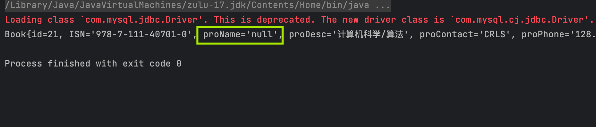
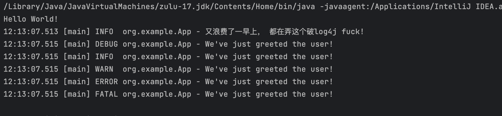
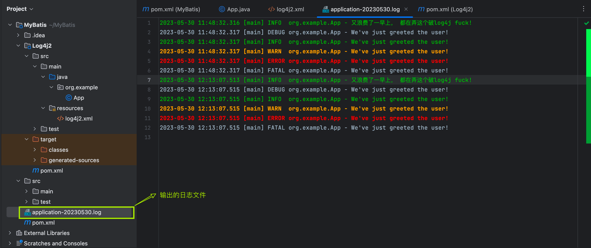
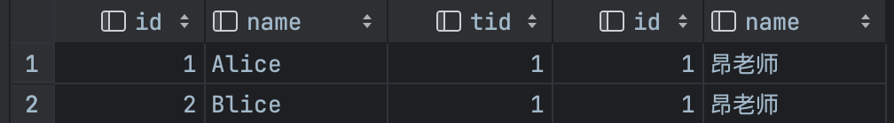
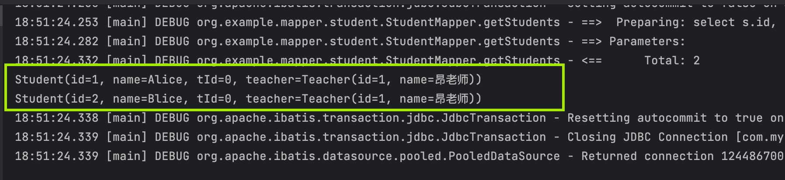

MyBatis学习笔记
<!-- more -->

## 入门之环境搭建

1. 导入依赖的jar包

   ```xml
   <dependency>
       <groupId>org.mybatis</groupId>
       <artifactId>mybatis</artifactId>
       <version>3.5.13</version>
   </dependency>
   ```

2. *解决Maven静态资源过滤问题 导致生成的target文件不包含xml，导致IO错误

   ```xml
   <resources>
       <resource>
           <directory>src/main/java</directory>
           <includes>
               <include>**/*.properties</include>
               <include>**/*.xml</include>
           </includes>
           <filtering>false</filtering>
       </resource>
       <resource>
           <directory>src/main/resources</directory>
           <includes>
               <include>**/*.properties</include>
               <include>**/*.xml</include>
           </includes>
           <filtering>false</filtering>
       </resource>
     </resources>
   ```

3. 新建MyBatis配置文件→`mybatis-config.xml`, 放在`resource`目录下. 

   理论上放在哪里都可以, 文件名叫什么也随意, 但是按照规范来能让代码更规范, 更具有可读性. 

   标签:   ` <properties resource="db.properties"/>`指代数据库的属性, 用于读取`properties`, 这样我们就配置数据库的属性比如Driver, URL时直接使用配置文件中的变量. 

   注意 XML 头部的声明，它用来验证 XML 文档的正确性。

   environment 元素体中包含了事务管理和连接池的配置。mappers 元素则包含了一组映射器（mapper），这些映射器的 XML 映射文件包含了 SQL 代码和映射定义信息。

   ```xml
   <?xml version="1.0" encoding="UTF-8" ?>
   <!DOCTYPE configuration
           PUBLIC "-//mybatis.org//DTD Config 3.0//EN"
           "https://mybatis.org/dtd/mybatis-3-config.dtd">
   <configuration>
   <!--    从db.properties读取数据库属性-->
       <properties resource="db.properties"/>
       <environments default="development">
           <environment id="development">
               <transactionManager type="JDBC"/>
               <dataSource type="POOLED">
                   <property name="driver" value="${DRIVER}"/>
                   <property name="url" value="${URL}"/>
                   <property name="username" value="${USERNAME}"/>
                   <property name="password" value="${PASSWORD}"/>
               </dataSource>
           </environment>
       </environments>
       <mappers>
         <mapper class="dao.book.BookMapper"></mapper>
     </mappers>
   </configuration>
   ```

3. 编写实体类

4. 编写dao层接口

   ```java
   public interface BookMapper {
       Book getRelativeBook( @Param("id") int id, @Param("bookDesc") String bookDesc);
   }
   ```

这段代码用于模糊查询同类书籍, `@Param`注解用于指明参数, 指明参数也可以通过xml文档在指明

5. 编写SQL

   一个语句既可以通过 XML 定义，也可以通过注解定义。我们先看看 XML 定义语句的方式

   ```xml
   <?xml version="1.0" encoding="UTF-8" ?>
   <!DOCTYPE mapper
           PUBLIC "-//mybatis.org//DTD Mapper 3.0//EN"
           "http://mybatis.org/dtd/mybatis-3-mapper.dtd">
   <!--namespace：绑定一个对应的Dao/Mapper接口-->
   <!--        dao.book.BookMapper-->
   <mapper namespace="dao.book.BookMapper">
       <!--select查询语句-->
       <select id="getRelativeBook" resultType="Bean.Book">
           select * from smbms_provider where proDesc like #{bookDesc}  and id != #{id} limit 1;
       </select>
   </mapper>
   ```

   - `Namespace`: 指明接口类的命名空间, 用接口类的权限定名

     命名空间的作用有两个，一个是利用更长的全限定名来将不同的语句隔离开来，同时实现了接口绑定。 将命名空间置于合适的 Java 包命名空间之中，你的代码会变得更加整洁，也有利于你更方便地使用 MyBatis。

   - `select`便签: 用于查询语句

   - `id`: 在命名空间中唯一的标识符，可以被用来引用这条语句. 对应接口类的方法名, **必须和接口类的方法名一致**

   - `resultType`: 期望从这条语句中返回结果的**类全限定名或别名**。 注意，**如果返回的是集合，那应该设置为集合包含的类型，而不是集合本身的类型**。 resultType 和 resultMap 之间只能同时使用一个. 

   - `parameterType`: 将会传入这条语句的参数的**类全限定名或别名**。这个属性是**可选**的，因为 MyBatis 可以根据语句中实际传入的参数计算出应该使用的类型处理器（TypeHandler），默认值为未设置（unset）。

   为了这个简单的例子，我们似乎写了不少配置，但其实并不多。**在一个 XML 映射文件中，可以定义无数个映射语句**，这样一来，XML 头部和文档类型声明部分就显得微不足道了。文档的其它部分很直白，容易理解。 它在命名空间 `dao.book.BookMapper `中定义了一个名为 `selectBlog` 的映射语句

5. 注册Mapper

   在mybatis-config.xml中注册Mapper

   ```xml
    <mappers>
   <!--        方式1： 通过resource注册mapper-->
       <mapper resource="dao/book/BookMapper.xml"></mapper>
   </mappers>
   ```

   7. 编写获取数据库连接的工具类Util

      ```java
      public class MybatisUtil {
          static SqlSessionFactory sqlSessionFactory;
          static {
              InputStream inputStream = null;
              try {
      //          从 XML 文件中构建 SqlSessionFactory 的实例
                  String resource = "mybatis-config.xml";
                  inputStream = Resources.getResourceAsStream(resource);
                  sqlSessionFactory = new SqlSessionFactoryBuilder().build(inputStream);
              } catch (IOException e) {
                  throw new RuntimeException(e);
              }
          }
          public static SqlSession getSqlSession() {
              return sqlSessionFactory.openSession();
          }
      }
      ```

      每个基于 MyBatis 的应用都是以一个` SqlSessionFactory `的实例为核心的。`SqlSessionFactory `的实例可以通过 `SqlSessionFactoryBuilder` 的`build`方法获得。而` SqlSessionFactoryBuilder `则可以从 XML 配置文件或一个预先配置的 Configuration 实例来构建出 `SqlSessionFactory` 实例。(**工厂模式**)

      > 工厂模式是一种创建型设计模式，用于封装对象的创建过程。它通过定义一个共同的接口或基类来创建对象，但具体的对象创建逻辑被移到工厂类中。这样，客户端代码只需要与工厂类交互，而不需要直接创建对象，从而降低了代码的耦合性。
      >
      > 通过工厂模式，代码实现了对象的创建与使用的分离，使得代码更具可维护性和扩展性。如果将来需要修改 `SqlSessionFactory` 对象的创建逻辑，只需修改 `MybatisUtil` 类中的代码，而不需要修改客户端代码。同时，工厂模式也隐藏了具体对象的创建细节，使得客户端代码更加简洁和可读。

      

      代码通过静态代码块在类加载时初始化了一个全局的 `SqlSessionFactory` 对象，并提供了一个公共的静态方法用于获取 `SqlSession` 实例。这样其他类在使用 MyBatis 进行数据库操作时，可以通过调用 `MybatisUtil.getSqlSession()` 方法来获取 `SqlSession` 对象，从而简化了 MyBatis 的配置和使用过程。

      

      `SqlSession `提供了在数据库执行 SQL 命令所需的所有方法。你可以通过	 SqlSession 	实例来直接执行已映射的 SQL 语句. 

   8. 编写测试类

      ```java
      @Test
      public void testGetRelativeBook(){
           SqlSession sqlSession = MybatisUtil.getSqlSession();
           BookMapper mapper = sqlSession.getMapper(BookMapper.class);
           Book relativeBook = mapper.getRelativeBook(12, "%计算机%");
           System.out.println(relativeBook.toString());
       }
      ```

### 参数

1. 对于大多数简单的使用场景，你都不需要使用复杂的参数，比如：

   ```xml
   <select id="selectUsers" resultType="User">
     select id, username, password from users where id = #{id}
   </select>
   ```

   参数类型（parameterType）会被自动设置为 `int`，这个参数可以**随意命名**。原始类型或简单数据类型（比如 `Integer` 和 `String`）因为没有其它属性，会用它们的值来作为参数.

2. 然而，如果传入一个**复杂的对象**，行为就会有点不一样了。比如

   ```xml
   <insert id="insertUser" parameterType="User">
     insert into users (id, username, password)
     values (#{id}, #{username}, #{password})
   </insert>
   ```

   如果 User 类型的参数对象传递到了语句中，会查找 id、username 和 password 属性，然后将它们的值传入预处理语句的参数中。**如果参数类型是具体的类, 参数可以直接通过属性名直接得到, 即使属性是私有的.** 

3. 参数类型是HashMap

   这时候, 参数名会被映射为Map中的key.

4. @Param注解用于给方法参数起一个名字。以下是总结的使用原则：
   - 在方法只接受一个参数的情况下，可以不使用@Param。
   - 在方法接受多个参数的情况下，建议一定要使用@Param注解给参数命名。
   - **如果参数是 JavaBean ， 则不能使用@Param。**
   - 不使用@Param注解时，参数只能有一个，并且是Javabean。

#### 字符串替换 

默认情况下，使用 `#{}` 参数语法时，MyBatis 会创建 `PreparedStatement` 参数占位符，并通过占位符安全地设置参数（就像使用 `?` 一样）。 这样做更安全，更迅速，通常也是首选做法，不过有时你就是想直接在 SQL 语句中直接插入一个不转义的字符串。 比如 ORDER BY 子句，这时候你可以：

```
ORDER BY ${columnName}
```

这样，MyBatis 就不会修改或转义该字符串了。

当 SQL 语句中的元数据（如表名或列名）是动态生成的时候，字符串替换将会非常有用。 举个例子，如果你想 `select` 一个表任意一列的数据时，不需要这样写：

```java
@Select("select * from user where id = #{id}")
User findById(@Param("id") long id);

@Select("select * from user where name = #{name}")
User findByName(@Param("name") String name);

@Select("select * from user where email = #{email}")
User findByEmail(@Param("email") String email);

// 其它的 "findByXxx" 方法
```

而是可以只写这样一个方法：

```java
@Select("select * from user where ${column} = #{value}")
User findByColumn(@Param("column") String column, @Param("value") String value);
```

其中 `${column}` 会被直接替换，而 `#{value}` 会使用 `?` 预处理。 这样，就能完成同样的任务：

```java
User userOfId1 = userMapper.findByColumn("id", 1L);
User userOfNameKid = userMapper.findByColumn("name", "kid");
User userOfEmail = userMapper.findByColumn("email", "noone@nowhere.com");
```

这种方式也同样适用于替换表名的情况。

> **提示** :
>
> 用这种方式接受用户的输入，并用作语句参数是不安全的，会导致潜在的 SQL 注入攻击。因此，要么不允许用户输入这些字段，要么自行转义并检验这些参数。

## XML配置解析


MyBatis 的配置文件包含了会深深影响 MyBatis 行为的设置和属性信息。 

- 能配置的内容如下：

```properties
configuration（配置）
properties（属性）
settings（设置）
typeAliases（类型别名）
typeHandlers（类型处理器）
objectFactory（对象工厂）
plugins（插件）
environments（环境配置）
environment（环境变量）
transactionManager（事务管理器）
dataSource（数据源）
databaseIdProvider（数据库厂商标识）
mappers（映射器）
<!-- 注意元素节点的顺序！顺序不对会报错 -->
```

### environments

environments 元素定义了如何配置环境。

```xml
<environments default="development">
  <environment id="development">
    <transactionManager type="JDBC">
      <property name="..." value="..."/>
    </transactionManager>
    <dataSource type="POOLED">
      <property name="driver" value="${driver}"/>
      <property name="url" value="${url}"/>
      <property name="username" value="${username}"/>
      <property name="password" value="${password}"/>
    </dataSource>
  </environment>
</environments>
```

注意一些关键点:

- 默认使用的环境 ID（比如：default="development"）。

  环境，将SQL映射到多个不同的数据库上，**不过要记住：尽管可以配置多个环境，但每个 SqlSessionFactory 实例只能选择一种环境。**必须指定其中一个为默认运行环境（通过default指定）

   环境可以随意命名，但务必保证默认的环境 ID 要匹配其中一个环境 ID。

- 事务管理器的配置（比如：type="JDBC"）。

  > 在 MyBatis 中有两种类型的事务管理器（也就是 type="[JDBC|MANAGED]"）：
  >
  > - JDBC – 这个配置直接使用了 JDBC 的提交和回滚功能
  > - MANAGED – 这个配置几乎没做什么。它从不提交或回滚一个连接，而是让容器来管理事务的整个生命周期（比如 JEE 应用服务器的上下文）。 默认情况下它会关闭连接。
  >
  > 如果你正在使用 Spring + MyBatis，则没有必要配置事务管理器，因为 Spring 模块会使用自带的管理器来覆盖前面的配置。

- 数据源的配置（比如：type="POOLED"）。

  dataSource 元素使用标准的 JDBC 数据源接口来配置 JDBC 连接对象的资源。

- 数据源是必须配置的。

- 有三种内建的数据源类型

  ```
  type="[UNPOOLED|POOLED|JNDI]"）
  ```

- unpooled：

  这个数据源的实现会每次请求时打开和关闭连接。虽然有点慢，但对那些数据库连接可用性要求不高的简单应用程序来说，是一个很好的选择。 性能表现则依赖于使用的数据库，对某些数据库来说，使用连接池并不重要，这个配置就很适合这种情形。

- **pooled**：

  这种数据源的实现利用“池”的概念将 JDBC 连接对象组织起来 , 避免了创建新的连接实例时所必需的初始化和认证时间。 这种处理方式很流行，能使并发 Web 应用快速响应请求。

- jndi：

  这个数据源的实现是为了能在如 Spring 或应用服务器这类容器中使用，容器可以集中或在外部配置数据源，然后放置一个 JNDI 上下文的引用。


### 映射器（mappers）


我们需要告诉 MyBatis 到哪里去找到这些语句。 在自动查找资源方面，Java 并没有提供一个很好的解决方案，所以最好的办法是直接告诉 MyBatis 到哪里去找映射文件。

```xml
<!-- 使用相对于类路径的资源引用 -->
<mappers>
  <mapper resource="org/mybatis/builder/AuthorMapper.xml"/>
  <mapper resource="org/mybatis/builder/BlogMapper.xml"/>
  <mapper resource="org/mybatis/builder/PostMapper.xml"/>
</mappers>
<!-- 使用完全限定资源定位符（URL） -->
<mappers>
  <mapper url="file:///var/mappers/AuthorMapper.xml"/>
  <mapper url="file:///var/mappers/BlogMapper.xml"/>
  <mapper url="file:///var/mappers/PostMapper.xml"/>
</mappers>
<!-- 使用映射器接口实现类的完全限定类名 -->
<mappers>
  <mapper class="org.mybatis.builder.AuthorMapper"/>
  <mapper class="org.mybatis.builder.BlogMapper"/>
  <mapper class="org.mybatis.builder.PostMapper"/>
</mappers>
<!-- 将包内的映射器接口全部注册为映射器 -->
<mappers>
  <package name="org.mybatis.builder"/>
</mappers>
```

⚠️注意: 使用将包内的映射器接口全部注册为映射器时, 必须保证接口和对应的mapper.xml文件名一致


### 类型别名（typeAliases）


类型别名可为 Java 类型设置一个缩写名字。 它仅用于 XML 配置，用于降低冗余的全限定类名书写。例如：

```xml
<typeAliases>
  <typeAlias alias="Author" type="domain.blog.Author"/>
  <typeAlias alias="Blog" type="domain.blog.Blog"/>
  <typeAlias alias="Comment" type="domain.blog.Comment"/>
  <typeAlias alias="Post" type="domain.blog.Post"/>
  <typeAlias alias="Section" type="domain.blog.Section"/>
  <typeAlias alias="Tag" type="domain.blog.Tag"/>
</typeAliases>
```

当这样配置时，`Blog` 可以用在任何使用 `domain.blog.Blog` 的地方。

也可以指定一个包名，MyBatis 会在包名下面搜索需要的 Java Bean，比如：

```xml
<typeAliases>
  <package name="domain.blog"/>
</typeAliases>
```

每一个在包 `domain.blog` 中的 Java Bean，**在没有注解的情况下，会使用 Bean 的首字母小写的非限定类名来作为它的别名**。 比如 `domain.blog.Author` 的别名为 `author`；若有注解，则别名为其注解值. 


## 作用域（Scope）和生命周期


作用域和生命周期类别是至关重要的，因为错误的使用会导致非常严重的**并发问题。**

### SqlSessionFactoryBuilder

这个类可以被实例化、使用和丢弃，**一旦创建了 SqlSessionFactory，就不再需要它了**。因此 SqlSessionFactoryBuilder 实例的最佳作用域是方法作用域（也就是**局部方法变量**）。 

### SqlSessionFactory

**SqlSessionFactory 一旦被创建就应该在应用的运行期间一直存在**，**没有任何理由丢弃它或重新创建另一个实例**。 使用 SqlSessionFactory 的最佳实践是在应用运行期间不要重复创建多次，多次重建 SqlSessionFactory 被视为一种代码“坏习惯”。因此 SqlSessionFactory 的最佳作用域是**应用作用域(Application)**。 有很多方法可以做到，最简单的就是使用**单例模式**或者**静态单例模式。**

>单例模式是一种创建型设计模式，用于确保一个类只有一个实例，并提供一个全局访问点来访问该实例。它通常适用于需要在整个应用程序中共享状态或资源的情况，以及需要对实例进行严格控制的情况。
>
>实现单例模式的关键是将类的构造函数私有化，这样就无法通过常规的方式创建类的实例。然后，通过一个静态方法或属性来创建并返回类的唯一实例。每次调用这个方法时，都会返回同一个实例。
>
>静态单例模式是单例模式的一种变体，它使用静态变量来保存单例实例，并提供一个静态方法来获取该实例。在静态单例模式中，实例的创建和获取方法都是静态的，因此可以通过类名直接调用，无需实例化类。
>
>**单例模式示例：**
>
>```java
>javaCopy code
>public class Singleton {
>    private static Singleton instance;
>
>    private Singleton() {
>        // 私有化构造函数
>    }
>
>    public static Singleton getInstance() {
>        if (instance == null) {
>            instance = new Singleton();
>        }
>        return instance;
>    }
>
>    // 其他方法...
>}
>```

### SqlSession

**每个线程都应该有它自己的 SqlSession 实例**。SqlSession 的实例不是线程安全的，因此是不能被共享的，所以**它的最佳的作用域是请求或方法作用域**。 


如果说 SqlSessionFactory 相当于数据库连接池，那么 SqlSession 就相当于一个数据库连接（Connection 对象），你可以在一个事务里面执行多条 SQL，然后通过它的 commit、rollback 等方法，提交或者回滚事务。**所以它应该存活在一个业务请求中，处理完整个请求后，应该关闭这条连接，让它归还给 SqlSessionFactory，否则数据库资源就很快被耗费精光，系统就会瘫痪**，所以用 try...catch...finally... 语句来保证其正确关闭。

比如 Servlet 框架中的 HttpSession, 每次收到 HTTP 请求，就可以打开一个 SqlSession，返回一个响应后，就关闭它。

### 映射器(Mapper)实例

映射器实例的生命周期与 SqlSession 相关联，作用域是每个 SqlSession。它们在每个 SqlSession 中创建，并在 SqlSession 关闭时销毁。可以通过依赖注入等方式实现映射器实例在不同 SqlSession 中的重用。这样可以确保映射器实例的正确性和资源的有效利用。

## ResultMap

#### 问题引出

类属性名property和数据库字段名column名不一致的问题: 

如果我们更改实体类的属性名把proName改为BookName, 再次执行查询我们会得到值为null. 

这是因为mybatis会根据这些查询的列名(会将列名转化为小写,数据库不区分大小写) , 去对应的实体类中查找相应列名的set方法设值 , 由于找不到setProName() , 所以返回null . 



下面介绍ResultMap来解决这个问题: 

#### 解决

**`resultMap` 元素是 MyBatis 中最重要最强大的元素。它可以让你从 90% 的 JDBC `ResultSets` 数据提取代码中解放出来。**实际上，在为一些比如连接的复杂语句编写映射代码的时候，一份 `resultMap` 能够代替实现同等功能的长达数千行的代码. 


ResultMap 的设计思想是，对于简单的语句根本不需要配置显式的结果映射，而对于复杂一点的语句只需要描述它们的关系就行了。

你已经见过简单映射语句的示例了，但并没有显式指定 `resultMap`。比如：

```
<select id="selectUserById" resultType="map">
select id , name , pwd
  from user
  where id = #{id}
</select>
```

上述语句只是简单地将所有的列映射到 `HashMap` 的键上，这由 `resultType` 属性指定。虽然在大部分情况下都够用，但是 HashMap 不是一个很好的模型。你的程序更可能会使用 JavaBean 或 POJO（Plain Old Java Objects，普通老式 Java 对象）作为模型。

`ResultMap` 最优秀的地方在于，虽然你已经对它相当了解了，但是根本就不需要显式地用到他们。看看下面这个 JavaBean：

```java
public class User {
  private int id;
  private String username;
  private String hashedPassword;
/*
* setter and getter...
*/
}
```

基于 JavaBean 的规范，上面这个类有 3 个属性：id，username 和 hashedPassword。**这些属性会对应到 select 语句中的列名**。

这样的一个 JavaBean 可以被映射到 `ResultSet`，就像映射到 `HashMap` 一样简单。

```xml
<select id="selectUsers" resultType="com.someapp.model.User">
  select id, username, hashedPassword
  from some_table
  where id = #{id}
</select>
```

类型别名是你的好帮手。使用它们，你就可以不用输入类的全限定名了。比如：

```xml
<!-- mybatis-config.xml 中 -->
<typeAlias type="com.someapp.model.User" alias="User"/>

<!-- SQL 映射 XML 中 -->
<select id="selectUsers" resultType="User">
  select id, username, hashedPassword
  from some_table
  where id = #{id}
</select>
```

在这些情况下，MyBatis 会在幕后自动创建一个 `ResultMap`，再根据属性名来映射列到 JavaBean 的属性上。如果列名和属性名不能匹配上，可以在 SELECT 语句中设置列别名（这是一个基本的 SQL 特性）来完成匹配。比如：

```xml
<select id="selectUsers" resultType="User">
  select
    user_id             as "id",
    user_name           as "userName",
    hashed_password     as "hashedPassword"
  from some_table
  where id = #{id}
</select>
```

在学习了上面的知识后，你会发现上面的例子没有一个需要显式配置 `ResultMap`，这就是 `ResultMap` 的优秀之处——你完全可以不用显式地配置它们。 虽然上面的例子不用显式配置 `ResultMap`。 但为了讲解，我们来看看如果在刚刚的示例中，显式使用外部的 `resultMap` 会怎样，这也是解决列名不匹配的另外一种方式。

```xml
<resultMap id="userResultMap" type="User">
  <id property="id" column="user_id" />
  <result property="username" column="user_name"/>
  <result property="password" column="hashed_password"/>
</resultMap>
```

然后在引用它的语句中设置 `resultMap` 属性就行了（注意我们去掉了 `resultType` 属性）。比如:

```xml
<select id="selectUsers" resultMap="userResultMap">
  select user_id, user_name, hashed_password
  from some_table
  where id = #{id}
</select>
```


**如果这个世界总是这么简单就好了。**


## 日志工厂

日志记录是任何优秀软件开发过程的重要组成部分。通过日志记录，您可以检测和修复问题、了解用户的行为. 如果一个 数据库相关的操作出现了问题，我们可以根据输出的SQL语句快速排查问题。

对于以往的开发过程，我们会经常使用到debug模式来调节，跟踪我们的代码执行过程。但是现在使用Mybatis是基于接口，配置文件的源代码执行过程。因此，我们必须选择日志工具来作为我们开发，调节程序的工具。

Mybatis内置的日志工厂提供日志功能，具体的日志实现有以下几种工具：

- SLF4J
- Apache Commons Logging
- **Log4j 2**
- Log4j (3.5.9 起废弃）
- JDK logging
- STDOUT_LOGGING 
- NO_LOGGING 

具体选择哪个日志实现工具由MyBatis的内置日志工厂确定。它会使用最先找到的（按上文列举的顺序查找）。如果一个都未找到，日志功能就会被禁用。


### **标准日志实现 **STDOUT_LOGGING 


指定 MyBatis 应该使用哪个日志记录实现。如果此设置不存在，则会自动发现日志记录实现。

```xml
<settings>
       <setting name="logImpl" value="STDOUT_LOGGING"/>
</settings>
```

测试，可以看到控制台有大量的输出！我们可以通过这些输出来判断程序到底哪里出了Bug


### **Log4j2**


**简介：**

- [Log4j2 是Java](https://www.scalyr.com/blog/get-started-quickly-java-logging/)语言的日志记录框架，由 Apache 基金会维护。Log4j2 是对其前身 Log4j 的改进。它的主要好处是：
  - API独立于实现
  - 更好地支持并发
  - 通过构建自定义组件轻松扩展

**使用步骤：**

1、导入log4j2的包

```xml
<!--      log4j-core- 核心Log4j实现类。-->
      <dependency>
          <groupId>org.apache.logging.log4j</groupId>
          <artifactId>log4j-core</artifactId>
          <version>2.20.0</version>
      </dependency>
<!--      log4j-api- 提供实现者创建日志实现所需的适配器组件。-->
      <dependency>
          <groupId>org.apache.logging.log4j</groupId>
          <artifactId>log4j-api</artifactId>
          <version>2.20.0</version>
      </dependency>
```

2、配置文件编写

```xml
<?xml version="1.0" encoding="UTF-8"?>
<Configuration status="INFO">
    <Appenders>
        <Console name="ConsoleAppender" target="SYSTEM_OUT">
            <PatternLayout pattern="%d{HH:mm:ss.SSS} [%t] %-5level %logger{36} - %msg%n" />
        </Console>
        <File name="FileAppender" fileName="application-${date:yyyyMMdd}.log" immediateFlush="false" append="true">
            <PatternLayout pattern="%d{yyy-MM-dd HH:mm:ss.SSS} [%t] %-5level %logger{36} - %msg%n"/>
        </File>
    </Appenders>
    <Loggers>
        <Root level="debug">
            <AppenderRef ref="ConsoleAppender" />
            <AppenderRef ref="FileAppender"/>
        </Root>
    </Loggers>
</Configuration>
```

仔细看看我们的配置文件。它首先定义两个 appender，一个称为“FileAppender”，另一个称为“ConsoleAppender”appender 是有效地将日志消息写入其目的地的组件。


第一个 appender 将 stdout 定义为其目标，而第二个 appender 定义文件名的模式。


换句话说，第一个 appender 记录到标准输出，而第二个 appender 记录到一个文件。


然后该文件继续定义记录器。记录器负责实际记录传递给它的消息。每个记录器都可以引用一个或多个附加程序，这正是这里发生的事情。记录器引用了两个附加程序，因此当它被调用时，它将同时记录到标准输出和日志文件中。


3、setting设置日志实现


```
<settings>
   <setting name="logImpl" value="LOG4J2"/>
</settings>
```

4、在程序中使用Log4j进行输出！


```java
import org.apache.logging.log4j.LogManager;
import org.apache.logging.log4j.Logger;
public class App 
{
    private static final Logger logger = LogManager.getLogger(App.class); ;
    public static void main( String[] args )
    {
        System.out.println( "Hello World!" );
        logger.info( "又浪费了一早上， 都在弄这个破log4j fuck!" );
        logger.trace("We've just greeted the user!");
        logger.debug("We've just greeted the user!");
        logger.info("We've just greeted the user!");
        logger.warn("We've just greeted the user!");
        logger.error("We've just greeted the user!");
        logger.fatal("We've just greeted the user!");
    }
}
```

5、测试，看控制台输出！

- 使用Log4j 2输出日志

  

- 可以看到还生成了一个日志的文件 【需要修改file的日志级别】




Ref:

- [在 Web 应用程序中使用 Log4j 2](https://www.docs4dev.com/docs/zh/log4j2/2.x/all/manual-webapp.html#Servlet-2.5)
- [Log4j2 in a Maven Project: How to Setup, Configure, and Use](https://www.dataset.com/blog/maven-log4j2-project/)


## 多对一处理之高级结果映射

MyBatis 创建时的一个思想是：

数据库不可能永远是你所想或所需的那个样子。 我们希望每个数据库都具备良好的第三范式或 BCNF 范式，可惜它们并不都是那样。 如果能有一种数据库映射模式，完美适配所有的应用程序，那就太好了，但可惜也没有。 而 ResultMap 就是 MyBatis 对这个问题的答案。


>1. 第一范式（1NF）：表中的每个属性都是原子的，即不可再分。每个属性只包含单个值，不包含多个值或重复的组合值。
>
>2. 第二范式（2NF）：表中的非主键属性必须完全依赖于主键。换句话说，表中的每个非主键属性必须完全依赖于表中的主键，而不是部分依赖于主键的某个子集。
>
>3. 第三范式（3NF）：表中的非主键属性之间不应该存在传递依赖关系。换句话说，表中的每个非主键属性应该直接依赖于主键，而不是依赖于其他非主键属性。
>
>通过将表设计为第三范式，可以避免数据冗余和不一致性，提高数据存储的效率和一致性。这样的设计有助于减少数据修改的复杂性，提高数据查询和更新的性能，并支持更好的数据一致性维护。
>
>然而，需要注意的是，严格遵循第三范式并不一定是最佳选择。在某些情况下，为了满足特定的性能需求或简化复杂查询，可能需要在设计中引入一些冗余数据或非范式化的结构。在数据库设计过程中，需要根据具体需求和性能考虑，权衡范式化和非范式化的设计选择。

先从简单的开始, 老师和学生的关系, 多个学生存在同属于一个老师, 这就是多对一关系, 我们设计以下Java Bean

```java
import lombok.AllArgsConstructor;
import lombok.Data;
import lombok.NoArgsConstructor;

@Data
@AllArgsConstructor
@NoArgsConstructor
public class Student {
    private int id;
    private String name;
    private int tId;
    private Teacher teacher;
}
```

```java
import lombok.AllArgsConstructor;
import lombok.Data;
import lombok.NoArgsConstructor;

@Data
@NoArgsConstructor
@AllArgsConstructor
public class Teacher {
    private int id;
    private String name;
}
```

如果我们需要查询所有的学生信息以及学生对应的老师, 我们编写SQL

```sql
select  s.id, s.name as sName, tid,t.name as tName 
from students s, teachers t 
where s.tid = t.id;
```

执行SQL可以得到



但是这样是得不到Teacher对象的值的，只能得到null，所以我需要编写ResutlMap

```java
<resultMap id="ST" type="org.example.Bean.Student">
    <id property="id" column="id"/>
    <result property="name" column="sName"/>
    <association property="teacher" javaType="org.example.Bean.Teacher">
        <id property="id" column="tid"></id>
        <result property="name" column="tName"/>
    </association>
</resultMap
```

这段代码是一个 MyBatis 的结果映射配置（resultMap），用于将查询结果映射到 Java 对象。根据给定的配置，它定义了一个名为 "ST" 的结果映射，将查询结果映射到 org.example.Bean.Student 类型的对象。

该 resultMap 包含三个映射项：

1. id 映射：将查询结果的 "id" 列映射到 Student 对象的 "id" 属性。**标记出作为 ID 的结果可以帮助提高整体性能**

2. name 映射：将查询结果的 "sName" 列映射到 Student 对象的 "name" 属性。

3. association（关联）映射：将查询结果中的部分字段映射到关联的 Teacher 对象。

   - id 映射：将查询结果的 "tid" 列映射到 Teacher 对象的 "id" 属性。
   
   - name 映射：将查询结果的 "tName" 列映射到 Teacher 对象的 "name" 属性。

通过使用 resultMap，MyBatis 可以根据查询结果自动将数据填充到 Student 对象中，并可通过访问 Student 对象的属性来获取查询结果的值。此外，关联映射允许将关联表的部分字段映射到关联对象中，以便在查询结果中包含关联对象的相关信息。


- 编写测试类

  ```java
  public class MapperTest {
      @Test
      public void test() {
          SqlSession sqlSession = MybatisUtil.getSqlSession();
          StudentMapper mapper = sqlSession.getMapper(StudentMapper.class);
          List<Student> students = mapper.getStudents();
          for (Student student : students) {
              System.out.println(student.toString());
          }
          sqlSession.close();
      }
  }
  ```

这样我们就可以给Teacher对象赋值了



实际项目中我们可能对多个表进行连表查询，比如，我们如何映射下面这个语句？

```xml
<!-- 非常复杂的语句 -->
<select id="selectBlogDetails" resultMap="detailedBlogResultMap">
  select
       B.id as blog_id,
       B.title as blog_title,
       B.author_id as blog_author_id,
       A.id as author_id,
       A.username as author_username,
       A.password as author_password,
       A.email as author_email,
       A.bio as author_bio,
       A.favourite_section as author_favourite_section,
       P.id as post_id,
       P.blog_id as post_blog_id,
       P.author_id as post_author_id,
       P.created_on as post_created_on,
       P.section as post_section,
       P.subject as post_subject,
       P.draft as draft,
       P.body as post_body,
       C.id as comment_id,
       C.post_id as comment_post_id,
       C.name as comment_name,
       C.comment as comment_text,
       T.id as tag_id,
       T.name as tag_name
  from Blog B
       left outer join Author A on B.author_id = A.id
       left outer join Post P on B.id = P.blog_id
       left outer join Comment C on P.id = C.post_id
       left outer join Post_Tag PT on PT.post_id = P.id
       left outer join Tag T on PT.tag_id = T.id
  where B.id = #{id}
</select>
```

你可能想把它映射到一个智能的对象模型，这个对象表示了一篇博客，它由某位作者所写，有很多的博文，每篇博文有零或多条的评论和标签。 我们先来看看下面这个完整的例子，它是一个非常复杂的结果映射（假设作者，博客，博文，评论和标签都是类型别名）。 不用紧张，我们会一步一步地来说明。虽然它看起来令人望而生畏，但其实非常简单。

```xml
<!-- 非常复杂的结果映射 -->
<resultMap id="detailedBlogResultMap" type="Blog">
  <constructor>
    <idArg column="blog_id" javaType="int"/>
  </constructor>
  <result property="title" column="blog_title"/>
  <association property="author" javaType="Author">
    <id property="id" column="author_id"/>
    <result property="username" column="author_username"/>
    <result property="password" column="author_password"/>
    <result property="email" column="author_email"/>
    <result property="bio" column="author_bio"/>
    <result property="favouriteSection" column="author_favourite_section"/>
  </association>
  <collection property="posts" ofType="Post">
    <id property="id" column="post_id"/>
    <result property="subject" column="post_subject"/>
    <association property="author" javaType="Author"/>
    <collection property="comments" ofType="Comment">
      <id property="id" column="comment_id"/>
    </collection>
    <collection property="tags" ofType="Tag" >
      <id property="id" column="tag_id"/>
    </collection>
    <discriminator javaType="int" column="draft">
      <case value="1" resultType="DraftPost"/>
    </discriminator>
  </collection>
</resultMap>
```

`resultMap` 元素有很多子元素和一个值得深入探讨的结构。 下面是`resultMap` 元素的概念视图。

#### 结果映射（resultMap）

- `constructor`- 用于在实例化类时，注入结果到构造方法中

  - `idArg` - ID 参数；标记出作为 ID 的结果可以帮助提高整体性能
  - `arg` - 将被注入到构造方法的一个普通结果

- `id` – 一个 ID 结果；标记出作为 ID 的结果可以帮助提高整体性能

- `result` – 注入到字段或 JavaBean 属性的普通结果

- `association`– 一个复杂类型的关联；许多结果将包装成这种类型

  - 嵌套结果映射 – 关联可以是 `resultMap` 元素，或是对其它结果映射的引用

- `collection`– 一个复杂类型的集合

  - 嵌套结果映射 – 集合可以是 `resultMap` 元素，或是对其它结果映射的引用

- `discriminator`– 使用结果值来决定使用哪个`resultMap`

  - `case`– 基于某些值的结果映射
    - 嵌套结果映射 – `case` 也是一个结果映射，因此具有相同的结构和元素；或者引用其它的结果映射

  

**ResultMap 的属性列表**

| 属性          | 描述                                                                                                                                     |
| :------------ | :--------------------------------------------------------------------------------------------------------------------------------------- |
| `id`          | 当前命名空间中的一个唯一标识，用于标识一个结果映射。                                                                                     |
| `type`        | 类的完全限定名, 或者一个类型别名（关于内置的类型别名，可以参考上面的表格）。                                                             |
| `autoMapping` | 如果设置这个属性，MyBatis 将会为本结果映射开启或者关闭自动映射。 这个属性会覆盖全局的属性 autoMappingBehavior。默认值：未设置（unset）。 |

>最好逐步建立结果映射。单元测试可以在这个过程中起到很大帮助。 如果你尝试一次性创建像上面示例那么巨大的结果映射，不仅容易出错，难度也会直线上升。 所以，从最简单的形态开始，逐步迭代。而且别忘了单元测试！ 有时候，框架的行为像是一个黑盒子（无论是否开源）。因此，为了确保实现的行为与你的期望相一致，最好编写单元测试。 并且单元测试在提交 bug 时也能起到很大的作用。

### **下一部分将详细说明每个元素。**

#### id & result

```xml
<id property="id" column="post_id"/>
<result property="subject" column="post_subject"/>
```

这些元素是结果映射的基础。*id* 和 *result* 元素都将一个列的值映射到一个简单数据类型（String, int, double, Date 等）的属性或字段。

这两者之间的唯一不同是，*id* 元素对应的属性会被标记为对象的标识符，在比较对象实例时使用。 这样可以提高整体的性能，尤其是进行缓存和嵌套结果映射（也就是连接映射）的时候。

两个元素都有一些属性：

| **属性**        | **描述**                                                                                                                                                                                                                                                                                                          |
| :-------------- | :---------------------------------------------------------------------------------------------------------------------------------------------------------------------------------------------------------------------------------------------------------------------------------------------------------------- |
| **`property`**  | **映射到列结果的字段或属性。如果 JavaBean 有这个名字的属性（property），会先使用该属性。否则 MyBatis 将会寻找给定名称的字段（field）。 无论是哪一种情形，你都可以使用常见的点式分隔形式进行复杂属性导航。 比如，你可以这样映射一些简单的东西：“username”，或者映射到一些复杂的东西上：“address.street.number”。** |
| **`column`**    | **数据库中的列名，或者是列的别名。一般情况下，这和传递给 `resultSet.getString(columnName)` 方法的参数一样。**                                                                                                                                                                                                     |
| `*javaType`*    | *一个 Java 类的全限定名，或一个类型别名（关于内置的类型别名，可以参考上面的表格）。 如果你映射到一个 JavaBean，MyBatis 通常可以推断类型。然而，如果你映射到的是 HashMap，那么你应该明确地指定 javaType 来保证行为与期望的相一致。*                                                                                |
| *`jdbcType`*    | *JDBC 类型*                                                                                                                                                                                                                                                                                                       |
| *`typeHandler`* | *我们在前面讨论过默认的类型处理器。使用这个属性，你可以覆盖默认的类型处理器。 这个属性值是一个类型处理器实现类的全限定名，或者是类型别名。*                                                                                                                                                                       |

#### 构造方法

构造方法注入允许你在初始化时为类设置属性的值，而不用暴露出公有方法。MyBatis 也支持私有属性和私有 JavaBean 属性来完成注入，但有一些人更青睐于通过构造方法进行注入。 *constructor* 元素就是为此而生的。

看看下面这个构造方法:

```java
public class User {
   //...
   public User(Integer id, String username, int age) {
     //...	
  }
//...
}
```

为了将结果注入构造方法，MyBatis 需要通过某种方式定位相应的构造方法。 在下面的例子中，MyBatis 搜索一个声明了三个形参的构造方法，参数类型以 `java.lang.Integer`, `java.lang.String` 和 `int` 的顺序给出。

```xml
<constructor>
   <idArg column="id" javaType="int"/>
   <arg column="username" javaType="String"/>
   <arg column="age" javaType="_int"/>
</constructor>
```

当你在处理一个带有多个形参的构造方法时，很容易搞乱 arg 元素的顺序。 从版本 3.4.3 开始，可以在指定参数名称的前提下，以任意顺序编写 arg 元素。 为了通过名称来引用构造方法参数，你可以添加 `@Param` 注解。

下面是一个等价的例子，尽管函数签名中第二和第三个形参的顺序与 constructor 元素中参数声明的顺序不匹配。

```xml
<constructor>
   <idArg column="id" javaType="int" name="id" />
   <arg column="age" javaType="_int" name="age" />
   <arg column="username" javaType="String" name="username" />
</constructor>
```

如果存在名称和类型相同的可写属性，那么可以省略 `javaType` 。

剩余的属性和规则和普通的 id 和 result 元素是一样的。


#### 关联

```xml
<association property="author" column="blog_author_id" javaType="Author">
  <id property="id" column="author_id"/>
  <result property="username" column="author_username"/>
</association>
```

关联（association）元素处理“有一个”类型的关系。 比如，在我们的示例中，一个博客有一个用户。关联结果映射和其它类型的映射工作方式差不多。 你需要指定目标属性名以及属性的`javaType`（很多时候 MyBatis 可以自己推断出来）。

关联的不同之处是，你需要告诉 MyBatis 如何加载关联。MyBatis 有两种不同的方式加载关联：

- 嵌套 Select 查询：通过执行另外一个 SQL 映射语句来加载期望的复杂类型。
- 嵌套结果映射：使用嵌套的结果映射来处理连接结果的重复子集。

首先，先让我们来看看这个元素的属性。你将会发现，和普通的结果映射相比，它只在 select 和 resultMap 属性上有所不同。

| 属性          | 描述                                                                                                                                                                                                                                                                                                                                                           |
| :------------ | :------------------------------------------------------------------------------------------------------------------------------------------------------------------------------------------------------------------------------------------------------------------------------------------------------------------------------------------------------------- |
| `column`      | 数据库中的列名，或者是列的别名。一般情况下，这和传递给 `resultSet.getString(columnName)` 方法的参数一样。                                                                                                                                                                                                                                                      |
| `javaType`    | 一个 Java 类的完全限定名，或一个类型别名（关于内置的类型别名，可以参考上面的表格）。 如果你映射到一个 JavaBean，MyBatis 通常可以推断类型。然而，如果你映射到的是 HashMap，那么你应该明确地指定 javaType 来保证行为与期望的相一致。                                                                                                                             |
| `jdbcType`    | JDBC 类型                                                                                                                                                                                                                                                                                                                                                      |
| `typeHandler` | *我们在前面讨论过默认的类型处理器。使用这个属性，你可以覆盖默认的类型处理器。 这个属性值是一个类型处理器实现类的完全限定名，或者是类型别名。*                                                                                                                                                                                                                  |
| `select`      | 用于加载复杂类型属性的映射语句的 ID，它会从 column 属性中指定的列检索数据，作为参数传递给此 select 语句。具体请参考关联元素。                                                                                                                                                                                                                                  |
| `resultMap`   | 结果映射的 ID，可以将嵌套的结果集映射到一个合适的对象树中。 它可以作为使用额外 select 语句的替代方案。它可以将多表连接操作的结果映射成一个单一的 `ResultSet`。这样的 `ResultSet` 将会将包含重复或部分数据重复的结果集。为了将结果集正确地映射到嵌套的对象树中，MyBatis 允许你 “串联”结果映射，以便解决嵌套结果集的问题。想了解更多内容，请参考下面的关联元素。 |
| `name`        | 构造方法形参的名字。从 3.4.3 版本开始，通过指定具体的参数名，你可以以任意顺序写入 arg 元素。参看上面的解释。                                                                                                                                                                                                                                                   |

#### 关联的嵌套 Select 查询


| 属性        | 描述                                                                                                                                                                                                                                                                                                                                             |
| :---------- | :----------------------------------------------------------------------------------------------------------------------------------------------------------------------------------------------------------------------------------------------------------------------------------------------------------------------------------------------- |
| `column`    | 数据库中的列名，或者是列的别名。一般情况下，这和传递给 `resultSet.getString(columnName)` 方法的参数一样。 注意：在使用复合主键的时候，你可以使用 `column="{prop1=col1,prop2=col2}"` 这样的语法来指定多个传递给嵌套 Select 查询语句的列名。这会使得 `prop1` 和 `prop2` 作为参数对象，被设置为对应嵌套 Select 语句的参数。                         |
| `select`    | 用于加载复杂类型属性的映射语句的 ID，它会从 column 属性指定的列中检索数据，作为参数传递给目标 select 语句。 具体请参考下面的例子。注意：在使用复合主键的时候，你可以使用 `column="{prop1=col1,prop2=col2}"` 这样的语法来指定多个传递给嵌套 Select 查询语句的列名。这会使得 `prop1` 和 `prop2` 作为参数对象，被设置为对应嵌套 Select 语句的参数。 |
| `fetchType` | 可选的。有效值为 `lazy` 和 `eager`。 指定属性后，将在映射中忽略全局配置参数 `lazyLoadingEnabled`，使用属性的值。                                                                                                                                                                                                                                 |

示例：

```xml
<resultMap id="blogResult" type="Blog">
  <association property="author" column="author_id" javaType="Author" select="selectAuthor"/>
</resultMap>

<select id="selectBlog" resultMap="blogResult">
  SELECT * FROM BLOG WHERE ID = #{id}
</select>

<select id="selectAuthor" resultType="Author">
  SELECT * FROM AUTHOR WHERE ID = #{id}
</select>
```

就是这么简单。我们有两个 select 查询语句：一个用来加载博客（Blog），另外一个用来加载作者（Author），而且博客的结果映射描述了应该使用 `selectAuthor` 语句加载它的 author 属性。

其它所有的属性将会被自动加载，只要它们的列名和属性名相匹配。

**这种方式虽然很简单，但在大型数据集或大型数据表上表现不佳**。这个问题被称为“**N+1 查询问题**”。 概括地讲，N+1 查询问题是这样子的：

- 你执行了一个单独的 SQL 语句来获取结果的一个列表（就是“+1”）。
- 对列表返回的每条记录，你执行一个 select 查询语句来为每条记录加载详细信息（就是“N”）。

这个问题会导致成百上千的 SQL 语句被执行。有时候，我们不希望产生这样的后果。

好消息是，MyBatis 能够对这样的查询进行延迟加载，因此可以将大量语句同时运行的开销分散开来。 然而，如果你加载记录列表之后立刻就遍历列表以获取嵌套的数据，就会触发所有的延迟加载查询，性能可能会变得很糟糕。

所以还有另外一种方法。


#### 关联的嵌套结果映射

| 属性            | 描述                                                                                                                                                                                                                                                                                                                                               |
| :-------------- | :------------------------------------------------------------------------------------------------------------------------------------------------------------------------------------------------------------------------------------------------------------------------------------------------------------------------------------------------- |
| `resultMap`     | 结果映射的 ID，可以将此关联的嵌套结果集映射到一个合适的对象树中。 它可以作为使用额外 select 语句的替代方案。它可以将多表连接操作的结果映射成一个单一的 `ResultSet`。这样的 `ResultSet` 有部分数据是重复的。 为了将结果集正确地映射到嵌套的对象树中, MyBatis 允许你“串联”结果映射，以便解决嵌套结果集的问题。使用嵌套结果映射的一个例子在表格以后。 |
| `columnPrefix`  | 当连接多个表时，你可能会不得不使用列别名来避免在 `ResultSet` 中产生重复的列名。指定 columnPrefix 列名前缀允许你将带有这些前缀的列映射到一个外部的结果映射中。 详细说明请参考后面的例子。                                                                                                                                                           |
| `notNullColumn` | 默认情况下，在至少一个被映射到属性的列不为空时，子对象才会被创建。 你可以在这个属性上指定非空的列来改变默认行为，指定后，Mybatis 将只在这些列中任意一列非空时才创建一个子对象。可以使用逗号分隔来指定多个列。默认值：未设置（unset）。                                                                                                             |
| `autoMapping`   | 如果设置这个属性，MyBatis 将会为本结果映射开启或者关闭自动映射。 这个属性会覆盖全局的属性 autoMappingBehavior。注意，本属性对外部的结果映射无效，所以不能搭配 `select` 或 `resultMap` 元素使用。默认值：未设置（unset）。                                                                                                                          |

之前，你已经看到了一个非常复杂的嵌套关联的例子。 下面的例子则是一个非常简单的例子，用于演示嵌套结果映射如何工作。 现在我们将博客表和作者表连接在一起，而不是执行一个独立的查询语句，就像这样：

```sql
<select id="selectBlog" resultMap="blogResult">
  select
    B.id            as blog_id,
    B.title         as blog_title,
    B.author_id     as blog_author_id,
    A.id            as author_id,
    A.username      as author_username,
    A.password      as author_password,
    A.email         as author_email,
    A.bio           as author_bio
  from Blog B left outer join Author A on B.author_id = A.id
  where B.id = #{id}
</select>
```

注意查询中的连接，以及为确保结果能够拥有唯一且清晰的名字，我们设置的别名。 这使得进行映射非常简单。现在我们可以映射这个结果：

```xml
<resultMap id="blogResult" type="Blog">
  <id property="id" column="blog_id" />
  <result property="title" column="blog_title"/>
  <association property="author" column="blog_author_id" javaType="Author" resultMap="authorResult"/>
</resultMap>

<resultMap id="authorResult" type="Author">
  <id property="id" column="author_id"/>
  <result property="username" column="author_username"/>
  <result property="password" column="author_password"/>
  <result property="email" column="author_email"/>
  <result property="bio" column="author_bio"/>
</resultMap>
```

在上面的例子中，你可以看到，博客（Blog）作者（author）的关联元素委托名为 “authorResult” 的结果映射来加载作者对象的实例。

**非常重要： id 元素在嵌套结果映射中扮演着非常重要的角色。你应该总是指定一个或多个可以唯一标识结果的属性。** 虽然，即使不指定这个属性，MyBatis 仍然可以工作，但是会产生严重的性能问题。 只需要指定可以唯一标识结果的最少属性。显然，你可以选择主键（复合主键也可以）。

现在，上面的示例使用了外部的结果映射元素来映射关联。这使得 Author 的结果映射可以被重用。 然而，如果你不打算重用它，或者你更喜欢将你所有的结果映射放在一个具有描述性的结果映射元素中。 你可以直接将结果映射作为子元素嵌套在内。这里给出使用这种方式的等效例子：

```xml
<resultMap id="blogResult" type="Blog">
  <id property="id" column="blog_id" />
  <result property="title" column="blog_title"/>
  <association property="author" javaType="Author">
    <id property="id" column="author_id"/>
    <result property="username" column="author_username"/>
    <result property="password" column="author_password"/>
    <result property="email" column="author_email"/>
    <result property="bio" column="author_bio"/>
  </association>
</resultMap>
```

那如果博客（blog）有一个共同作者（co-author）该怎么办？select 语句看起来会是这样的：

```sql
<select id="selectBlog" resultMap="blogResult">
  select
    B.id            as blog_id,
    B.title         as blog_title,
    A.id            as author_id,
    A.username      as author_username,
    A.password      as author_password,
    A.email         as author_email,
    A.bio           as author_bio,
    CA.id           as co_author_id,
    CA.username     as co_author_username,
    CA.password     as co_author_password,
    CA.email        as co_author_email,
    CA.bio          as co_author_bio
  from Blog B
  left outer join Author A on B.author_id = A.id
  left outer join Author CA on B.co_author_id = CA.id
  where B.id = #{id}
</select>
```

回忆一下，Author 的结果映射定义如下：

```xml
<resultMap id="authorResult" type="Author">
  <id property="id" column="author_id"/>
  <result property="username" column="author_username"/>
  <result property="password" column="author_password"/>
  <result property="email" column="author_email"/>
  <result property="bio" column="author_bio"/>
</resultMap>
```

由于结果中的列名与结果映射中的列名不同。你需要指定 `columnPrefix` 以便重复使用该结果映射来映射 co-author 的结果。

```xml
<resultMap id="blogResult" type="Blog">
  <id property="id" column="blog_id" />
  <result property="title" column="blog_title"/>
  <association property="author"
    resultMap="authorResult" />
  <association property="coAuthor"
    resultMap="authorResult"
    columnPrefix="co_" />
</resultMap>
```

#### 关联的多结果集（ResultSet）

| 属性            | 描述                                                                                                                        |
| :-------------- | :-------------------------------------------------------------------------------------------------------------------------- |
| `column`        | 当使用多个结果集时，该属性指定结果集中用于与 `foreignColumn` 匹配的列（多个列名以逗号隔开），以识别关系中的父类型与子类型。 |
| `foreignColumn` | 指定外键对应的列名，指定的列将与父类型中 `column` 的给出的列进行匹配。                                                      |
| `resultSet`     | 指定用于加载复杂类型的结果集名字。                                                                                          |

从版本 3.2.3 开始，MyBatis 提供了另一种解决 N+1 查询问题的方法。

某些数据库允许存储过程返回多个结果集，或一次性执行多个语句，每个语句返回一个结果集。 我们可以利用这个特性，在不使用连接的情况下，只访问数据库一次就能获得相关数据。

在例子中，存储过程执行下面的查询并返回两个结果集。第一个结果集会返回博客（Blog）的结果，第二个则返回作者（Author）的结果。

```sql
SELECT * FROM BLOG WHERE ID = #{id}

SELECT * FROM AUTHOR WHERE ID = #{id}
```

在映射语句中，必须通过 `resultSets` 属性为每个结果集指定一个名字，多个名字使用逗号隔开。

```xml
<select id="selectBlog" resultSets="blogs,authors" resultMap="blogResult" statementType="CALLABLE">
  {call getBlogsAndAuthors(#{id,jdbcType=INTEGER,mode=IN})}
</select>
```

现在我们可以指定使用 “authors” 结果集的数据来填充 “author” 关联：

```xml
<resultMap id="blogResult" type="Blog">
  <id property="id" column="id" />
  <result property="title" column="title"/>
  <association property="author" javaType="Author" resultSet="authors" column="author_id" foreignColumn="id">
    <id property="id" column="id"/>
    <result property="username" column="username"/>
    <result property="password" column="password"/>
    <result property="email" column="email"/>
    <result property="bio" column="bio"/>
  </association>
</resultMap>
```

你已经在上面看到了如何处理“有一个”类型的关联。但是该怎么处理“有很多个”类型的关联呢？这就是我们接下来要介绍的。


## 一对多处理之集合


```xml
<collection property="posts" ofType="domain.blog.Post">
  <id property="id" column="post_id"/>
  <result property="subject" column="post_subject"/>
  <result property="body" column="post_body"/>
</collection>
```

集合元素和关联元素几乎是一样的，它们相似的程度之高，以致于没有必要再介绍集合元素的相似部分。 所以让我们来关注它们的不同之处吧。

我们来继续上面的示例，一个博客（Blog）只有一个作者（Author)。但一个博客有很多文章（Post)。 在博客类中，这可以用下面的写法来表示：

```java
private List<Post> posts;
```

要像上面这样，映射嵌套结果集合到一个 List 中，可以使用集合元素。 和关联元素一样，我们可以使用嵌套 Select 查询，或基于连接的嵌套结果映射集合。


#### 集合的嵌套 Select 查询

首先，让我们看看如何使用嵌套 Select 查询来为博客加载文章。

```xml
<resultMap id="blogResult" type="Blog">
  <collection property="posts" javaType="ArrayList" column="id" ofType="Post" select="selectPostsForBlog"/>
</resultMap>

<select id="selectBlog" resultMap="blogResult">
  SELECT * FROM BLOG WHERE ID = #{id}
</select>

<select id="selectPostsForBlog" resultType="Post">
  SELECT * FROM POST WHERE BLOG_ID = #{id}
</select>
```

你可能会立刻注意到几个不同，但大部分都和我们上面学习过的关联元素非常相似。 首先，你会注意到我们使用的是集合元素。 接**下来你会注意到有一个新的 “ofType” 属性。这个属性非常重要，它用来将 JavaBean（或字段）属性的类型和集合存储的类型区分开来。** 所以你可以按照下面这样来阅读映射：

```xnl
<collection property="posts" javaType="ArrayList" column="id" ofType="Post" select="selectPostsForBlog"/>
```

读作： “posts 是一个存储 Post 的 ArrayList 集合”

在一般情况下，MyBatis 可以推断 javaType 属性，因此并不需要填写。所以很多时候你可以简略成：

```xml
<collection property="posts" column="id" ofType="Post" select="selectPostsForBlog"/>
```


#### 集合的嵌套结果映射

现在你可能已经猜到了集合的嵌套结果映射是怎样工作的——除了新增的 “ofType” 属性，它和关联的完全相同。

首先, 让我们看看对应的 SQL 语句：

```sql
<select id="selectBlog" resultMap="blogResult">
  select
  B.id as blog_id,
  B.title as blog_title,
  B.author_id as blog_author_id,
  P.id as post_id,
  P.subject as post_subject,
  P.body as post_body,
  from Blog B
  left outer join Post P on B.id = P.blog_id
  where B.id = #{id}
</select>
```

我们再次连接了博客表和文章表，并且为每一列都赋予了一个有意义的别名，以便映射保持简单。 要映射博客里面的文章集合，就这么简单：

```xml
<resultMap id="blogResult" type="Blog">
  <id property="id" column="blog_id" />
  <result property="title" column="blog_title"/>
  <collection property="posts" ofType="Post">
    <id property="id" column="post_id"/>
    <result property="subject" column="post_subject"/>
    <result property="body" column="post_body"/>
  </collection>
</resultMap>
```

再提醒一次，要记得上面 id 元素的重要性，如果你不记得了，请阅读关联部分的相关部分。

如果你喜欢更详略的、可重用的结果映射，你可以使用下面的等价形式：

```xml
<resultMap id="blogResult" type="Blog">
  <id property="id" column="blog_id" />
  <result property="title" column="blog_title"/>
  <collection property="posts" ofType="Post" resultMap="blogPostResult" columnPrefix="post_"/>
</resultMap>

<resultMap id="blogPostResult" type="Post">
  <id property="id" column="id"/>
  <result property="subject" column="subject"/>
  <result property="body" column="body"/>
</resultMap>
```

## 缓存

MyBatis 内置了一个强大的事务性查询缓存机制，它可以非常方便地配置和定制。 为了使它更加强大而且易于配置，我们对 MyBatis 3 中的缓存实现进行了许多改进。

默认情况下，只启用了本地的会话缓存，它仅仅对一个会话中的数据进行缓存。 要启用全局的二级缓存，只需要在你的 SQL 映射文件中添加一行：

```xml
<cache/>
```

基本上就是这样。这个简单语句的效果如下:

- 映射语句文件中的所有 select 语句的结果将会被缓存。
- 映射语句文件中的所有 insert、update 和 delete 语句会刷新缓存。
- 缓存会使用最近最少使用算法（LRU, Least Recently Used）算法来清除不需要的缓存。
- 缓存不会定时进行刷新（也就是说，没有刷新间隔）。
- 缓存会保存列表或对象（无论查询方法返回哪种）的 1024 个引用。
- 缓存会被视为读/写缓存，这意味着获取到的对象并不是共享的，可以安全地被调用者修改，而不干扰其他调用者或线程所做的潜在修改。

**提示** 缓存只作用于 cache 标签所在的映射文件中的语句。如果你混合使用 Java API 和 XML 映射文件，在共用接口中的语句将不会被默认缓存。你需要使用 @CacheNamespaceRef 注解指定缓存作用域。

这些属性可以通过 cache 元素的属性来修改。比如：

```xml
<cache
  eviction="FIFO"
  flushInterval="60000"
  size="512"
  readOnly="true"/>
```

这个更高级的配置创建了一个 FIFO 缓存，每隔 60 秒刷新，最多可以存储结果对象或列表的 512 个引用，而且返回的对象被认为是只读的，因此对它们进行修改可能会在不同线程中的调用者产生冲突。

可用的清除策略有：

- `LRU` – 最近最少使用：移除最长时间不被使用的对象。
- `FIFO` – 先进先出：按对象进入缓存的顺序来移除它们。
- `SOFT` – 软引用：基于垃圾回收器状态和软引用规则移除对象。
- `WEAK` – 弱引用：更积极地基于垃圾收集器状态和弱引用规则移除对象。

默认的清除策略是 LRU。

flushInterval（刷新间隔）属性可以被设置为任意的正整数，设置的值应该是一个以毫秒为单位的合理时间量。 默认情况是不设置，也就是没有刷新间隔，缓存仅仅会在调用语句时刷新。

size（引用数目）属性可以被设置为任意正整数，要注意欲缓存对象的大小和运行环境中可用的内存资源。默认值是 1024。

readOnly（只读）属性可以被设置为 true 或 false。只读的缓存会给所有调用者返回缓存对象的相同实例。 因此这些对象不能被修改。这就提供了可观的性能提升。而可读写的缓存会（通过序列化）返回缓存对象的拷贝。 速度上会慢一些，但是更安全，因此默认值是 false。

**提示** 二级缓存是事务性的。这意味着，当 SqlSession 完成并提交时，或是完成并回滚，但没有执行 flushCache=true 的 insert/delete/update 语句时，缓存会获得更新。

#### 使用自定义缓存

除了上述自定义缓存的方式，你也可以通过实现你自己的缓存，或为其他第三方缓存方案创建适配器，来完全覆盖缓存行为。

```xml
<cache type="com.domain.something.MyCustomCache"/>
```

这个示例展示了如何使用一个自定义的缓存实现。type 属性指定的类必须实现 org.apache.ibatis.cache.Cache 接口，且提供一个接受 String 参数作为 id 的构造器。 这个接口是 MyBatis 框架中许多复杂的接口之一，但是行为却非常简单。

```java
public interface Cache {
  String getId();
  int getSize();
  void putObject(Object key, Object value);
  Object getObject(Object key);
  boolean hasKey(Object key);
  Object removeObject(Object key);
  void clear();
}
```

为了对你的缓存进行配置，只需要简单地在你的缓存实现中添加公有的 JavaBean 属性，然后通过 cache 元素传递属性值，例如，下面的例子将在你的缓存实现上调用一个名为 `setCacheFile(String file)` 的方法：

```xml
<cache type="com.domain.something.MyCustomCache">
  <property name="cacheFile" value="/tmp/my-custom-cache.tmp"/>
</cache>
```

你可以使用所有简单类型作为 JavaBean 属性的类型，MyBatis 会进行转换。 你也可以使用占位符（如 `${cache.file}`），以便替换成在[配置文件属性](https://mybatis.org/mybatis-3/zh/configuration.html#properties)中定义的值。

从版本 3.4.2 开始，MyBatis 已经支持在所有属性设置完毕之后，调用一个初始化方法。 如果想要使用这个特性，请在你的自定义缓存类里实现 `org.apache.ibatis.builder.InitializingObject` 接口。

```java
public interface InitializingObject {
  void initialize() throws Exception;
}
```

**提示** 上一节中对缓存的配置（如清除策略、可读或可读写等），不能应用于自定义缓存。

请注意，缓存的配置和缓存实例会被绑定到 SQL 映射文件的命名空间中。 因此，同一命名空间中的所有语句和缓存将通过命名空间绑定在一起。 每条语句可以自定义与缓存交互的方式，或将它们完全排除于缓存之外，这可以通过在每条语句上使用两个简单属性来达成。 默认情况下，语句会这样来配置：

```xml
<select ... flushCache="false" useCache="true"/>
<insert ... flushCache="true"/>
<update ... flushCache="true"/>
<delete ... flushCache="true"/>
```

鉴于这是默认行为，显然你永远不应该以这样的方式显式配置一条语句。但如果你想改变默认的行为，只需要设置 flushCache 和 useCache 属性。比如，某些情况下你可能希望特定 select 语句的结果排除于缓存之外，或希望一条 select 语句清空缓存。类似地，你可能希望某些 update 语句执行时不要刷新缓存。

#### cache-ref

回想一下上一节的内容，对某一命名空间的语句，只会使用该命名空间的缓存进行缓存或刷新。 但你可能会想要在多个命名空间中共享相同的缓存配置和实例。要实现这种需求，你可以使用 cache-ref 元素来引用另一个缓存。

```xml
<cache-ref namespace="com.someone.application.data.SomeMapper"/>
```
