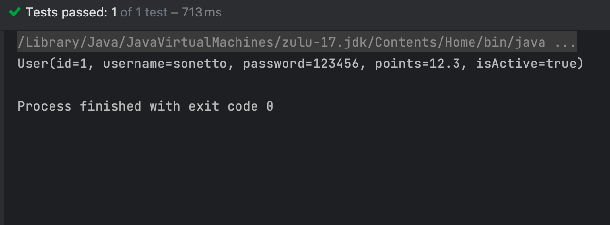

Spring 学习笔记
<!-- more -->

## Spring概述


- **Spring框架**是[Java](https://zh.wikipedia.org/wiki/Java)平台的一个[开源](https://zh.wikipedia.org/wiki/开放源代码)的全栈（[full-stack](https://zh.wikipedia.org/wiki/全栈)）[应用程式框架](https://zh.wikipedia.org/wiki/软件框架)和[控制反转](https://zh.wikipedia.org/wiki/控制反转)容器实现，一般被直接称为Spring。

- **Spring**是一个轻量级的控制**反转(IoC)**和面向**切面(AOP)**的**容器框架**。

- Spring最初的出现是为了解决EJB臃肿的设计，以及难以测试等问题。

- Spring为简化开发而生，让程序员只需关注核心业务的实现，尽可能的不再关注非业务逻辑代码（事务控制，安全日志等）。

##  Spring特点


1. 轻量

1. 1. 从大小与开销两方面而言Spring都是轻量的。完整的Spring框架可以在一个大小只有1MB多的JAR文件里发布。并且Spring所需的处理开销也是微不足道的。
   2. Spring**是非侵入式**的：Spring应用中的对象不依赖于Spring的特定类。

1. **控制反转**

1. 1. Spring通过一种称作控制反转（IoC）的技术促进了松耦合。当应用了IoC，一个对象依赖的其它对象会通过被动的方式传递进来，而不是这个对象自己创建或者查找依赖对象。你可以认为IoC与JNDI相反——不是对象从容器中查找依赖，而是容器在对象初始化时不等对象请求就主动将依赖传递给它。

1. **面向切面**

1. 1. Spring提供了面向切面编程的丰富支持，允许通过分离应用的业务逻辑与系统级服务（例如审计（auditing）和事务（transaction）管理）进行内聚性的开发。应用对象只实现它们应该做的——完成业务逻辑——仅此而已。它们并不负责（甚至是意识）其它的系统级关注点，例如日志或事务支持。

1. 容器

1. 1. Spring包含并管理应用对象的配置和生命周期，在这个意义上它是一种容器，你可以配置你的每个bean如何被创建——基于一个可配置原型（prototype），你的bean可以创建一个单独的实例或者每次需要时都生成一个新的实例——以及它们是如何相互关联的。然而，Spring不应该被混同于传统的重量级的EJB容器，它们经常是庞大与笨重的，难以使用。

1. 框架

1. 1. Spring可以将简单的组件配置、组合成为复杂的应用。在Spring中，应用对象被声明式地组合，典型地是在一个XML文件里。Spring也提供了很多基础功能（事务管理、持久化框架集成等等），将应用逻辑的开发留给了你。

所有Spring的这些特征使你能够编写更干净、更可管理、并且更易于测试的代码。它们也为Spring中的各种模块提供了基础支持。


## Spring对IOC的实现

- >控制反转（Inversion of Control，IoC）是面向对象编程中的一种设计思想，可以用来降低代码之间的耦合度，符合**依赖倒置原则**。
  >
  >控制反转的核心是：**将对象的创建权交出去，将对象和对象之间关系的管理权交出去，由第三方容器来负责创建与维护**。
  >
  >控制反转常见的实现方式：依赖注入（Dependency Injection，简称DI）

- 

**Spring通过依赖注入的方式来完成Bean管理的。**

**Bean管理说的是：Bean对象的创建，以及Bean对象中属性的赋值（或者叫做Bean对象之间关系的维护）。**

依赖注入：

- 依赖指的是对象和对象之间的关联关系。

- 注入指的是一种数据传递行为，通过注入行为来让对象和对象产生关系。

  - 依赖注入常见的实现方式包括两种：set注入 构造注入

    

  ### set注入

  **原理：**

  1. 通过`property`标签获取到属性名：userDao

  2. 通过属性名推断出set方法名：setUserDao

  3. 通过反射机制调用setUserDao()方法给属性赋值

  `property`标签的name是属性名。

  `property`标签的ref是要注入的bean对象的id。

  **(通过ref属性来完成bean的装配，这是bean最简单的一种装配方式。装配指的是：创建系统组件之间关联的动作)**

  

  ==set注入的核心实现原理：通过反射机制调用set方法来给属性赋值，让两个对象之间产生关系。==

  

  TeacherService往往需要依赖TeacherMapper/Dao 对象， 为了降低类与类，层与层之间的耦合度，我们通常采用面向接口编程。把对象的创建权交出去，交给Spring容器来管理。由Spring容器来创建对象和维护对象与对象之间的关系。

  

  通过在spring配置文件（如spring-config.xml）中，注册Bean，以及Bean与Bean的关系，Bean的属性值，来让Spring去创建和注入Bean。

  

  ```xml
  <bean id="teacherMapper" class="mapper.teacher.TeacherMapperImpl"></bean>
  <!--    基于setter的外部Bean注入-->
  <!--    <property> 标签内的name属性是对应setter方法的方法名去掉setter，首字母小写-->
  <!--    在规范的Bean setter 方法中，这个值就等于Bean的属性名称-->
  <bean id="teacherService" class="service.teacher.TeacherService">
    <property name="teacherMapper" ref="teacherMapper"/>
  </bean>
  ```

  在这个配置文件中，我们注册了两个Bean，`teacherMapper`和`teacherService` ，并通过set注入来给属性负责。

  ```java
  public class TestTeacherService {
    public void testTeacher(){
            ApplicationContext applicationContext = new ClassPathXmlApplicationContext("spring.xml");
            TeacherService teacherService = applicationContext.getBean("teacherService", TeacherService.class);
            teacherService.getTeachers();
        }
  }
  ```

  这样，我们就可以通过`applicatContext`对象得到，`applicationContext`对象通过读取配置文件得到。

  调用`applicatonContext.getBean("Bean id")`我们就可以得到实例化的Bean了。

  ### 构造注入

  ==通过调用构造方法来给属性赋值。==

  ```xml
  <!--    基于构造方法注入-->
  <!--    要求对应Bean中要有对应的构造方法-->
  <!--    可以通过<constructor-arg>标签 注入属性值-->
  <!--    其中，name属性通过属性名完成注入，值为value-->
  <!--    index 使用属性值下标完成注入，从0开始-->
  <bean id="blog" class="bean.Blog">
    <constructor-arg name="title" value="unveil a new cd"/>
    <constructor-arg name="author" value="regulus"/>
    <constructor-arg name="description" value="new cd"/>
    <constructor-arg name="id" value="1"/>
  </bean>
  ```


## set注入专题


### 注入外部Bean和内部Bean

```xml
<!--    基于setter的外部Bean注入-->
<!--    <property> 标签内的name属性是对应setter方法的方法名去掉setter，首字母小写-->
<!--    在规范的Bean setter 方法中，这个值就等于Bean的属性名称-->
    <bean id="teacherService" class="service.teacher.TeacherService">
        <property name="teacherMapper" ref="teacherMapper"/>
    </bean>
<!--    同样，我们可以基于内部Bean注入-->
<!--    内部Bean就是在<bean> 标签里嵌套定义的Bean-->
    <bean id="teacherService2" class="service.teacher.TeacherService">
        <property name="teacherMapper">
            <bean id="teacherMapper" class="mapper.teacher.TeacherMapperImpl"></bean>
        </property>
    </bean>
```

### 注入简单类型

==如果给简单类型赋值，使用value属性或value标签。而不是ref。==

```java
package bean;

import lombok.Data;

@Data
public class Person {
    private String name;
    private int age;
    private String gender;
}
```

```xml
<bean id="person" class="bean.Person">
    <property name="age" value="20"/>
    <property name="gender" value="female"/>
    <property name="name" value="sonetto"/>
</bean
```

**简单类型包括哪些呢？**

可以通过Spring的源码来分析一下：BeanUtils类

```java
public class BeanUtils{
  //.......
	public static boolean isSimpleValueType(Class<?> type) {
		return (Void.class != type && void.class != type &&
				(ClassUtils.isPrimitiveOrWrapper(type) ||
				Enum.class.isAssignableFrom(type) ||
				CharSequence.class.isAssignableFrom(type) ||
				Number.class.isAssignableFrom(type) ||
				Date.class.isAssignableFrom(type) ||
				Temporal.class.isAssignableFrom(type) ||
				URI.class == type ||
				URL.class == type ||
				Locale.class == type ||
				Class.class == type));
	}
    
    //........
}
```

通过源码分析得知，简单类型包括：

- 基本数据类型(int,char)
- 基本数据类型对应的包装类(String, Interger)
- String或其他的CharSequence子类
- Number子类
- Date子类
- Enum子类
- URI
- URL
- Temporal子类
- Locale
- Class
- 另外还包括以上简单值类型对应的数组类型。


### 注入集合数组


#### 数组

```java
package bean;

import lombok.Data;

@Data
public class Article {
    private String tags[];
    private Person person[];
}
```

```xml
<!--    注入数组-->
<!--    1. 数组元素是简单类型-->
    <bean id="article" class="bean.Article">
        <property name="tags">
            <array >
                <value>mac</value>
                <value>c++</value>
                <value>app recommend</value>
            </array>
        </property>
<!--        数组元素是引用类型-->
        <property name="person">
            <array>
                <ref bean="person"/>
            </array>
        </property>
    </bean>

```

**要点：**

- **如果数组中是简单类型，使用value标签。**
- **如果数组中是非简单类型，使用ref标签。**


#### 集合

```java
import lombok.Data;

import java.util.List;
import java.util.Set;

@Data
public class Library {
    private List<Book> bookList;
    private List<String> classifications;
    private Set<Book> bookSet;
}
```

```xml
<!--    注入集合-->
    <bean name="library" class="bean.Library">
<!--        注入List集合-->
        <property name="bookList">
            <list>
                <bean class="bean.Book">
                    <property name="bookName" value="爱丽丝梦游仙境"/>
                    <property name="ISBN" value="1192-2313-31-13"/>
                </bean>
                <bean class="bean.Book">
                    <property name="bookName" value="追风筝的人"/>
                    <property name="ISBN" value="1192-2343-34-33"/>
                </bean>
            </list>
        </property>
<!--        注入set集合-->
        <property name="bookSet">
           <set>
               <bean class="bean.Book">
                    <property name="bookName" value="爱丽丝梦游仙境"/>
                    <property name="ISBN" value="1192-2313-31-13"/>
                </bean>
                <bean class="bean.Book">
                    <property name="bookName" value="追风筝的人"/>
                    <property name="ISBN" value="1192-2343-34-33"/>
                </bean>
           </set>
        </property>
<!--        注入简单类型 String-->
        <property name="classifications">
            <array>
                <value>小说</value>
                <value>教育</value>
            </array>
        </property>
    </bean>
```

**注入List集合的时候使用list标签，如果List集合中是简单类型使用value标签，反之使用ref标签。**

**set集合中元素是简单类型的使用value标签，反之使用ref标签。**


#### map

==使用<map>标签和<entry key="" value="">嵌套==

```java
package bean;

import lombok.Data;

import java.util.Map;
@Data
public class Color {
    private Map<String,String> colorMap;
}
```

```xml
<!--    注入map-->
    <bean name="color" class="bean.Color">
        <property name="colorMap">
            <map>
                <entry key="RED" value="255,0,255"/>
                <entry key="GREEN" value="0,255,0"/>
                <entry key="BLUE" value="0,0,255"/>
            </map>
        </property>
    </bean>
```

### 注入Propertis

==使用<props>标签嵌套<prop>标签完成。==

```java
package bean;

import lombok.Data;

import java.util.Properties;

@Data
public class JDBC {
    private Properties properties;
}
```

```xml
<!--注入properties-->
<bean name="JDBC" class="bean.JDBC">
  <property name="properties" >
      <props>
          <prop key="DRIVER">com.mysql.jdbc.Driver</prop>
          <prop key="URL">jdbc:mysql://localhost:3306/demo?useUnicode=true&amp;characterEncoding=utf-8</prop>
          <prop key="USERNAME">root</prop>
          <prop key="PASSWORD">password</prop>
      </props>
  </property>
</bean>
```

### 注入空字符串和NULL

不注入就是`null`，空字符串可以设置`value=""`注入

除此之外，还可以使用`<value/>`这个自闭和标签注入空字符串，以及使用`<null/>`标签注入null。

```xml
<!--空串的第一种方式-->
<property name="email" value=""/>
<!--空串的第二种方式-->
<property name="email">
  <value/>
</property>
<!--注入null-->
<bean id="vipBean" class="com.powernode.spring6.beans.Vip">
  <property name="email">
      <null/>
  </property>
</bean>
```

### 注入特殊符号

XML中有5个特殊字符，分别是：<、>、'、"、&

以上5个特殊符号在XML中会被特殊对待，会被当做XML语法的一部分进行解析，如果这些特殊符号直接出现在注入的字符串当中，会报错。

解决方案包括两种：

- 第一种：特殊符号使用转义字符代替。
- 第二种：将含有特殊符号的字符串放到：<![CDATA[]]> 当中。因为放在CDATA区中的数据不会被XML文件解析器解析。

5个特殊字符对应的转义字符分别是：

| **特殊字符** | **转义字符** |
| ------------ | ------------ |
| >            | \&gt;        |
| <            | \&lt;        |
| '            | \&apos;      |
| "            | \&quot;      |
| &            | \&amp;       |


## Bean的实例化方式

1. 通过构造方法实例化

2. 通过简单工厂模式实例化

3. **通过factory-bean实例化**

4. 通过factoryBean接口实例化


### 通过构造方法实例化Bean

通过构造方法实例化Bean时，默认情况下Spring会在加载配置文件的时候，也就是我们调用

```java
ApplicationContext applicationContext = new ClassPathXmlApplicationContext("spring.xml");
```

这段代码时，Spring调用目标Bean的无参构造方法实例化Bean。


### 通过简单工厂模式实例化Bean

在Spring框架中，你可以使用简单工厂模式来实例化Bean。

1. 创建一个工厂类，该类负责实例化Bean并返回实例化后的对象。这个工厂类可以是一个**普通的Java类，不需要实现特定的接口**。

```java
public class BeanFactory {
    public static MyBean createBean() {
        // 在这里进行实例化Bean的逻辑
        MyBean bean = new MyBean();
        // 可以进行一些初始化操作
        bean.setName("Example Bean");
        // 返回实例化后的Bean对象
        return bean;
    }
}
```

在上面的示例中，`MyBean`是要实例化的Bean类，你可以根据实际情况替换为你自己的Bean类。在`createBean()`方法中，你可以根据需要进行Bean的实例化，并对其进行一些初始化操作。


2. 在你的Spring配置文件中，可以使用工厂方法来创建Bean的实例。通过在配置文件中声明一个工厂方法，Spring将调用该方法来获取Bean的实例。

```xml
<bean id="myBean" class="com.example.BeanFactory" factory-method="createBean" />
```

在上面的示例中，`id`属性指定了Bean的ID，`class`属性指定了工厂类的全限定名，`factory-method`属性指定了工厂类中用于创建Bean实例的方法名。

现在，当Spring容器启动时，它将使用工厂方法来实例化`myBean`。你可以通过从容器中获取该Bean来使用它。

```java
MyBean bean = (MyBean) applicationContext.getBean("myBean");
```

通过这种方式，你可以使用简单工厂模式来实例化Bean，并将其集成到Spring框架中。


> 简单工厂模式（Simple Factory Pattern）是一种创建型设计模式，它提供了一种集中化的方法来创建对象，而不需要在客户端代码中直接实例化具体的对象。
>
> 简单工厂模式由三个主要组件组成：
>
> 1. 工厂类（Factory Class）：负责创建对象的类。它包含一个或多个创建对象的静态方法，这些方法根据传入的参数或条件确定要创建的具体对象类型，并返回相应的对象实例。
> 2. 产品类（Product Class）：被工厂类创建的对象。它们共享一个共同的父类或接口，并定义了一组共同的行为和属性。
> 3. 客户端（Client）：使用工厂类创建对象的代码。客户端通过调用工厂类的方法来获取所需的对象，而无需直接实例化具体的产品类。
>
> 简单工厂模式的工作原理如下：
>
> 1. 客户端通过调用工厂类的方法请求创建对象。
> 2. 工厂类根据传入的参数或条件确定要创建的对象类型。
> 3. 工厂类实例化相应的对象，并返回给客户端。
> 4. 客户端使用返回的对象进行后续操作。
>
> 简单工厂模式的优点包括：
>
> - 将对象的创建逻辑集中在工厂类中，客户端无需知道具体的对象实现。
> - 简化了客户端代码，客户端只需要关注如何使用对象，而不需要关注对象的创建过程。
> - 通过工厂类可以轻松添加新的产品类，无需修改客户端代码。
>
> 然而，简单工厂模式也有一些局限性：
>
> - 如果需要添加新的产品类，需要修改工厂类的代码，违背了开闭原则。
> - 工厂类的职责较重，可能会导致类的职责不够单一。
> - 客户端只能通过工厂类提供的方法来创建对象，缺乏灵活性。
>
> 简单工厂模式适用于对象的创建逻辑相对简单、对象类型较少且不经常变化的情况。对于复杂的对象创建逻辑或对象类型频繁变化的情况，可以考虑使用其他创建型设计模式，如工厂方法模式或抽象工厂模式。


### Bean**的生命周期**

1. 五步
   1. 实例化Bean。默认使用无参数构造方法new一个Bean
   2. 注入Bean。通过Settet方法给属性赋值
   3. 初始化Bean。调用Bean的init方法，这个方法需要程序员自己编写，下destoy方法同。
   4. 使用Bean。
   5. 销毁Bean。调用bean的destroy方法。

```java
package bean;

public class Cat {
    private String name;
    public Cat() {
        System.out.println("1. new cat is instantiated");
    }
    public void miao(){
        System.out.println("4. cat: miao miao miao....");
    }
    public void setName(String name) {
        System.out.println("2. bean resign properties");
        this.name = name;
    }
    public void init(){
        System.out.println("3. cat is initialized");
    }
    public void destroy() {
        System.out.println("5. cat is destroyed");
    }
}
```

```xml
<bean name="cat" class="bean.Cat" init-method="init" destroy-method="destroy">
    <property name="name" value="Mio"/>
</bean>
```


1. **七步（需要掌握）**

   1. 实例化Bean。默认使用无参数构造方法new一个Bean
   2. 注入Bean。通过Settet方法给属性赋值
   3. ==Bean后处理器Before方法执行==
   4. 初始化Bean。调用Bean的init方法，这个方法需要程序员自己编写，下destoy方法同。==←在这里插入==
   5. ==Bean后处理器的After方法执行==
   6. 使用Bean。
   7. 销毁Bean。调用bean的destroy方法。

   在以上的5步中，第3步是初始化Bean，如果你还想在初始化前和初始化后添加代码，可以加入“Bean后处理器”。

   编写一个类实现BeanPostProcessor类，并且重写before和after方法：

   ```java
   package bean;
   
   import org.springframework.beans.BeansException;
   import org.springframework.beans.factory.config.BeanPostProcessor;
   
   public class PostProcessor implements BeanPostProcessor {
       @Override
       public Object postProcessBeforeInitialization(Object bean, String beanName) throws BeansException {
           System.out.println("------------------------>beforeInitialization");
           return BeanPostProcessor.super.postProcessBeforeInitialization(bean, beanName);
       }
   
       @Override
       public Object postProcessAfterInitialization(Object bean, String beanName) throws BeansException {
           System.out.println("------------------------>afterInitialization");
           return BeanPostProcessor.super.postProcessAfterInitialization(bean, beanName);
       }
   }
   ```

   在spring.xml文件中配置“Bean后处理器”：

   ```xml
   <!--    在spring.xml文件中配置“Bean后处理器”：-->
   <bean class="bean.PostProcessor"/>
   ```

   ==一定要注意：在spring.xml文件中配置的Bean后处理器将作用于当前配置文件中所有的Bean。==

2. 十步

   1. 实例化Bean。默认使用无参数构造方法new一个Bean

   2. 注入Bean。通过Settet方法给属性赋值

   3. ==检查Bean是否实现了Aware相关接口，并设置相关依赖。==

   4. Bean后处理器Before方法执行

   5. ==检查Bean是否实现了InitializingBean接口 & 调用接口方法。==

   6. 初始化Bean。调用Bean的init方法，这个方法需要程序员自己编写，下destoy方法同。

   7. Bean后处理器的After方法执行

   8. 使用Bean。

   9. ==检查Bean是否实现了DisposableBean接口，并调用接口方法==

   10. 销毁Bean。调用bean的destroy方法。

       

Aware相关的接口包括：BeanNameAware、BeanClassLoaderAware、BeanFactoryAware

- 当Bean实现了BeanNameAware，Spring会将Bean的名字传递给Bean。
- 当Bean实现了BeanClassLoaderAware，Spring会将加载该Bean的类加载器传递给Bean。
- 当Bean实现了BeanFactoryAware，Spring会将Bean工厂对象传递给Bean。

测试以上10步，可以让User类实现5个接口，并实现所有方法：

- BeanNameAware
- BeanClassLoaderAware
- BeanFactoryAware
- InitializingBean
- DisposableBean


## Bean的循环依赖问题

### Overview

Bean的循环依赖指的是在Spring容器中存在相互依赖的Bean实例。这种循环依赖会导致Bean的创建过程陷入死循环或无法完成，从而导致应用程序无法正常启动或出现其他异常。

循环依赖通常发生在以下情况下：

1. **构造函数循环依赖**：一个Bean的构造函数参数依赖于另一个Bean，而另一个Bean的构造函数参数又依赖于第一个Bean。这种情况下，当容器尝试实例化其中一个Bean时，它需要先实例化另一个Bean，而后者又依赖于前者，从而导致循环依赖。
2. **属性循环依赖**：一个Bean的属性依赖于另一个Bean，而另一个Bean的属性又依赖于第一个Bean。这种情况下，当容器尝试为一个Bean注入属性时，它需要先实例化另一个Bean，而后者又依赖于前者，从而导致循环依赖。

Spring框架通过使用**三级缓存**来解决Bean的循环依赖问题。在实例化Bean的过程中，如果发现循环依赖，Spring会先创建一个尚未完成初始化的早期对象并缓存起来，然后继续完成当前Bean的实例化和初始化。当其他Bean需要访问当前Bean时，将返回该早期对象。待当前Bean初始化完成后，Spring会将其设置到早期对象中，从而解决循环依赖。

然而，需要注意的是，循环依赖可能会导致潜在的问题，如死锁或不确定性状态。因此，应该尽量避免循环依赖的产生，合理设计Bean之间的依赖关系，或者考虑通过重构代码来消除循环依赖。


### Spring的三级缓存

Spring为什么可以解决set + singleton模式下循环依赖？


==根本的原因在于：这种方式可以做到将“实例化Bean”和“给Bean属性赋值”这两个动作分开去完成。==

实例化Bean的时候：调用无参数构造方法来完成。**此时可以先不给属性赋值，可以提前将该Bean对象“曝光”给外界。**

给Bean属性赋值的时候：调用setter方法来完成。

两个步骤是完全可以分离开去完成的，并且这两步不要求在同一个时间点上完成。

也就是说，Bean都是单例的，我们可以先把所有的单例Bean实例化出来，放到一个集合当中（我们可以称之为缓存），所有的单例Bean全部实例化完成之后，以后我们再慢慢的调用setter方法给属性赋值。这样就解决了循环依赖的问题。

那么在Spring框架底层源码级别上是如何实现的呢？请看：

```java
public class DefaultSingletonBeanRegistry extends SimpleAliasRegistry implements SingletonBeanRegistry {

   /** Maximum number of suppressed exceptions to preserve. */
   private static final int SUPPRESSED_EXCEPTIONS_LIMIT = 100;
// 1. 一级缓存 单例对象缓存池
   /** Cache of singleton objects: bean name to bean instance. */
   private final Map<String, Object> singletonObjects = new ConcurrentHashMap<>(256);
// 3. 三级缓存 原始对象缓存池
   /** Cache of singleton factories: bean name to ObjectFactory. */
   private final Map<String, ObjectFactory<?>> singletonFactories = new HashMap<>(16);
// 2. 二级缓存 早期对象缓存池
   /** Cache of early singleton objects: bean name to bean instance. */
   private final Map<String, Object> earlySingletonObjects = new ConcurrentHashMap<>(16);
}
```

Spring的三级缓存（Three-Level Cache）是Spring框架在处理Bean实例化和循环依赖时使用的一种机制。它是为了解决Bean的循环依赖问题而引入的。

三级缓存在Spring容器的Bean生命周期中扮演重要角色，它包含了以下三个层次的缓存：

1. 第一级缓存：单例对象缓存池（Singleton Cache）。
   - 第一级缓存是Spring容器中的单例Bean缓存。
   - **当Spring容器创建一个单例Bean时，会首先尝试从第一级缓存中获取已经创建的实例。**
   - 如果能够找到实例，则直接返回给调用者，避免重复实例化相同的单例Bean。
   - 第一级缓存的键值对结构为 `<Bean名称, Bean实例>`。

2. 第二级缓存：早期对象缓存池（Early-Stage Object Cache）。
   - **第二级缓存用于解决Bean的循环依赖问题。**
   - 当Bean实例化过程中存在循环依赖时，Spring会将已经创建但尚未完成初始化的Bean对象放入第二级缓存中。
   - 早期对象指的是在Bean实例化过程中已经创建出来但尚未完全初始化的对象。
   - 通过第二级缓存，Spring能够在后续的Bean初始化阶段中解决循环依赖，将依赖的Bean设置到早期对象中。
   - 第二级缓存的键值对结构为 `<Bean名称, 早期对象>`。

3. 第三级缓存：原始对象缓存池（Raw Object Cache）。
   - 第三级缓存是最底层的缓存，用于存储尚未经过任何处理的原始Bean对象。
   - 当容器创建Bean时，如果无法从第一级和第二级缓存中获取Bean实例，Spring会将正在创建的Bean放入第三级缓存中，作为缓存的最后一道防线。
   
   - 原始对象指的是尚未经过任何处理的初始对象，尚未进行依赖注入等操作。
   
   - 通过第三级缓存，Spring可以确保在解决循环依赖后，将原始对象进行进一步的初始化操作。
   
   - 第三级缓存的键值对结构为 `<Bean名称, 原始对象>`。

在Bean的实例化过程中，Spring框架会依次尝试从三级缓存中获取Bean的实例，以满足依赖注入和循环依赖的需求。这种缓存机制使得Spring能够高效地处理复杂的Bean依赖关系，保证了Bean的正确创建和初始化。

需要注意的是，**三级缓存仅在处理单例（Singleton）作用域的Bean时使用，对于其他作用域（如原型Prototype）的Bean，不会使用三级缓存。每次请求原型Bean时，Spring都会创建一个新的实例，避免了循环依赖的问题。**


## 手写Spring框架


Spring底层是通过反射机制来实例化对象，以及属性注入的，在手写Spring框架之前，我们需要了解反射机制。


> JAVA反射机制是在运行状态中，对于任意一个类，都能够知道这个类的所有属性和方法；对于任意一个对象，都能够调用它的任意一个方法和属性；这种动态获取的信息以及动态调用对象的方法的功能称为java语言的反射机制。Java反射机制在框架设计中极为广泛，需要深入理解。


通过反射，我们可以拿到类的属性，方法。 回顾Spring框架，我们需要编写一个spring的配置文件例如：spring.xml，在这个配置文件中，我们注册一个类，并注入属性值。

```xml
<?xml version="1.0" encoding="UTF-8"?>
<beans>
    <beans>
        <bean name="user" class="bean.User">
            <property name="id" value="1"/>
            <property name="username" value="sonetto"/>
            <property name="password" value="123456"/>
            <property name="points" value="12.3"/>
            <property name="isActive" value="true"/>
        </bean>
        <bean name="userDao" class="bean.UserDao"/>
        <bean name="userService" class="bean.UserService">
            <property name="userDao" ref="userDao"/>
        </bean>
    </beans>
</beans>
```

在实例化一个对象时，我们通过`ClassPathXmlApplicationContext()`，传入我们的配置文件，拿到一个`ApplicationContext`对象，通过`ApplicationContext`对象调用`getBean（）`方法来获取对象, 最终调用对象发方法，来使用Bean。

```java
ApplicationContext context = new ClassPathXmlApplicationContext("mySpring.xml");
        User user = (User) context.getBean("user");
        System.out.println(user);
        UserService userService = (UserService) context.getBean("userService");
        userService.createUser();
```

我们的最终目的就是调用对象的方法，而一个指定一个方法需要四要素： 什么对象（对象的全限定类名是什么？）什么方法（方法名），什么参数（参数的类型和数量），返回什么值。


指定来这方法的四个要素，我们就可以唯一的确定一个方法，然后调用该方法。


在spring的配置文件中，注册一个Bean时，我们需要提供这个Bean的全限定类名，也就是Bean标签内的class属性的内容。有了全限定类名，我们就可以通过反射机制调用`class.forName()`拿到这个对象的类。更进一步，通过这个类拿到构造方法，实例化对象。拿到我们需要的目标方法，最终调用这个目标方法。


有了整个大概的全景图，我们就可以开始编写我们自己的Spring框架了。


1. 首先，让我们先编写一个`ApplicationContext` 接口类，这个类定义了`getBean()`方法

```java
package org.loulan.spring;


public interface ApplicationContext {
    Object getBean(String name);
}
```

2. 然后编写该接口的实现类`ClassPathXmlApplicationContext` 我们正是通过这个类来实例化一个`ApplicationContext` 对象。回顾`ApplicationContext context = new ClassPathXmlApplicationContext("mySpring.xml");` 这段代码，实例化这个类时，我们需要一个参数——Spring配置文件，这个参数对应一个构造方法，所以我们的`ClassPathXmlApplicationContext`也需要提供这个构造方法。

```java
public ClassPathXmlApplicationContext(String resource) {}
```

3. 我们需要读取使用这个框架的配置文件，并拿到所有的Bean标签。要拿到这个xml文件并读取里面的标签已经属性，我们可以借助`SAXReader` 这个类来完成。通过Maven我们可以轻松的引入这个jar包。同时，我们还需要解析这个xml文件，通过`Document` 来完成。所以我还需要dom4j的依赖。

   ```xml
   <!--        dom4j依赖-->
           <dependency>
               <groupId>org.dom4j</groupId>
               <artifactId>dom4j</artifactId>
               <version>2.1.4</version>
           </dependency>
   <!--        jaxen的依赖，因为要使用它解析XML文件-->
           <dependency>
               <groupId>jaxen</groupId>
               <artifactId>jaxen</artifactId>
               <version>2.0.0</version>
           </dependency>
   ```

    接下来就是愉快的编写代码啦！

   ```java
   package org.loulan.spring;
   
   import org.dom4j.Document;
   import org.dom4j.DocumentException;
   import org.dom4j.Element;
   import org.dom4j.Node;
   import org.dom4j.io.SAXReader;
   import org.slf4j.Logger;
   import org.slf4j.LoggerFactory;
   
   import java.lang.reflect.Constructor;
   import java.lang.reflect.Field;
   import java.lang.reflect.Method;
   import java.util.HashMap;
   import java.util.List;
   import java.util.Map;
   
   public class ClassPathXmlApplicationContext implements ApplicationContext{
       private Map<String,Object>beans = new HashMap<String,Object>();
       private Logger logger = LoggerFactory.getLogger(ClassPathXmlApplicationContext.class);
       public ClassPathXmlApplicationContext(String resource) {
           //1. 拿到这个xml配置文件
           SAXReader reader = new SAXReader();
           Document document = null;
           try {
               document = reader.read(ClassLoader.getSystemClassLoader().getResourceAsStream(resource));
               // 获取所有的bean标签
               List<Node> beanNodes = document.selectNodes("//bean");
               // 遍历集合
               beanNodes.forEach(beanNode -> {
                   Element beanElt = (Element) beanNode;
                   // 获取id
                   String id = beanElt.attributeValue("name");
                   // 获取className
                   String className = beanElt.attributeValue("class");
                   logger.info("id->"+id+" className->"+className);
                   try {
                       //通过反射拿到class
                       Class<?> clazz = Class.forName(className);
                       // 获得class的构造器
                       Constructor<?> constructor = clazz.getConstructor();
                       // 实例化对象
                       Object o = constructor.newInstance();
                       logger.info("实例化对象->"+o);
                       // 暴露bean，放在map（缓存）
                       beans.put(id,o);
                   } catch (Exception e) {
                       e.printStackTrace();
                   }
               });
               //再次遍历bean，给属性赋值（DI）
               beanNodes.forEach(beanNode -> {
                   Element beanElt = (Element) beanNode;
                   // 获取id
                   String id = beanElt.attributeValue("name");
                   // 获取className
                   String className = beanElt.attributeValue("class");
                   // 获取实例化对象
                   Object bean = beans.get(id);
                   logger.info("获取实例化对象"+bean.toString());
                   //拿到properties
                   List<Node> properties = beanElt.selectNodes("property");
                   properties.forEach(property ->{
                       logger.info("获取property-> " + property);
                       Element element = (Element) property;
                       String name = element.attributeValue("name");
                       String arg = element.attributeValue("value");
                       String ref = element.attributeValue("ref");
                       String methodName = "set"+name.toUpperCase().charAt(0)+name.substring(1);
                       logger.info("methodName="+methodName+" arg="+arg);
                       Object actualValue = null;
                       try {
                           //获得属性
                           Field field = bean.getClass().getDeclaredField(name);
                           Method method = bean.getClass().getMethod(methodName, field.getType());
                           logger.info("参数类型->"+field.getType().getSimpleName());
                           if(ref != null){
                               //如果参数是引用数据类型
                               method.invoke(bean,beans.get(ref));
                           } else if( arg != null){
                               //参数是简单数据类型
                               switch (field.getType().getSimpleName()){
                                   case "boolean","Boolean": actualValue = Boolean.parseBoolean(arg); break;
                                   case "byte","Byte": actualValue = Byte.parseByte(arg); break;
                                   case "short","Short": actualValue = Short.parseShort(arg); break;
                                   case "int","Integer": actualValue = Integer.parseInt(arg); break;
                                   case "long", "Long": actualValue = Long.parseLong(arg); break;
                                   case "float","Float": actualValue = Float.parseFloat(arg); break;
                                   case "double","Double": actualValue = Double.parseDouble(arg); break;
                                   case "char","Character": actualValue = arg.charAt(0); break;
                                   case "String": actualValue = arg; break;
                               }
                               method.invoke(bean,actualValue);
                           }
                       } catch (Exception e) {
                           e.printStackTrace();
                       }
   
                   });
               });
           } catch (Exception e) {
               e.printStackTrace();
           }
       }
   
       @Override
       public Object getBean(String name) {
   
           return beans.get(name);
       }
   }
   ```

代码很长，别急我们一步步分析：

这段代码做三件事：

1. 通过 `document = reader.read(ClassLoader.getSystemClassLoader().getResourceAsStream(resource));`拿到配置文件。

2. 拿到所以的bean标签,获取标签的name属性和和class属性值，name属性值是这个bean的id，class是这个类的全限定类名。

3. 通过反射机制实例化对象，并放到map集合中。

   这一步相当于把bean放入二级缓存中，提前暴露bean。map集合就是二级缓存，其中key存放对象的name或id，value存放这个实例化的对象。

```java
//1. 拿到这个xml配置文件
SAXReader reader = new SAXReader();
Document document = null;
try {
    document = reader.read(ClassLoader.getSystemClassLoader().getResourceAsStream(resource));
    // 获取所有的bean标签
    List<Node> beanNodes = document.selectNodes("//bean");
    // 遍历集合
    beanNodes.forEach(beanNode -> {
        Element beanElt = (Element) beanNode;
        // 获取id
        String id = beanElt.attributeValue("name");
        // 获取className
        String className = beanElt.attributeValue("class");
        logger.info("id->"+id+" className->"+className);
        try {
            //通过反射拿到class
            Class<?> clazz = Class.forName(className);
            // 获得class的构造器
            Constructor<?> constructor = clazz.getConstructor();
            // 实例化对象
            Object o = constructor.newInstance();
            logger.info("实例化对象->"+o);
            // 暴露bean，放在map（缓存）
            beans.put(id,o);
        } catch (Exception e) {
            e.printStackTrace();
        }
    });
```

实例化bean之后，接下里就是依赖注入了（Dependency Injection）。我们需要再次遍历每一个bean节点，一个bean节点相当于一个bean对象。对于每一个bean对象，再次遍历bean对象的<property>标签，这对于这些bena对象的属性值，对于这些属性值，我们需要通过set注入的方法给属性赋值。

这时候就是调用对象的set方法了，还记得调用方法的四要素吗？没错，我们需要方法所属的对象，方法名，方法参数，以及返回值类型。

其中，对象我们可以通过二级缓存拿到，也就是上一部分的map集合。方法参数也是属性值，在property标签的value属性值指明。返回值就更轻松了，set方法的返回值都是void。

那么剩下的，就是方法名了，按照Java命名规范规范，set方法名有set加上属性名的首字母大小组成，符合驼峰命名规范。我们拿到了属性值，就可以通过拼接字符串的方法来得到方法名。

但是还有一个问题，属性值有普通类型和引用类型两种，对应引用类型，我们的做法很简单，通过二级缓存拿到引用对象，再通过set方法注入就好啦。但是普通类型就比较麻烦了。

首先，普通类型太多，而我们从配置文件中拿到的数据都是字符串类型，如果目标属性是String类型的话很直接，直接调用set方法即可。但是如果属性类型是int类型，或者bool类型，我们就需要把String类型转换成对应的类型。

好在这些普通类都有对应的包装类型，通包装类型我们可以轻松的实现字符串类型的转换，所以我们需要的就是匹配每一个普通类型，对这样的类型做类型转换即可。

普通类型太多，出于学习的目的，假设我们的Spring框架只支持其中部分类型。

```java
//再次遍历bean，给属性赋值（DI）
beanNodes.forEach(beanNode -> {
  Element beanElt = (Element) beanNode;
  // 获取id
  String id = beanElt.attributeValue("name");
  // 获取className
  String className = beanElt.attributeValue("class");
  // 获取实例化对象
  Object bean = beans.get(id);
  logger.info("获取实例化对象"+bean.toString());
  //拿到properties
  List<Node> properties = beanElt.selectNodes("property");
  properties.forEach(property ->{
      logger.info("获取property-> " + property);
      Element element = (Element) property;
      String name = element.attributeValue("name");
      String arg = element.attributeValue("value");
      String ref = element.attributeValue("ref");
      String methodName = "set"+name.toUpperCase().charAt(0)+name.substring(1);
      logger.info("methodName="+methodName+" arg="+arg);
      Object actualValue = null;
      try {
          //获得属性
          Field field = bean.getClass().getDeclaredField(name);
          Method method = bean.getClass().getMethod(methodName, field.getType());
          logger.info("参数类型->"+field.getType().getSimpleName());
          if(ref != null){
              //如果参数是引用数据类型
              method.invoke(bean,beans.get(ref));
          } else if( arg != null){
              //参数是简单数据类型
              switch (field.getType().getSimpleName()){
                  case "boolean","Boolean": actualValue = Boolean.parseBoolean(arg); break;
                  case "byte","Byte": actualValue = Byte.parseByte(arg); break;
                  case "short","Short": actualValue = Short.parseShort(arg); break;
                  case "int","Integer": actualValue = Integer.parseInt(arg); break;
                  case "long", "Long": actualValue = Long.parseLong(arg); break;
                  case "float","Float": actualValue = Float.parseFloat(arg); break;
                  case "double","Double": actualValue = Double.parseDouble(arg); break;
                  case "char","Character": actualValue = arg.charAt(0); break;
                  case "String": actualValue = arg; break;
              }
              method.invoke(bean,actualValue);
          }
      } catch (Exception e) {
          e.printStackTrace();
      }
```

最后，提供一个getBean方法的接口，用于活动实例化的bean

```java
@Override
public Object getBean(String name) {
    return beans.get(name);
}
```

到这里，我们的Spring框架就算编写完了，打包发布吧！


### 测试自己的Spring框架

创建一个Maven模块，并引入刚刚打包好的jar包吧

```xml
<dependency>
    <groupId>cn.loulan</groupId>
    <artifactId>MySpring</artifactId>
    <version>1.0-SNAPSHOT</version>
</dependency>
```

首先，我们需要一个Bean类

```java
package bean;

import lombok.Data;

@Data
public class User {
    private int id;
    private String username;
    private String password;
    private float points;
    private boolean isActive;

    public void setIsActive(boolean active) {
        isActive = active;
    }
}

```

然后是Spring配置文件

```java
<?xml version="1.0" encoding="UTF-8"?>
<beans>
    <beans>
        <bean name="user" class="bean.User">
            <property name="id" value="1"/>
            <property name="username" value="sonetto"/>
            <property name="password" value="123456"/>
            <property name="points" value="12.3"/>
            <property name="isActive" value="true"/>
        </bean>
        <bean name="userDao" class="bean.UserDao"/>
        <bean name="userService" class="bean.UserService">
            <property name="userDao" ref="userDao"/>
        </bean>
    </beans>
</beans>
```

编写测试类：

```java
package bean;

import org.junit.Test;
import org.loulan.spring.ApplicationContext;
import org.loulan.spring.ClassPathXmlApplicationContext;
import org.springframework.beans.factory.support.DefaultSingletonBeanRegistry;

public class TestBean {
    @Test
    public void test(){
        ApplicationContext context = new ClassPathXmlApplicationContext("mySpring.xml");
        User user = (User) context.getBean("user");
        System.out.println(user);

    }
}
```



跑起来了！


## Spring 集成MyBatis框架


### Overview

1. 需要的依赖

   1. Spring-context(关联引入Spring-aop)
   2. Spring-MyBatis（Spring 集成MyBatis）
   3. Mysql-connetor(Mysql驱动)
   4. Spring-jdbc（链接数据库）
   5. MyBatis
   6. Junit（单元测试）
   7. druid(数据源)
   8. Lombok

2. 配置数据库

   1. account表，字段act_no,banlance

3. 项目结构搭建

   1. Bean(pojo)

      1. Account
   2. mapper
   
      1. AccountMapper
      2. AccountMapper.xml
   3. Service 

      1. AccountService
      2. AccountServiceImpl
   4. resources
   
      1. Spring核心配置文件Spring.xml
   
         1. 组建扫描
         2. 事务管理器
      2. MyBatis核心配置文件MyBatis.xml
      
         1. 注册Mapper
         2. 类别名
         3. 设置日志实现
      3. - 该文件可以没有，大部分的配置可以转移到spring配置文件中。
         - 如果遇到mybatis相关的系统级配置，还是需要这个文件。
      4. DB.propertis
      
         1. Driver→com.mysql.jdbc.Driver
         2. url→jdbc:mysql://localhost:3307/class?useUnicode=true&characterEncoding=utf-8
         3. username→root
         4. Password→root
      5. 编写测试类

   

### 编写mapper

```java
package cn.loulan.mapper;

import cn.loulan.bean.Account;

import java.util.List;

public interface AccountMapper {
    int insert(Account account);
    int delete(String actNo);
    int update(Account account);
    Account getById(String actNo);
    List<Account> getAll();

}
```

```xml
<?xml version="1.0" encoding="UTF-8" ?>
<!DOCTYPE mapper
        PUBLIC "-//mybatis.org//DTD Mapper 3.0//EN"
        "https://mybatis.org/dtd/mybatis-3-mapper.dtd">
<mapper namespace="cn.loulan.mapper.AccountMapper">
    <insert id="insert">
        Insert into account values(#{actNo},#{balance})
    </insert>
    <update id="update" parameterType="Account">
        update account set balance = #{balance} where act_no = #{actNo}
    </update>
    <delete id="delete" >
        delete account where act_no = #{actNo};
    </delete>
    <select id="getById" resultType="Account">
        select * from account where act_no =#{actNo}
    </select>
    <select id="getAll" resultType="Account">
        select * from account;
    </select>

</mapper>
```

### Service

```java
package cn.loulan.service;

import cn.loulan.bean.Account;

import java.util.List;

public interface AccountService {
    boolean save(Account account);
    boolean delete(String actNo);
    boolean modify(Account account);
    Account getById(String actNo);
    List<Account> getAllAccounts();
    boolean transaction(String from, String to,double amount);
}
```

```java
package cn.loulan.service;

import cn.loulan.bean.Account;
import cn.loulan.mapper.AccountMapper;
import lombok.Data;
import org.springframework.beans.factory.annotation.Autowired;
import org.springframework.stereotype.Service;
import org.springframework.transaction.annotation.Transactional;

import java.util.List;
@Service("accountService")
@Transactional
public class AccountServiceImpl implements AccountService {

    private AccountMapper accountMapper;
    @Autowired
    public void setMapper(AccountMapper mapper) {
        this.accountMapper = mapper;
    }

    @Override
    public boolean save(Account account) {
       accountMapper.insert(account);
        return true;
    }

    @Override
    public boolean delete(String actNo) {
        accountMapper.delete(actNo);
        return true;
    }

    @Override
    public boolean modify(Account account) {
        accountMapper.update(account);
        return false;
    }

    @Override
    public Account getById(String actNo) {
        return accountMapper.getById(actNo);
    }

    @Override
    public List<Account> getAllAccounts() {
        return accountMapper.getAll();
    }

    @Override
    public boolean transaction(String from, String to, double amount) {
        Account fromAccount = accountMapper.getById(from);
        Account toAccount = accountMapper.getById(to);
        if(fromAccount.getBalance() < amount) {
            throw new RuntimeException("余额不足");
        }
        fromAccount.setBalance(fromAccount.getBalance() -  amount);
        toAccount.setBalance(toAccount.getBalance() + amount);
        int count = accountMapper.update(fromAccount);
         count += accountMapper.update(toAccount);
        if (count != 2) throw new RuntimeException("异常");
        return count == 2 ? true : false;

    }
}
```

### resources

数据配置文件

```properties
#DRIVER=com.mysql.jdbc.Driver
DRIVER=com.mysql.cj.jdbc.Driver
URL=jdbc:mysql://localhost:3306/demo?useUnicode=true&characterEncoding=utf-8
USERNAME=root
PASSWORD=root
```

MyBatis核心配置文件：

```xml
<?xml version="1.0" encoding="UTF-8" ?>
<!DOCTYPE configuration
        PUBLIC "-//mybatis.org//DTD Config 3.0//EN"
        "https://mybatis.org/dtd/mybatis-3-config.dtd">
<configuration>
    <!--日志实现-->
    <settings>
        <setting name="logImpl" value="STDOUT_LOGGING"/>
    </settings>
    <typeAliases>
        <typeAlias alias="Account" type="cn.loulan.bean.Account"/>
    </typeAliases>
</configuration>
```

Spring核心配置文件

```xml
<?xml version="1.0" encoding="UTF-8"?>
<beans xmlns="http://www.springframework.org/schema/beans"
       xmlns:xsi="http://www.w3.org/2001/XMLSchema-instance"
       xmlns:context="http://www.springframework.org/schema/context" xmlns:tx="http://www.springframework.org/schema/tx"
       xsi:schemaLocation="http://www.springframework.org/schema/beans http://www.springframework.org/schema/beans/spring-beans.xsd http://www.springframework.org/schema/context https://www.springframework.org/schema/context/spring-context.xsd http://www.springframework.org/schema/tx http://www.springframework.org/schema/tx/spring-tx.xsd">
<!--开启组件自动扫描-->
    <context:component-scan base-package="cn.loulan.service"/>
<!--    加载数据库配置文件-->
    <context:property-placeholder location="DB.properties"/>

<!--    配置数据源-->
    <bean id="dataSource" class="com.alibaba.druid.pool.DruidDataSource">
        <property name="driverClassName" value="${DRIVER}"/>
        <property name="url" value="${URL}"/>
        <property name="username" value="${USERNAME}"/>
        <property name="password" value="${PASSWORD}"/>
    </bean>
    <!--Mapper扫描器-->
    <bean class="org.mybatis.spring.mapper.MapperScannerConfigurer">
        <property name="basePackage" value="cn.loulan.mapper"/>
    </bean>
    <!--SqlSessionFactoryBean-->
    <bean class="org.mybatis.spring.SqlSessionFactoryBean">
        <!--mybatis核心配置文件路径-->
        <property name="configLocation" value="mybatis.xml"/>
        <!--注入数据源-->
        <property name="dataSource" ref="dataSource"/>
        <!--起别名-->
        <property name="typeAliasesPackage" value="cn.loulan.bean"/>
    </bean>
    <!--事务管理器-->
    <bean id="txManager" class="org.springframework.jdbc.datasource.DataSourceTransactionManager">
        <property name="dataSource" ref="dataSource"/>
    </bean>

    <!--开启事务注解-->
    <tx:annotation-driven transaction-manager="txManager"/>
</beans>
```

### 编写测试类

```java
package cn.loulan.service;

import cn.loulan.bean.Account;
import cn.loulan.mapper.AccountMapper;
import cn.loulan.util.MybatisUtil;
import org.apache.ibatis.session.SqlSession;
import org.junit.Test;
import org.springframework.context.ApplicationContext;
import org.springframework.context.support.ClassPathXmlApplicationContext;

import java.util.List;

public class ServiceTest {
    @Test
    public void mapper(){
        SqlSession sqlSession = MybatisUtil.getSqlSession();
        AccountMapper mapper = sqlSession.getMapper(AccountMapper.class);
//        mapper.insert(new Account("123",500.00));
        mapper.insert(new Account("234",500.00));
        sqlSession.commit();
        sqlSession.close();

    }
    @Test
    public void testSpring()throws Exception {
        ApplicationContext applicationContext = new ClassPathXmlApplicationContext("spring.xml");
        AccountService accountService = applicationContext.getBean("accountService", AccountService.class);
        List<Account> allAccounts = accountService.getAllAccounts();
        allAccounts.forEach(account ->{
            System.out.println(account);
        });
    }
    @Test
    public void testTransaction(){
        ApplicationContext applicationContext = new ClassPathXmlApplicationContext("spring.xml");
        AccountService accountService = applicationContext.getBean("accountService", AccountService.class);
        accountService.transaction("1","234",100);
    }
}
```


### 总结 

配置文件还是要写好多，而且完全靠记忆嘛。简单整理一下这些配置文件，主要分为两部分，spring的配置文件和mybatis的配置文件。spring配置文件中主要的配置有：

1. 注册bean，在用注解开发时开启组建自动扫描
2. 加载数据库配置文件。
3. 配置数据源。包括数据库的一下配置信息，驱动器啊url之类的。
4. Mapper扫描器。相当于在mybatis中注册mapper，使用包名扫描这个包下的所有mapper。
5. 配置sqlSessionFactoryBean在这个bean中价值mybatis的核心配置文件，以及价值数据源，类型别名等等可以在mybatis中配置的内容都可以通过这个bean来配置。
6. 配置事务管理器
7. 开启事务注解


这样在MyBatis配置文件的内容就少很多了，甚至可以不配或者没有。这个案例中，我们配置了日志实现和类型别名。


感觉好乱，课程的这一段讲得太快了，老杜是不是赶着吃饭啊。


Spring框架下的mybatis还是和直接用mybatis有很大区别。Spring中，我们不需要一个工具类用于价值mybatis配置文件以便获取sqlsession对象了。事务的处理也不需要管了，虽然简化了很多代码，但是总有一种项目莫名其妙就跑起来的感觉，终极还是我了解得不够多了吧。
