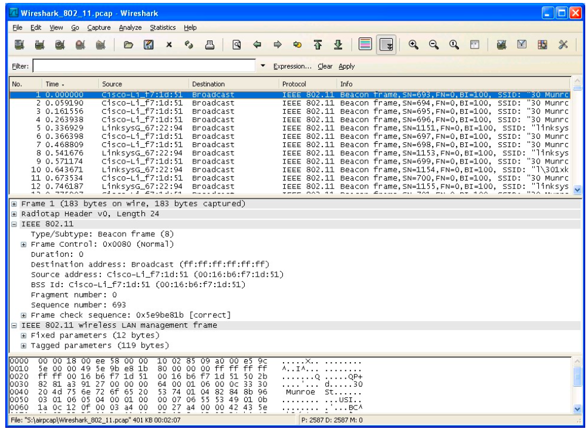

在本实验中，我们将研究 802.11 无线协议。
<!-- more -->

------

## Wireshark 实验:  802.11

**《计算机网络：自顶向下方法（第6版）》补充材料，J.F. Kurose and K.W. Ross**

“不闻不若闻之，闻之不若见之，见之不若知之，知之不若行之。” ——中国谚语 

© 2005-2012, J.F Kurose and K.W. Ross, All Rights Reserved

------

在本实验中，我们将研究 802.11 无线协议。在开始本实验之前，建议您重新阅读课本的中第 7.3 节。因为我们将比课本深入研究 802.11 协议内容，因此您可能需要查看 Pablo Brenner (Breezecom Communications)写的《802.11 协议技术指南》[ATechnical Tutorial on the 802.11Protocol ](http://www.sss-mag.com/pdf/802_11tut.pdf) 以及 Jim Geier 写的《了解 802.11 帧类型》[Understanding 802.11 Frame Types](http://www.wi-fiplanet.com/tutorials/article.php/1447501) 。当然，您还需要查阅 802.11 的圣经-它的标准书[《ANSI / IEEE 标准 802.11,1999 版(R2003)》(ANSI/IEEE Std 802.11, 1999 Edition (R2003)](http://gaia.cs.umass.edu/wireshark-labs/802.11-1999.pdf )。您可能会发现标准书第 36 页的表 1 在分析无线跟踪特别有用. 

在除本次实验以外其它的 Wireshark 实验中，我们都是在有线以太网连接进行抓包(捕获帧)。在本实验中，因为 802.11 是无线链路层协议，我们将在“空中”捕获帧。不幸的是，带有 802.11 协议的无线网卡(NIC)设备驱动无法提供钩子将捕获/接收的 802.11 帧用于 Wireshark 实验分析。因此，在本实验中，您可能会使用作 者捕获的 802.11 帧(抓包结果)进行分析。如果您有能力自己捕获，欢迎您自己动手。如果您乐意自己跟踪，或许你可以买一个小的 [USB 网卡 AirPcap 用以捕获 802.1 帧](www.cacetech.com)

## Getting Started 开始实验

从 http://gaia.cs.umass.edu/wireshark-labs/wireshark-traces.zip 下载压缩包并且得到 Wireshark_802_11.pcap。本结果由团队的一个作者在家庭网络使用 AirPcap 以及运行 Wireshark 的计算机得到，结果其中包括 Linksys 802.11g 的组合接入点(路由器)，该接入点为两台有线 PC 和一台无线 PC 提供服务。作者幸运邻居也使用无线接入点。在此跟踪文件中，我们能看到在通道 6 上捕获的帧。由于我们需要分析主机和接入点不是使用通道 6 的唯一组合，我们也会看到其他例如邻居接入点使用通道6被作者收集到。跟踪文件中采用的无线主机活动包括:

-  跟踪开始时，主机已经与 30 Munroe St 接入点关联(associated)。

- 在时间 24.82 时刻，主机向 IP 地址 128.119.245.12 的服务器发送 HTTP 请

  求，请求内容是 http://gaia.cs.umass.edu/wireshark-labs/alice.txt 。

- 在时间 32.82 时刻，主机向 IP 地址 128.119.240.19.的服务器发送 HTTP 请求，请求内容是 http://www.cs.umass.edu。

-  在时间 49.58 的时刻，主机断开了与 30 Munroe St 接入点的关联，并且尝试

  连接到 linksys_ses_24086 接入点。该接入点不是开放的接入点，因此主机始终没有成功与该接入点关联成功。

-  在时间 63.0 时刻，主机放弃尝试关联 linksys_ses_24086 接入点，并且再次连接30 Munroe St 接入点关联。

1. 下载作者的抓包结果后，使用 Wireshark 的 File 菜单打开该文件

   Wireshark_802_11.pcap，您应该看到与图 1 显示相同的结果

   

## Beacon Frames 信标帧

回想一下，802.11 接入点使用信标帧表示其存在。要回答下面的问题，您或许应该 展开 IEEE 802.11 帧并在 Wireshark 中间窗口看到它的字段详细信息。请尽量清晰 的展示您的答案，必要时您可以在图中用标记辅以说明。您的答案应该简单可读。

- 发送最多信标帧的两个接入点的服务集标识符是多少(SSID)?

- inksys_ses_24086 接入点和 30 Munroe St.接入点的信标帧传输时间是多少?(提示:此时间间隔包含在信标帧本身之中。)

- 请以十六进制表示法找到 30 Munroe St 接入点的源 MAC 地址。回想课本中 图 7-13，并说明源地址，目的地址，基本服务集(BSS)的地址是什么。有 关 802.11 帧结构的详细讨论说明，请参阅 IEEE 802.11 标准文档(上文所 提)中的第 7 节。

- 30 Munroe St 接入点的信标帧目的地址十六进制表示是什么?

- 30 Munroe St 接入点的 BSS ID 地址是什么?

- 来自 30 Munroe St 接入点的信标帧宣告接入点可以支持四种数据速率和八种

  额外的“扩展支持速率”。这些速率是多少?

## Data Transfer 数据传输

由于作者抓包开始时，主机已经与 AP 关联，因此在做下面 AP 关联/解除关联之 前，我们首先研究已经主机与关联 802.11 AP 的数据传输。回想一下，在作者抓包 结果中，在时间 24.82 的时刻，主机向 http://gaia.cs.umass.edu/wireshark- labs/alice.txt 发出 HTTP 请求。 gaia.cs.umass.edu 的 IP 地址是 128.119.245.12。然 后，在 32.82 时刻，主机向 http://www.cs.umass.edu 发出 HTTP 请求。

- 找到包含第一个 TCP SYN TCP 报文(下载 alice.txt 会话)的 802.11 帧。 802.11 帧中三个 MAC 地址字段分别是什么?此帧中那个 MAC 地址对应十 六进制的无线主机的 MAC 地址?那个对应接入点 MAC 地址，第一跳路由 器的 MAC 地址?发送此 TCP 报文的无线主机 IP 是什么?目的地 IP 地址是 什么?此目的地是否与主机地址，接入点地址，第一跳路由器地址或者某些 其他网络设备相对应，解释并且说明。
- 找到包含此 TCP 会话 SYN ACK 报文的 802.11 帧。该帧中三个 MAC 地址 字段是什么?那个 MAC 地址对应十六进制的无线主机的 MAC 地址?那个 对应接入点 MAC 地址，第一跳路由器的 MAC 地址?帧中的发送方 MAC 地址是否与发送此 TCP 报文的设备的 IP 地址相对应?

## Association/Disassociation 关联/解除关联

回想一下课本的第 7.3.1 节，主机在发送数据之前必须与接入点关联。802.11 中的关联使用 ASSOCIATE REQUEST 帧(从主机发送到 AP，帧类型 0 和子类型 0，参 见本文中的第 7.3.3 节)和 ASSOCIATE RESPONSE 帧(由 AP 发送给具有主机， 帧类型 0 和子类型 1，响应于接收到的 ASSOCIATE REQUEST)。有关 802.11 帧 中每个字段的详细说明，请参阅 http://gaia.cs.umass.edu/wireshark-labs/802.11- 1999.pdf 中 802.11 规范的第 34 页(第 7 节)。

- 在时间 49 的时刻，主机在跟踪中使用那两个动作(例如:发送帧)解除在 跟踪开始之前就已经连接的 30 Munroe St AP 的关联。(提示:一个是 IP 层 多宗，一个是 802.11 层动作)。在查看 802.11 规范之后，请找出抓包结果 中未显示一个动作帧。

- 在抓包结果中，找到主机发送给无线 AP 的 AUTHENICATION 帧，同时也

  找无线 AP 的回复响应帧。在时间 49 时刻之后，无线主机向 linksys_ses_24086 AP(MAC 地址包括 Cisco_Li_f5:ba:bb)发送了多少 AUTHENTICATION 消息?

- 主机是否希望身份认证和关联 AP?

- 您是否在跟踪中看到来自 linksys_ses_24086 AP 回的 AUTHENTICATION?

- 现在让我们来分析当主机放弃尝试与 linksys_ses_24086 AP 关联并且现在尝

  试与 30 Munroe St AP 关联发生什么。查找从主机发送到 AP 的 AUTHENICATION 帧，同时也找无线 AP 的回复响应帧。在什么时间有一 个主机到 30 Munroe St AP 的帧，在什么时间无线 AP 回主机该帧的回复。 (注意:您可以使用“ wlan.fc.subtype == 11and wlan.fc.type == 0 and wlan.addr == IntelCor_d1:b6:4f ”(不含引号)在此跟踪中仅显示无线主机的 AUTHENTICATION 帧)

- 从主机到 AP 的关联请求，以及相应的 AP 对主机关联请求的响应。在什么 时候有来自主机到 AP 关联请求，什么时候 AP 对主机关联请求响应。(注 意:你可以使用过滤表达式“wlan.fc.subtype < 2 and wlan.fc.type == 0 and wlan.addr == IntelCor_d1:b6:4f”来仅显示 ASSOCIATE REQUEST 和 ASSOCIATE RESPONSE 帧。

- 主机和 AP 愿意使用什么传输速率?要回答此问题，您或许要查看 802.11 无

  线管理帧的字段。

## Other Frame types 其他帧类型

作者的抓包结果中含许多 PROBE REQUEST 和 PROBE RESPONSE 帧。

- 这些帧中的发送方，接收方和 BSS ID MAC 地址是什么? 这两种帧的目的是什么? (要回答最后一个问题，您需要深入研究本实验前面引用说明的 在线参考资料)。

