在本实验中，我们将研究以太网协议和ARP协议
<!-- more -->

**官方英文文档：[Wireshark_Intro_v6.01.pdf](Wireshark_Intro_v6.01.pdf)**  

**以下内容为笔者翻译：**

------

## Wireshark 实验:  Ethernet and ARP v7.0

**《计算机网络：自顶向下方法（第6版）》补充材料，J.F. Kurose and K.W. Ross**

“不闻不若闻之，闻之不若见之，见之不若知之，知之不若行之。” ——中国谚语 

© 2005-2012, J.F Kurose and K.W. Ross, All Rights Reserved

------

在本实验中，我们将研究以太网协议和 ARP 协议。在开始实验之前， 您可以查看课本的 6.4.1 节（链路层地址和 ARP）和 6.4.2（以太网）, 您也可以去看 RFC 826(ftp://ftp.rfc-editor.org/in-notes/std/std37.txt)了解关于 ARP 的协议详细信息,该协议可以根据 IP 地址获取远程主机的的物理地址。


## 捕获和分析以太网帧


让我们从捕获一组以太网帧开始研究。 请执行下列操作 :

- 首先，清除浏览器缓存。 在Firefox 下执行此操作，请选择 历史记录，然后选中清除历史记录。 
-  然后启动 Wireshark 数据包嗅探器
- 打开以下 URL http://gaia.cs.umass.edu/wireshark-labs/HTTP-ethereal-lab-file3.html 您的浏览器应显示相当冗长的美国权利法案。

- 接下来停止 Wireshark 数据包捕获，找到您向 gaia.cs.umass.edu 的 HTTP GET 消 息的数据包编号以及 gaia.cs.umass.edu 相应您的 HTTP 回应。您的抓包结果应 看起来向下面一样:

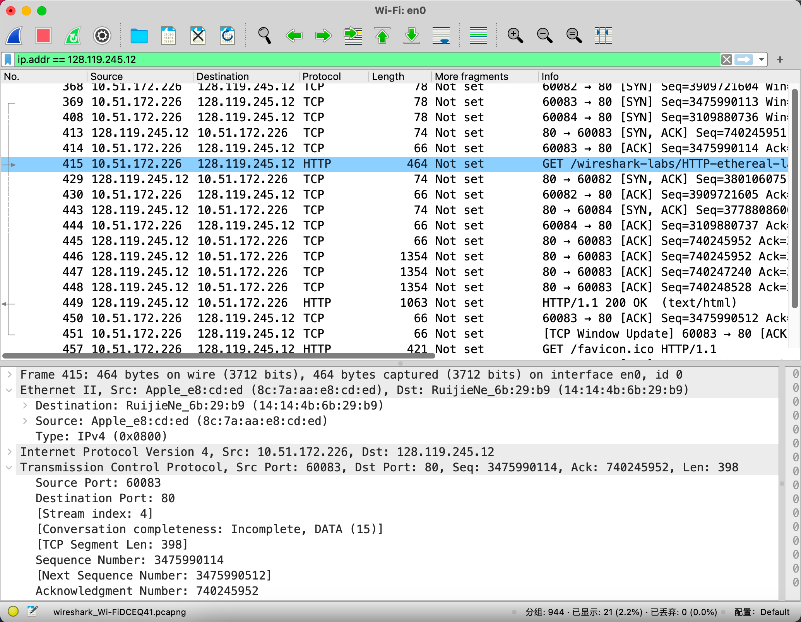

- 由于本实验是关于以太网和 ARP 的，我们对 IP 或更高层协议不感兴趣。 因此，让我们更改 Wireshark 的“捕获数据包列表”窗口，以便它仅显示有关 IP 以下协议的信息。 要让 Wireshark 执行此操作，请选择 Analyze-> Enabled Protocols(分析-启用的协议)。 然后取消选中 IP 框(译者注:这里指的 IPV4 协议，下面有搜索)并选择确定。 您现在 Wireshark 窗口应该如下所示:

  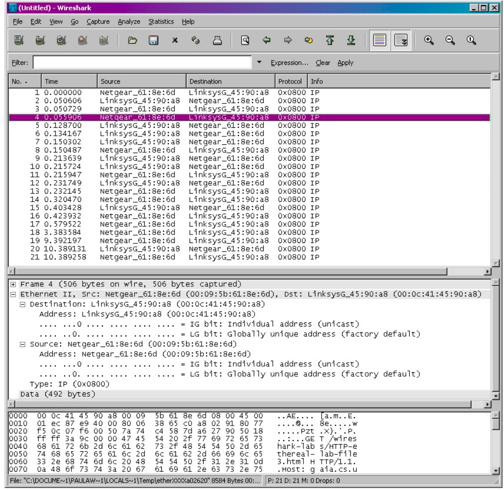

- 为了回答以下问题，您需要查看数据包详细信息和数据包内容窗口(Wireshark 中 的中间和下部显示窗口，译者注: 若您看到的不是如此-建议您重置布局(视图-重 置布局))。

- 选择包含 HTTP GET 消息的以太网帧。 (回想一下，HTTP GET 请求是被加上 TCP 头封装到 TCP 段进行传输,TCP 段加上 IP 头被封装到 IP 数据报进行传输,IP 数 据报又被加上以太网头封装成以太网帧进行传输;如果你发现这个封装有点令人困 惑，请重读文本中的第 1.5.2 节)。 在数据包详细信息窗口中展开以太网 II 信息。 请注意，以太网帧的内容(标题以及有效负载)显示在数据包内容窗口中 

- 根据包含 HTTP GET 消息的以太网帧进行分析，如果有可能建议您使用标记的方式展现您的答案。

1. 你的电脑 48 位的地址是多少

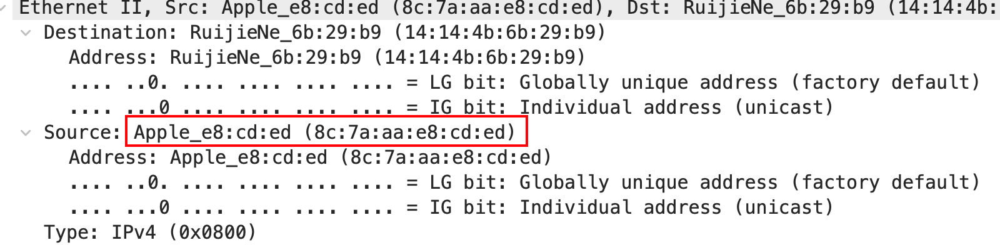

1. 以太网帧中的 48 位目标地址是什么?这是 gaia.cs.umass.edu 的以太网地址 吗?(提示:答案是否定的)。那么它是什么?注意这一题可能会犯错，请 阅读 468-469(中文版 305-308 页)然后理解它

下一跳路由器的对应接口的MAC地址.

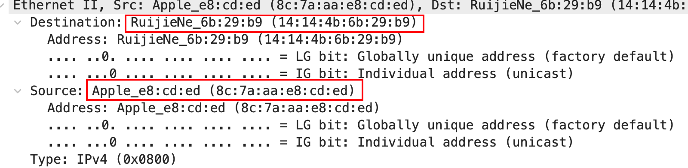

1. 以太网帧上层协议 16 进制值是什么?这对应的上层协议是什么?

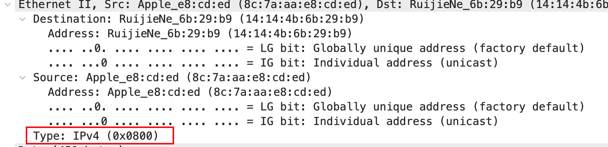

1. 从以太帧的开始，一直到“GET”中的 ASCII“G”出现在以太网帧中為止，有多

   少字节?

   G 的ascii码为0x47, 对应地址为0x0042, 故在这之前共有0x43字节, 即67Byte

   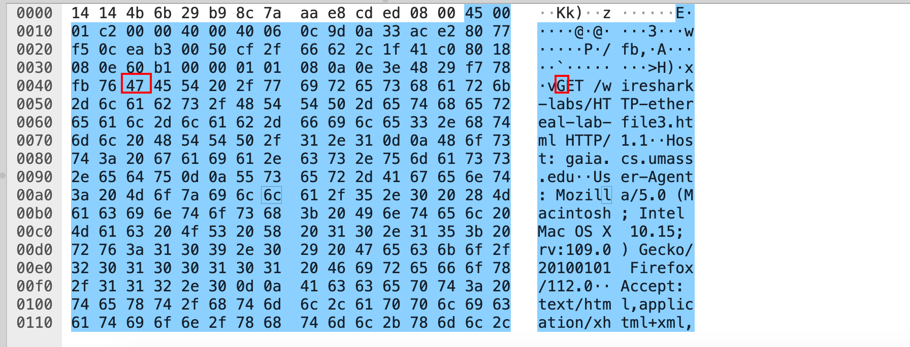

接下来，根据包含 HTTP 响应消息的第一个字节的以太网帧的内容，回答以下问题

5. 这个以太网帧中，以太网源地址的值是多少?这是你的计算机的地址，还是gaia.cs.umass.edu 的地址(提示:答案是否定的)。拥有这个以太网地址的设备是什么?

   ANS: 是最后一跳路由器网卡的MAC地址

   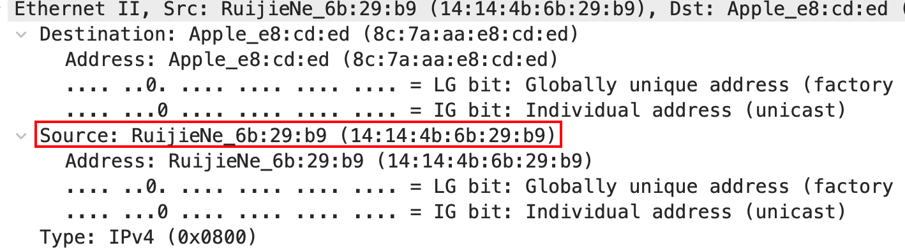

5. 以太网帧中的目的地址是什么?这是您的计算机的以太网地址吗? 

   ANS: 是的

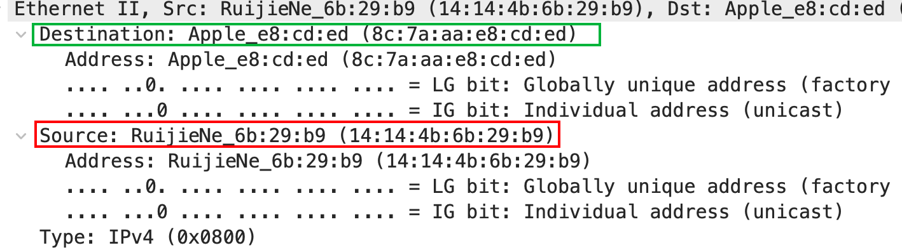

5. 以太网帧上层协议 16 进制值是什么?这对应的上层协议是什么?

ANS: 0x0800, IPv4

5. 从以太帧的开始，一直到“OK”中的 ASCII“O”出现在以太网帧中为止，有多少字节?

ANS: 0x4f Byte, 79Byte

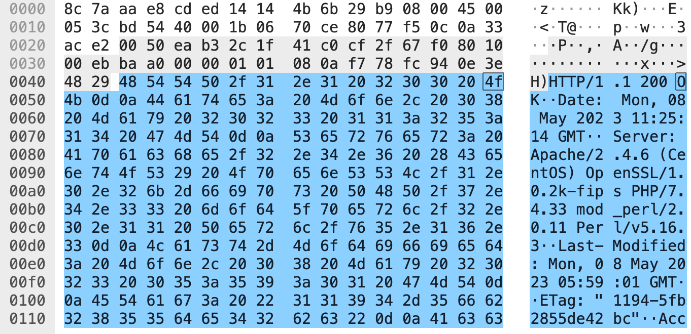

## The Address Resolution Protocol 地址解析协议


在本节中，我们将观察 ARP 协议的作用。我们强烈建议您在继续实验之前重读课文 6.4.1 节

### ARP Caching(ARP 缓存)

回想一下，ARP 协议通常在您的计算机上维护 IP 到以太网地址转换对的缓存.arp 命令(在 MSDOS 和 Linux / Unix 中)用于查看和操作此缓存的内容。由于 arp 命 令和 ARP 协议具有相同的名称，因此很容易混淆它们。但请记住，它们是不同的: arp 命令用于查看和操作 ARP 缓存内容，而 ARP 协议定义了发送和接收的消息的 格式和含义，并定义了对消息传输和接收所采取的操作。

我们来看看您计算机上 ARP 缓存的内容: 

- MS-DOS:arp 命令位于 c:\windows\system32 中，因此在 MS-DOS 命令行中

  输入“arp”或“c:\windows\system32\arp”(没有引号)

- Linux/Unix/MacOS. 根据安装位置不同路径而不同，一般有/sbin/arp (linux)

  和/usr/etc/arp (Unix)

没有参数的 Windows arp 命令将显示计算机上 ARP 缓存的内容。运行 ARP 命 令。

9. 写下计算机 ARP 缓存的内容。每个列值的含义是什么?

```shell
// mac/linux arp commend by tldr 
- Show the current ARP table:
    arp -a

- Delete a specific entry:
    arp -d address

- Create an entry in the ARP table:
    arp -s address mac_address
```

IP地址, MAC地址

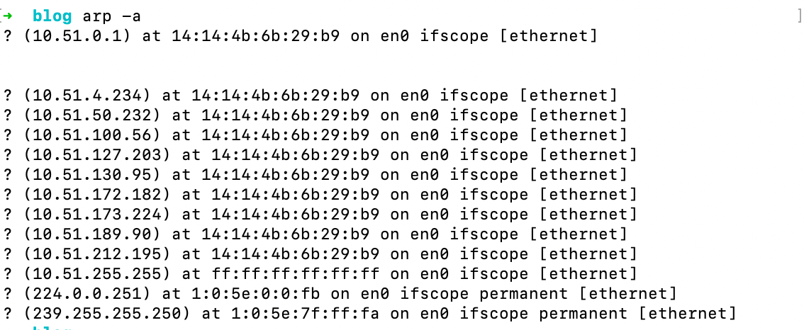

为了观察您的计算机发送和接收 ARP 消息，我们需要清除 ARP 缓存，否则您的计算机很可能在其缓存中找到所需的 IP-Ethernet 地址转换关系，因此不会发送 ARP 消息。

- MS-DOS:MS-DOS arp -d *命令将清除 ARP 缓存。-d 标志指示删除操作，* *  是表示删除所有表项的通配符。
- Linux/Unix/MacOS: 清除 arp 缓存的 arp –d *需要 root 权限，如果您没有也没办法使用 Windows 系统进行实验，请下载作者的抓包结果。

*所有在Linux系统下 **arp -d $ip** 命令只能清除一个IP地址的对应MAC地址缓存，当然可以使用组合命令操作，这也算是Linux的一个优点吧。*

### Observing ARP in action 抓取 ARP 消息


请进行以下操作: 

- 清除你的 ARP 缓存，如上所述。

  ```shell
  sudo arp -a -d //clear arp cahce in mac os
  ```

  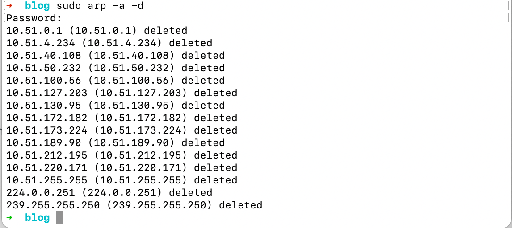

- 接下来，确保浏览器的缓存是空的。
- 启动 Wireshark 捕捉封包
- 打开以下 URL，http://gaia.cs.umass.edu/wireshark-labs/HTTP-wireshark-lab-file3.html。你的浏览器应该再次显示相当长的美国权利法案 
- 同样设置不显示 IP 和更高层协议，请选择 Analyze-> Enabled Protocols(分析 -启用的协议)。 然后取消选中 IP 框(译者注:这里指的 IPV4 协议，下面有 搜索)并选择确定。 您现在 Wireshark 窗口应该如下所示:

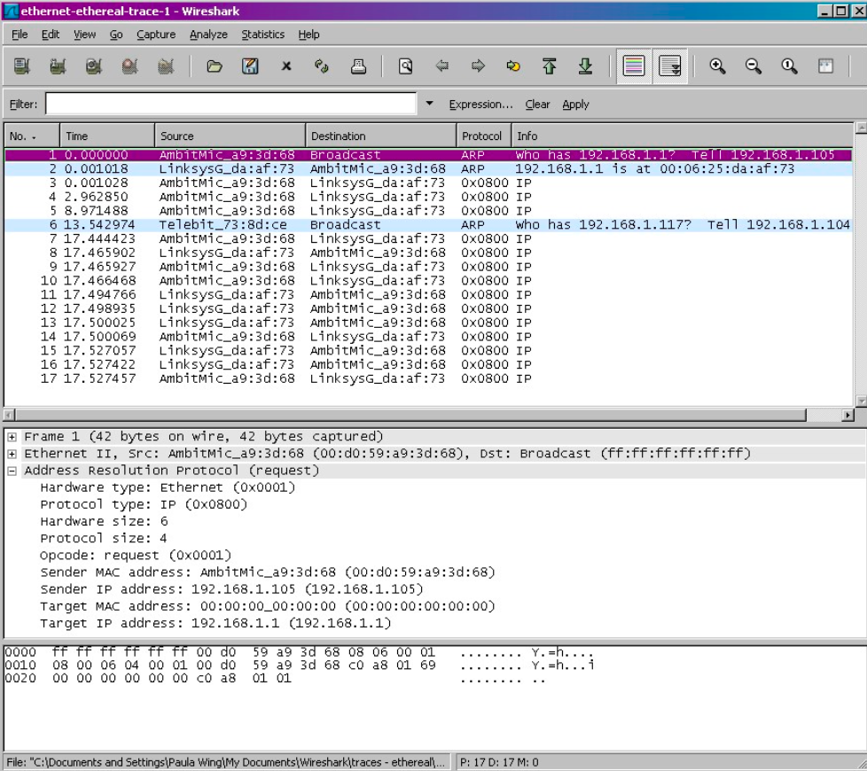

图示是作者的抓包结果截图，您可以发现第 1，2，6 帧都包含 ARP 消息

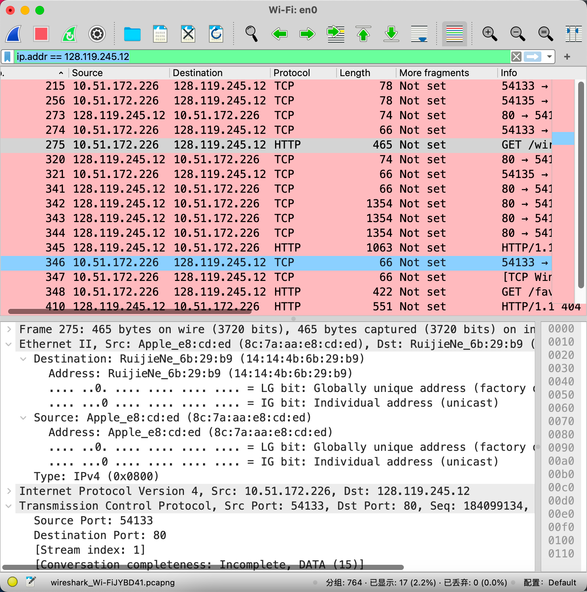

Answer the following questions: (回答下列问题)

10. 包含 ARP 请求消息的以太网帧中源和目标地址的十六进制值是什么?

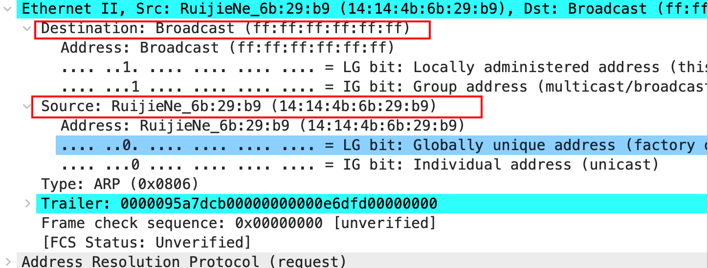

10. 以太网帧上层协议 16 进制值是什么?

    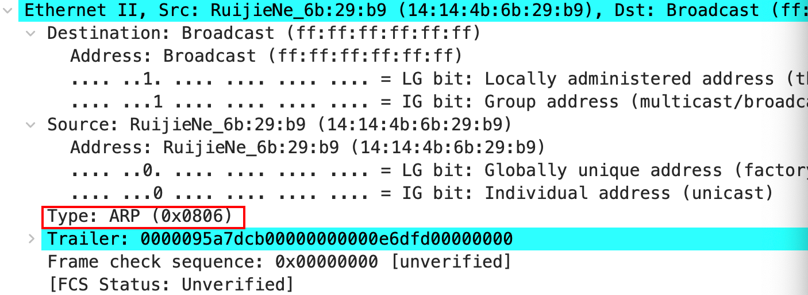

10. 下载 ARP 规范(ftp://ftp.rfc-editor.org/in-notes/std/std37.txt.),讨论请移步

    (http://www.erg.abdn.ac.uk/users/gorry/course/inet-pages/arp.html)

    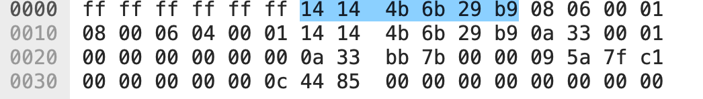

    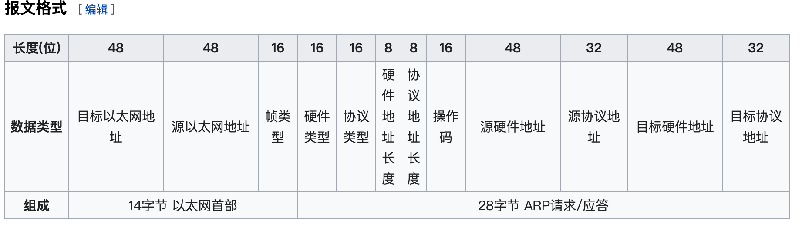

    a) ARP 操作码字段开始从以太网帧的最开始有多少字节?

    0x13Byte = 19Byte, 

    操作码：1为ARP请求，2为ARP应答，3为[RARP](https://zh.wikipedia.org/wiki/逆地址解析协议)请求，4为RARP应答。

    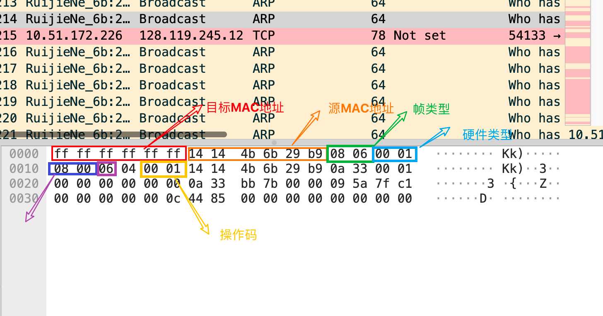

    b) 在进行 ARP 请求的以太网帧的 ARP 负载部分中，操作码字段的值是 多少?

    操作码1为ARP请求

    c) ARP 消息是否包含发送方的 IP 地址?

    不包括. 

    d) 在 ARP 请求中从哪里看出我们要查询相应 IP 的以太网地址?

    图中蓝色部分, 可以看到要查询的IP(16进制), 转换为十进制为: 10.51.187.123

    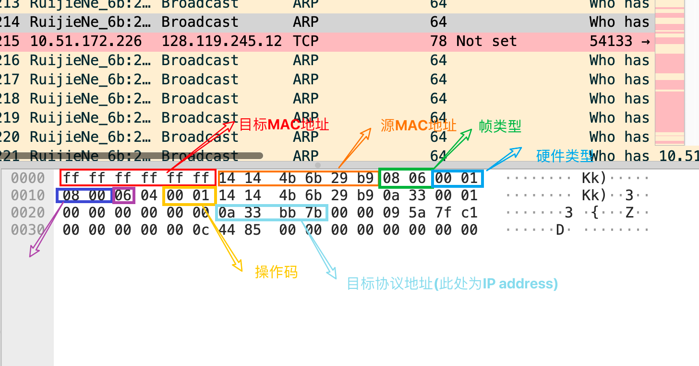

11.  找到相应 ARP 请求的而发送 ARP 回复

    1. a) ARP 操作码字段开始从以太网帧的最开始有多少字节?

    2. b)  在进行 ARP 响应的以太网帧的 ARP 负载部分中，操作码字段的值是

       多少?

       2, 表示ARP响应

    3. c)   在响应 ARP 中从哪里看出现早期 ARP 请求的答案?

       响应ARP中的源MAC地址

12. 包含 ARP 回复消息的以太网帧中的源地址和目标地址的十六进制值是多 少?

13. 在作者抓包结果中，他有两台电脑，一台运行 wireshark 进行抓包，一台没 有，那么为什么运行 wireshark 那台电脑发送 ARP 请求得到了应答，另外一 台电脑的 ARP 请求没有得到应答?(没有相应第 6 帧的 ARP 的请求)

请求ARP的目标MAC地址48位全1, 是广播地址, 所以局域网设备都能收到, 而响应ARP是单播地址, 目标MAC为请求目标的MAC地址, 故只有发起对该IP请求对电脑能收到. 

### Extra Credit 额外实验

EX-1. The arp command: arp 命令: 

```shell
arp -s InetAddr EtherAddr
```

这个命令允许你手动添加 arp 记录到缓存表中。它会把您输入的 IP 地址 (InetAddr)解析为物理地址(EtherAddr)，请问您输入正确 IP 地址但是物理地 址错误会发生什么。

成功写入了, 类型为permanent, 没有发生什么, 而且可以在ARP table中看到两条同一IP地址的不同MAC地址条目. 

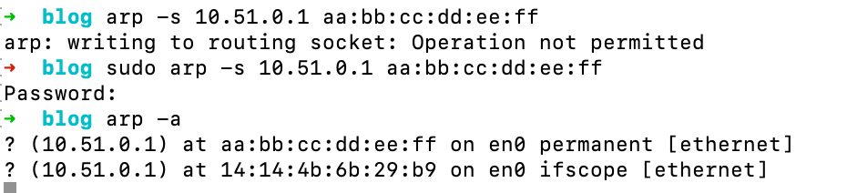

EX-2. 在删除 ARP 缓存之前，请问它们默认的有效时间是多少，您可以通过不定 时的查看缓存内容得出结论或者查询相应的操作系统文档。

