In this lab, we’ll explore several aspects of the ICMP protocol: 
在本实验中，我们将探讨 ICMP 协议的几个方面:

<!--more-->


- ICMP messages generating by the Ping program; Ping 程序生成的 ICMP 消息;

-  ICMP messages generated by the Traceroute program; Traceroute 程序生成的 ICMP 消息;

-  the format and contents of an ICMP message. ICMP 消息的格式和内容。

  Before attacking this lab, you’re encouraged to review the ICMP material in section 5.6
   of the text1. We present this lab in the context of the Microsoft Windows operating system. However, it is straightforward to translate the lab to a Unix or Linux environment. 在开始本实验之前，我们建议您查看课本的 5.6 节中的 ICMP 章节。此实验是在Windows 下完成的，如果您使用其他系统也不用担心，因为大体都相同。

## ICMP and Ping ICMP 协议和 Ping 程序

Let’s begin our ICMP adventure by capturing the packets generated by the Ping program. You may recall that the Ping program is simple tool that allows anyone (for example, a network administrator) to verify if a host is live or not. The Ping program in the source host sends a packet to the target IP address; if the target is live, the Ping program in the target host responds by sending a packet back to the source host. As you might have guessed (given that this lab is about ICMP), both of these Ping packets are ICMP packets. 让我们通过捕获 Ping 程序生成的数据包开始我们的 ICMP 实验。 您可能还记得Ping 程序是一个简单的工具，允许任何人(例如:网络管理员)验证主机是否存在。 源主机中的 Ping 程序将数据包发送到目标 IP 地址; 如果目标是在线的，则目标主机中的 Ping 程序将会发送响应 Ping 数据包证明他在线，这两个 Ping 数据包都是 ICMP 数据包。 因此您可能猜出我们这个实验都是关于 ICMP 的实验了。

Do the following: 请按照以下动作做:

- Let’s begin this adventure by opening the Windows Command Prompt application (which can be found in your Accessories folder).
   打开 windows 的命令提示符。

-   Start up the Wireshark packet sniffer, and begin Wireshark packet capture. 启动 Wireshark 数据包嗅探器，并开始 Wireshark 数据包捕获。

-   The ping command is in c:\windows\system32, so type either “ping –n 10 hostname” or “c:\windows\system32\ping –n 10 hostname” in the MS-DOS command line (without quotation marks), where hostname is a host on another continent. If you’re outside of Asia, you may want to enter www.ust.hk for the Web server at Hong Kong University of Science and Technology. The argument “-n 10” indicates that 10 ping messages should be sent. Then run the Ping program by typing return.

  Ping 程序在 c:\windows\system32 目录中，所以您在命令提示符中输入“ping –n 10 hostname” 或 “c:\windows\system32\ping –n 10 hostname”都是正确的 (注意命令是引号里的内容)。其中 hostname 是另一个大陆的主机名。如 您如果在非亚洲地区，建议您访问香港科技大学 www.ust.hk ， 参数-n 10 代表发送 10 个 Ping 消息，然后按下回车执行命令。

-   When the Ping program terminates, stop the packet capture in Wireshark. 当 Ping 程序终止时，停止在 Wireshark 中捕获数据包。

At the end of the experiment, your Command Prompt Window should look something like Figure 1. In this example, the source ping program is in Massachusetts and the destination Ping program is in Hong Kong. From this window we see that the source ping program sent 10 query packets and received 10 responses. Note also that for each response, the source calculates the round-trip time (RTT), which for the 10 packets is on average 375 msec.

在实验结束时，您的命令提示符窗口应如图 1 所示。在此示例中，源 ping 程序位 于马萨诸塞州，目标 Ping 程序位于香港。 从这个窗口我们看到源 ping 程序发送了10 个查询包并收到了 10 个响应。 另请注意，对于每个响应，源计算往返时间 (RTT)，对于 10 个数据包平均为 375 毫秒。

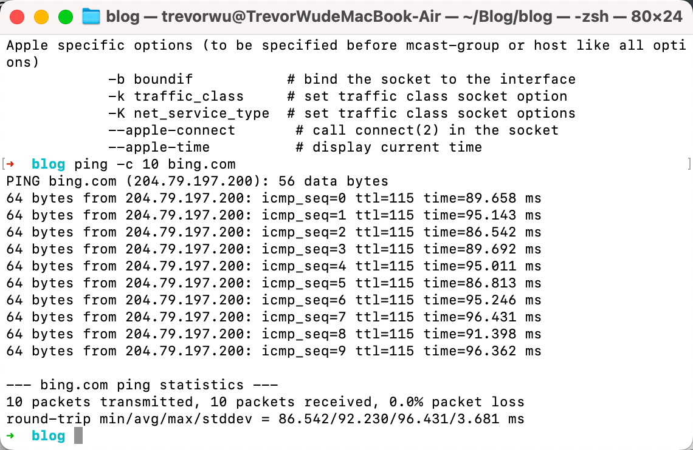

Figure 2 provides a screenshot of the Wireshark output, after “icmp” has been entered into the filter display window. Note that the packet listing shows 20 packets: the 10 Ping queries sent by the source and the 10 Ping responses received by the source. Also note that the source’s IP address is a private address (behind a NAT) of the form 192.168/12; the destination’s IP address is that of the Web server at HKUST. Now let’s zoom in on the first packet (sent by the client); in the figure below, the packet contents area provides information about this packet. We see that the IP datagram within this packet has protocol number 01, which is the protocol number for ICMP. This means that the payload of the IP datagram is an ICMP packet.
 如图 2，在将“icmp”输入过滤器显示窗口后 Wireshark 输出的屏幕截图。 请注意，

数据包列表显示 20 个数据包:源发送的 10 个 Ping 查询和源接收的 10 个 Ping 响 应。 另请注意，源的 IP 地址是 192.168 / 12 格式的私有地址(通过 NAT 协议连接 互联网); 目的地的 IP 地址是香港科技大学网络服务器的 IP 地址。 现在让我们点 击显示第一个由客户端发送的数据包; 在图中的下方，数据包内容区域提供有关此 数据包的信息。 我们看到该数据包中的 IP 数据报具有协议号 01，这是 ICMP 的协 议号。 这意味着 IP 数据报的有效载荷是 ICMP 数据包

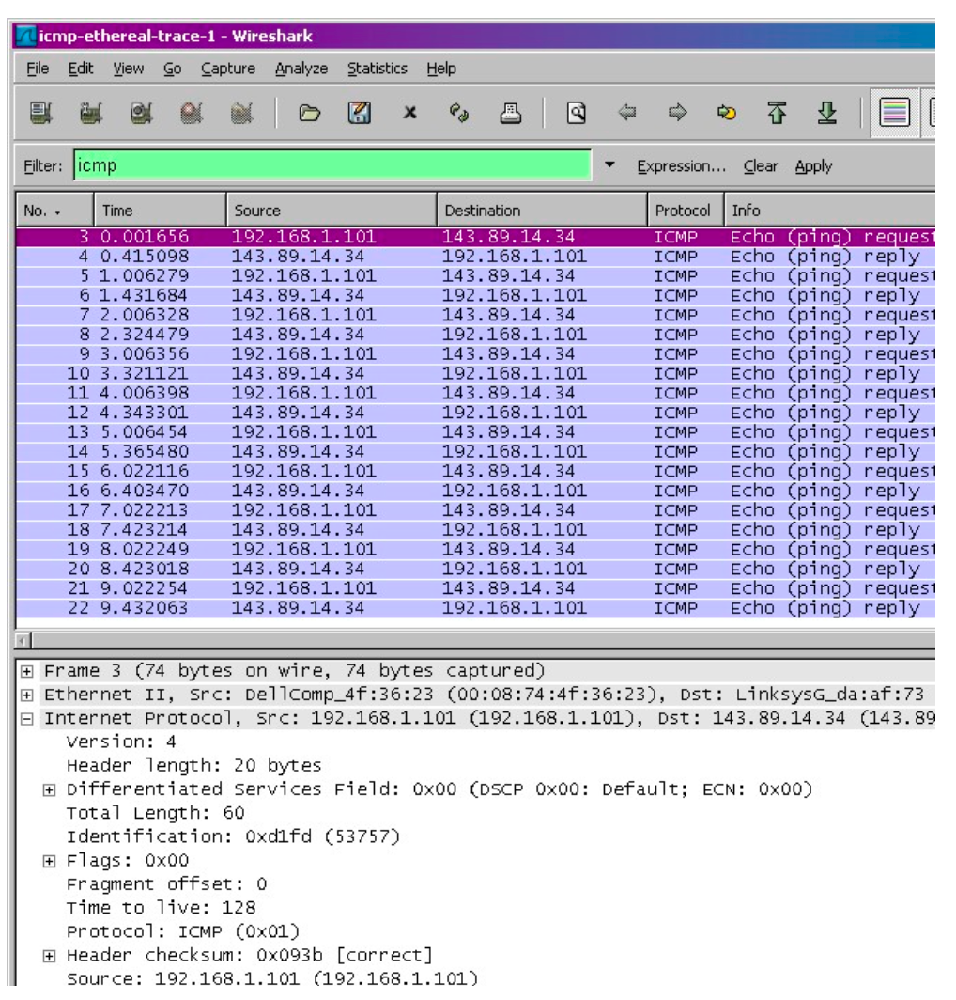

<center>图 2 在 Wireshark 中过滤 ICMP 协议并且选中某个 ICMP 消息<center/>

Figure 3 focuses on the same ICMP but has expanded the ICMP protocol information in the packet contents window. Observe that this ICMP packet is of Type 8 and Code 0 - a so-called ICMP “echo request” packet. (See Figure 5.19 of text.) Also note that this ICMP packet contains a checksum, an identifier, and a sequence number.

图 3 同样使用相同的 ICMP 过滤器，展开可以看到该 ICMP 包的详情信息。 观察到 该 ICMP 数据包是类型 8 和代码 0 ——所谓的 ICMP“回应请求”数据包。 (请参见 书本的图 5.19。)此外，此 ICMP 数据包包含校验和，标识符和序列号

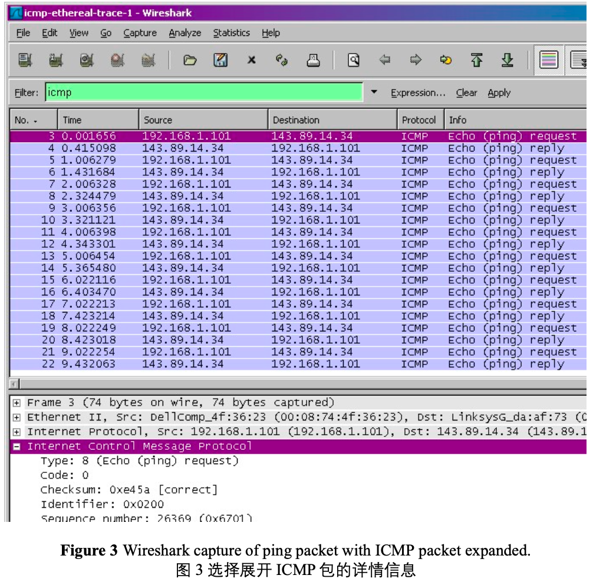

## What to Hand In: 回答问题

You should hand in a screen shot of the Command Prompt window similar to Figure 1 above. Whenever possible, when answering a question below, you should hand in a printout of the packet(s) within the trace that you used to answer the question asked. Annotate the printout to explain your answer. To print a packet, use File->Print, choose Selected packet only, choose Packet summary line, and select the minimum amount of packet detail that you need to answer the question.

请尽量清晰的展示您的答案，必要时您可以在图中用标记辅以说明。您的答案应该
简单可读。  

```sh
ping -c 10 bing.com // [-c count] 
```

You should answer the following questions: 请回答以下问题:

1. What is the IP address of your host? What is the IP address of the destination host? 您的主机的 IP 地址是多少? 目标主机的 IP 地址是多少?

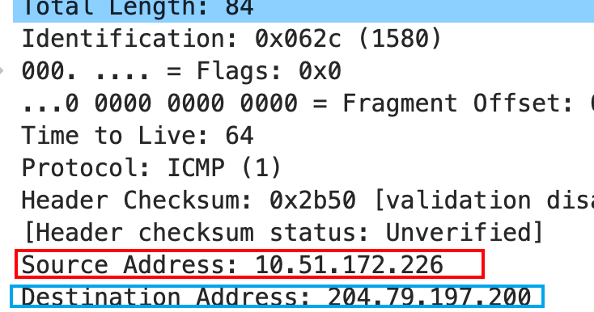

1. Why is it that an ICMP packet does not have source and destination port numbers? 为什么 ICMP 数据包没有源端口号和目的端口号?

**大多数TCP/IP实现直接在操作系统中支持ping服务器, 即该服务器不是一个进程.**

ICMP（Internet Control Message Protocol）数据包没有源端口号和目的端口号，因为ICMP不像TCP（传输控制协议）或UDP（用户数据报协议）那样是传输层协议。相反，ICMP是一种直接在IP（Internet Protocol）层之上运行的网络层协议。

TCP和UDP使用源和目的地端口号来在同一设备上运行的不同应用程序之间进行多路复用和解复用数据。然而，ICMP不用于传输应用程序数据，而是用于在网络设备之间传递错误消息和网络状态信息。因此，ICMP消息并不是针对设备上的特定端口而言的，而是针对设备本身的。

ICMP消息包含类型、代码和校验和等字段，这些字段用于指示消息的目的和内容。这些字段允许网络设备适当地解释和响应ICMP消息。例如，当从一个设备发送ping命令到另一个设备时，ping数据包包含一个ICMP回显请求消息，这促使接收设备向发送方发送一个ICMP回显回复消息。ICMP数据包中缺少源和目的端口号是由于这些信息对协议的运行不必要。

1. Examine one of the ping request packets sent by your host. What are the ICMP type and code numbers? What other fields does this ICMP packet have? How many bytes are the checksum, sequence number and identifier fields? 查看任意的请求 ICMP 数据包， ICMP 类型和代码是什么? 该 ICMP 数据包还有哪些其他字段? 校验和，序列号和标识符字段有多少字节?

**Type: 8 code: 0 回显请求**。还包括**检验和(2 Byte)**, **id(2 Byte)**, **sequence number(2 Byte)**

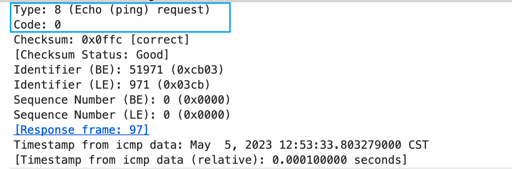

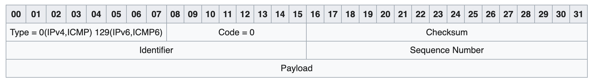

1. Examine the corresponding ping reply packet. What are the ICMP type and code numbers? What other fields does this ICMP packet have? How many bytes are the checksum, sequence number and identifier fields?
    查看任意的响应 ICMP 数据包， ICMP 类型和代码是什么? 该 ICMP 数据包
    还有哪些其他字段? 校验和，序列号和标识符字段有多少字节?  

Type: 0(Echo reply)   

Code : 0 

还包括**检验和(2 Byte)**, **id(2 Byte)**, **sequence number****(2 Byte**)

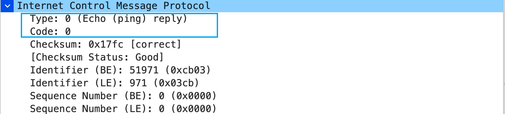

## ICMP and Traceroute ICMP 协议和 Traceroute 命令


Let’s now continue our ICMP adventure by capturing the packets generated by the Traceroute program. You may recall that the Traceroute program can be used to figure out the path a packet takes from source to destination. Traceroute is discussed in Section 1.4 and in Section 5.6 of the text.
现在让我们通过捕获 Traceroute 程序生成的数据包继续我们的 ICMP 实验。 您可能
还记得 Traceroute 程序可用于确定数据包从源到目的地的路径。 Traceroute 命令可 以在课本中的 1.4 节和 5.6 节中找到  

Traceroute is implemented in different ways in Unix/Linux/MacOS and in Windows. In Unix/Linux, the source sends a series of UDP packets to the target destination using an unlikely destination port number; in Windows, the source sends a series of ICMP packets to the target destination. For both operating systems, the program sends the first packet with TTL=1, the second packet with TTL=2, and so on. Recall that a router will decrement a packet’s TTL value as the packet passes through the router. When a packet arrives at a router with TTL=1, the router sends an ICMP error packet back to the source. In the following, we’ll use the native Windows tracert program. A shareware version of a much nice Windows Traceroute program is pingplotter (www.pingplotter.com). We’ll use pingplotter in our Wireshark IP lab since it provides additional functionality that we’ll need there.  
每个系统有不同路由跟踪实现办法，在 Unix / Linux 中，路由跟踪 traceroute 使用 发送不可到达(无使用的)端口的 **UDP** 包来实现，在 Windows 中，路由跟踪 tracert 仅使用 **ICMP** 数据包来实现，但是对于他们来说，都是发送 TTL 增加的数据 包，例如 TTL=1,TTL=2，回想下，每经过一个路由器，TTL 就会减一，**当 TTL=1 的包达到路由器，该路由器会将该包丢弃，并且发送 ICMP 错误给请求的机器**，在 本次实验，我们使用 window 自带的 tracert。有一个跨平台 Windows Traceroute 程序的是 pingplotter(www.pingplotter.com)(收费但可以试用)。 我们将在 Wireshark IP 实验室中使用 pingplotter，因为它提供了我们在那里需要的其他功能。

Do the following4: 请执行以下步骤

- Let’s begin by opening the Windows Command Prompt application (which can be found in your Accessories folder).
   打开 windows 的命令提示符。

- Start up the Wireshark packet sniffer, and begin Wireshark packet capture. 启动 Wireshark 数据包嗅探器，并开始 Wireshark 数据包捕获。

- The tracert command is in c:\windows\system32, so type either “tracert hostname” or “c:\windows\system32\tracert hostname” in the MS-DOS command line (without quotation marks), where hostname is a host on another continent. (Note that on a Windows machine, the command is “tracert” and not “traceroute”.) If you’re outside of Europe, you may want to enter www.inria.fr for the Web server at INRIA, a computer science research institute in France. Then run the Traceroute program by typing return.
  tracert 程序在 c:\windows\system32 目录中，所以您在命令提示符中输入

  “tracert hostname” 或 “c:\windows\system32\ tracert hostname”都是正确的(注 意命令是引号里的内容)。其中 hostname 是另一个大陆的主机名。如您如 果在非欧洲地区，建议您访问法国 INRIA(计算机科学研究所) www.inria.fr 然后按下回车执行命令。

- When the Traceroute program terminates, stop packet capture in Wireshark. 当 Traceroute 程序终止时，停止在 Wireshark 中捕获数据包。

  At the end of the experiment, your Command Prompt Window should look something like Figure 4. In this figure, the client Traceroute program is in Massachusetts and the target destination is in France. From this figure we see that for each TTL value, the


source program sends three probe packets. Traceroute displays the RTTs for each of the probe packets, as well as the IP address (and possibly the name) of the router that returned the ICMP TTL-exceeded message. 在实验结束时，您的命令提示符窗口应如图 4 所示。在此图中，客户端 Traceroute程序主机位于马萨诸塞州，目标主机位于法国。 从该图中我们看到，对于每个 TTL 值，源程序发送三个探测包。 Traceroute 显示每个探测包的 RTT，以及返回 ICMP TTL 超出消息的路由器的 IP 地址(可能还有名称)。

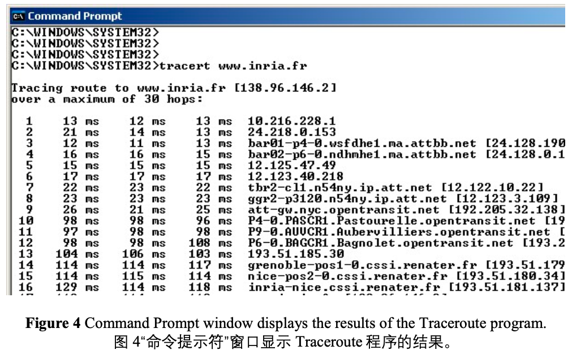

Figure 5 displays the Wireshark window for an ICMP packet returned by a router. Note that this ICMP error packet contains many more fields than the Ping ICMP messages.
 图 5 显示了路由器返回的 ICMP 数据包的 Wireshark 窗口。 请注意，此 ICMP 错误数据包包含的字段比 Ping ICMP 消息多得多。

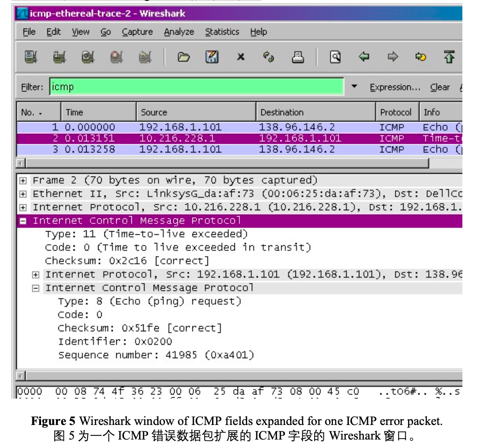
------

 If you are unable to run Wireshark live on a computer, you can download the zip file http://gaia.cs.umass.edu/wireshark-labs/wireshark-traces.zip and extract the file ICMP-ethereal-trace-2. The traces in this zip file were collected by Wireshark running on one of the author’s computers, while performing the steps indicated in the Wireshark lab. Once you have downloaded the trace, you can load it into Wireshark and view the trace using the File pull down menu, choosing Open, and then selecting the ICMP-ethereal-trace-2 trace file. You can then use this trace file to answer the questions below. 同样如果您无法抓包，建议您下载作者的抓包结果 http://gaia.cs.umass.edu/wireshark-labs/wireshark-traces.zip 解压并且使用 Wireshark 打开 ICMP-ethereal-trace-2 进行分析。

-----


## What to Hand In: 回答问题

For this part of the lab, you should hand in a screen shot of the Command Prompt window. Whenever possible, when answering a question below, you should hand in a printout of the packet(s) within the trace that you used to answer the question asked. Annotate the printout to explain your answer. To print a packet, use File->Print, choose Selected packet only, choose Packet summary line, and select the minimum amount of packet detail that you need to answer the question. 请尽量清晰的展示您的答案，必要时您可以在图中用标记辅以说明。您的答案应该简单可读

Answer the following questions: 请回答以下问题:

1. What is the IP address of your host? What is the IP address of the target destination host?
    您的主机的 IP 地址是多少? 目标目标主机的 IP 地址是多少?

2. If ICMP sent UDP packets instead (as in Unix/Linux), would the IP protocol number still be 01 for the probe packets? If not, what would it be?
    如果 ICMP 发送了 UDP 数据包(如在 Unix / Linux 中)，那么探测数据包的 IP 协议号仍然是 01 吗? 如果没有，它会是什么?

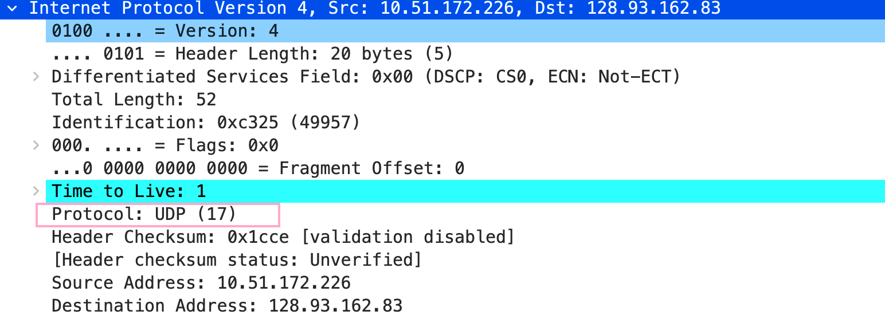

1. Examine the ICMP echo packet in your screenshot. Is this different from the ICMP ping query packets in the first half of this lab? If yes, how so? 检查屏幕截图中的 ICMP 响应数据包。 这与本实验的前半部分中的 ICMP ping 查询数据包不同吗? 如果不同，请解释为什么?


该ICMP Message Type:11 Code: 0 , 路由器告诉源主机你的分组由于TTL减为0被我丢掉了(Time-to-live exceeded), 这是Ping和treaceroute程序的工作原理不同导致的, Ping程序发送请求回显报文, 目标主机收到后回复(回显回答), 而traceroute程序通过发送TTL从1递增的UPD数据报来获得路由信息. 

1. Examine the ICMP error packet in your screenshot. It has more fields than the ICMP echo packet. What is included in those fields?
   检查屏幕截图中的 ICMP 错误数据包。 它具有比 ICMP 响应数据包更多的字段。 这个数据包含哪些内容?

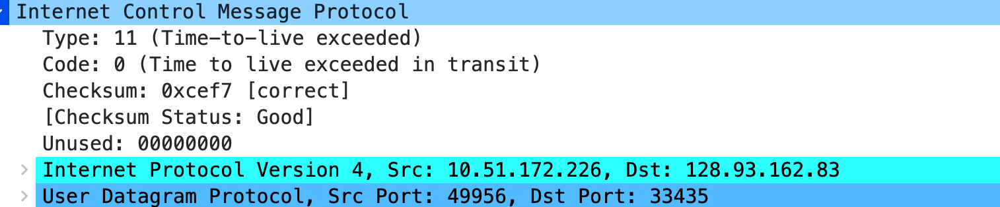

多了IP头部, IP头部包含了被丢弃的IP数据报的头部字段

1. Examine the last three ICMP packets received by the source host. How are these packets different from the ICMP error packets? Why are they different? 检查源主机收到的最后三个 ICMP 数据包。 这些数据包与 ICMP 错误数据包有何不同? 他们为什么不同?

找不到...最后都没有收到, 但我还是说几句. 这些同为ICMP数据包, 但TYPE和Code字段的字不同, Type:3 Code:3 目标主机告诉源主机目标端口不可达, 这是因为treaceroute程序发送了不可达的端口

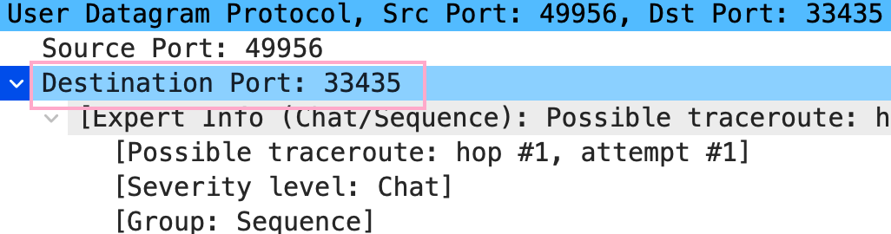

1. Within the tracert measurements, is there a link whose delay is significantly longer than others? Refer to the screenshot in Figure 4, is there a link whose delay is significantly longer than others? On the basis of the router names, can you guess the location of the two routers on the end of this link?

   在 tracert 跟踪测量中，是否有一个连接的延迟比其他连接长得多? 请参阅 图 4 中的屏幕截图，是否有连接的延迟明显长于其他连接? 根据路由器名 称，您能猜出这个连接末端的两个路由器的位置吗?

可以发现TTL为6和为10时, 延迟变化很大, 通过best trace程序发现, 这两个路由器的位置分别是中国北京和德国，黑森州，法兰克福，

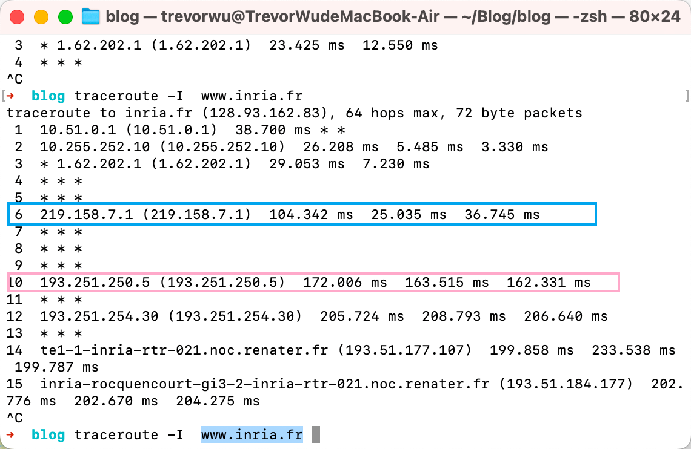

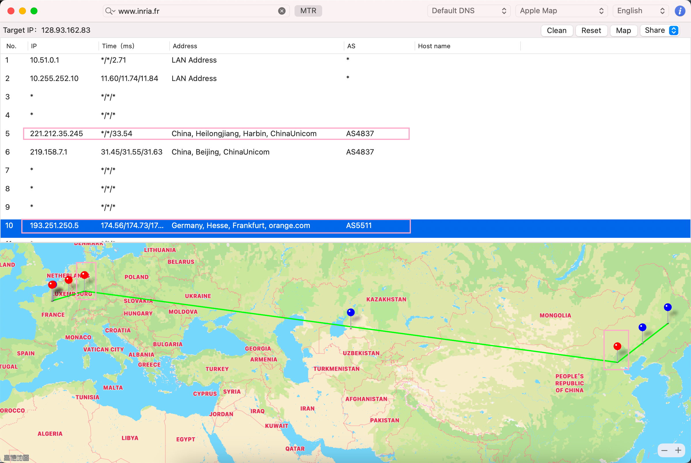

## Extra Credit 额外问题

For one of the programming assignments you created a UDP client ping program. This ping program, unlike the standard ping program, sends UDP probe packets rather than ICMP probe packets. Use the client program to send a UDP packet with an unusual destination port number to some live host. At the same time, use Wireshark to capture any response from the target host. Provide a Wireshark screenshot for the response as well as an analysis of the response.

对于一个编程任务，您可能创建了一个 UDP 客户端 ping 程序。 与标准 ping 程序 不同，此 ping 程序发送 UDP 探测包而不是 ICMP 探测包。 使用客户端程序将具有 异常目标端口号的 UDP 数据包发送到某个活动主机。 同时，使用 Wireshark 捕获 目标主机的任何响应。 提供响应的 Wireshark 屏幕截图以及响应分析。

