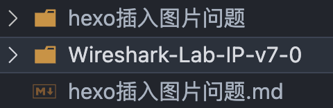
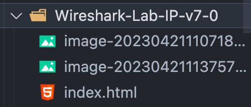
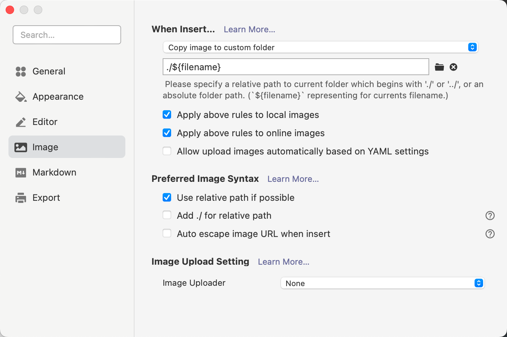
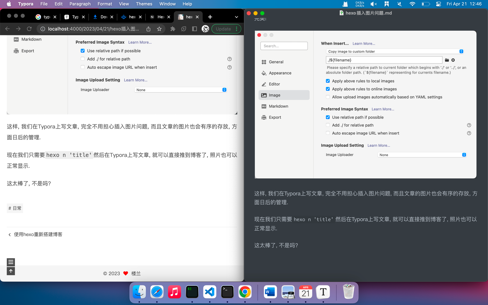

昨天刚搭建完博客, 发现直接写markdown, hexo 生成后图片全部都没法显示了, 毕竟图片都在本地, 以绝对路径的方式存储的, markdown的路径的hexo的路径不匹配. 

<!--More-->

以前搭博客的时候这个图片问题就老是困扰着我, 我用typora编写的文章转到html之后, 我还得把图片也引到项目目录来, 然后在一个个的该路径. 体验可以说是很差了, 这也导致哪怕写完文章, 我也懒得发布了, 太麻烦. 

这次用hexo搭建也遇到了同样的问题, 按照老方法, 我能想到的就只有把图片全部拉过来了, 我直接把全部图片`mv`到了public目录的imag目录下, 部署到github上的时候, 由于图片太多了, 进度条老是卡住, 我只好放弃了. 我直接`ctl+c`, `hexo clean`,`hexo s`.这时候我还不知道`hexo clean`意味这什么, 只是看教程大家都是这样做的, 结果, 结果hexo把我pubilc目录下的文件全部删了..., 我的图片, 也全没了. 

今天发现一个绝好的解决方案, 将Typora和hexo完美结合起来. 

### 第一步 修改hexo的站点配置文件_config.yml

首先安装插件:

```shell
npm install hexo-renderer-marked
```

在_config.yml搜索`post_asset_folder`改为true 如下:

```yml
post_asset_folder: true
marked:
  prependRoot: true
  postAsset: true
```

修改之后会开启 Hexo 的文章资源文件管理功能。Hexo 将会在我们每一次通过 `hexo new <title>` 命令创建新文章时自动创建一个同名文件夹，并在执行`hexo g`的时候连同图片以前复制到public目录下(网站的根目录).于是我们便可以将文章所引用的相关资源放到这个同名文件夹下，然后通过相对路径引用。例如，你把一个 `example.jpg` 图片放在了这个同名文件夹中，使用相对路径的常规 markdown 语法 ``即可访问 。

  也就是这样



但是呢, 执行`hexo g`生成的时候, hexo会把sourec目录下的_posts文件的转化为成html, 并保存在pubilc对应日期的路径中,

可以看到, 此时index中的图片路径和markdown的图片路径是冲突的. 

```markdown
typora的路径使用: 

这样页面上的img路径就会是:
/你的文章标题/example/example.jpg
正确的图片地址: 
/example/example.jpg
```

这是因为`hexo g`把文件夹里面图片复制过来了, 但并没有复制整个图片的文件夹. 

所以我只需要拿到当前博客的路径，直接加上图片名字就行.

### 第二步, 编写路径替换脚本

在全局js文件 themes\next\source\js\next-boot.js中，编写img 路径替换脚本

```javascript
// 脚本提供者
//http://songpengpeng.com
var images = document.getElementsByTagName("img");
var loHref = window.location.href
let baseHref = loHref.substring(0,loHref.lastIndexOf("/")+1)
for (let i = 0; i <images.length; i++) {
    let executeNum = 0;
    let src = images[i]['src']
    let img = new Image();
    img.src = src
    img.onload= ()=> {
    }
    img.onerror= ()=> {
        executeNum ++ ;
        handAMark(src)
        if(executeNum>3){
            return;
        }
        let fileName = src.substring(src.lastIndexOf("/")+1);
        images[i].src= baseHref+fileName
    }
}
function  handAMark(src){
    var as = document.getElementsByClassName("fancybox");
    for (let i = 0; i <as.length; i++) {
        let executeNum = 0;
        let href = as[i]['href']
        if(href==src){
            let img = new Image();
            img.src = src

            img.onload= ()=> {
            }
            img.onerror= ()=> {
                executeNum ++ ;
                if(executeNum>3){
                    return;
                }
                let fileName = src.substring(src.lastIndexOf("/")+1);
                as[i].href= baseHref+fileName
            }
        }
    }
}
```


这样, 使用`hexo g`生成的时候, 就会自动将图片的路径替换. 

### 第三步, 搭配typora才是最佳

但是还是不够方便啊, 我们得先把图片放到文章的资源文件夹中. Typora对插图片的支持非常好, 可以在复制图片的同时, 把物品保存在对应的文件夹中

打开Typora, `⌘+,`进入系统偏好设置, 点击image选项卡, 修改为以下格式: 

这样当插入图片的时候, 会自动把图片放到当前目录的markdown相名的文件夹中, 恰好, Hexo 在我们每一次通过 `hexo new <title>` 命令创建新文章时自动创建一个同名文件夹. 

完美!



这样, 我们在Typora上写文章, 完全不用担心插入图片问题, 而且文章的图片也会有序的存放, 方面日后的管理. 

现在我们只需要`hexo n 'title'`然后在Typora上写文章, 就可以直接推到博客了, 照片也可以正常显示. 

你看, 我写完这篇文章的时候, hexo已经完美的生成网页了. 

这太棒了, 不是吗? 


