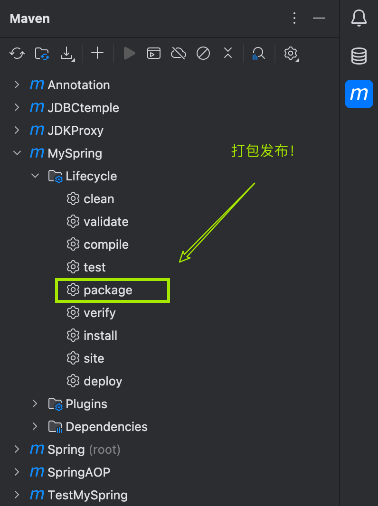

在实例化一个对象时，我们通过`ClassPathXmlApplicationContext()`，传入我们的配置文件，拿到一个`ApplicationContext`对象，通过`ApplicationContext`对象调用`getBean（）`方法来获取对象, 最终调用对象发方法，来使用Bean。
<!-- more -->


## 手写Spring框架


Spring底层是通过反射机制来实例化对象，以及属性注入的，在手写Spring框架之前，我们需要了解反射机制。


> JAVA反射机制是在运行状态中，对于任意一个类，都能够知道这个类的所有属性和方法；对于任意一个对象，都能够调用它的任意一个方法和属性；这种动态获取的信息以及动态调用对象的方法的功能称为java语言的反射机制。Java反射机制在框架设计中极为广泛，需要深入理解。


通过反射，我们可以拿到类的属性，方法。 回顾Spring框架，我们需要编写一个spring的配置文件例如：spring.xml，在这个配置文件中，我们注册一个类，并注入属性值。

```xml
<?xml version="1.0" encoding="UTF-8"?>
<beans>
    <beans>
        <bean name="user" class="bean.User">
            <property name="id" value="1"/>
            <property name="username" value="sonetto"/>
            <property name="password" value="123456"/>
            <property name="points" value="12.3"/>
            <property name="isActive" value="true"/>
        </bean>
        <bean name="userDao" class="bean.UserDao"/>
        <bean name="userService" class="bean.UserService">
            <property name="userDao" ref="userDao"/>
        </bean>
    </beans>
</beans>
```

在实例化一个对象时，我们通过`ClassPathXmlApplicationContext()`，传入我们的配置文件，拿到一个`ApplicationContext`对象，通过`ApplicationContext`对象调用`getBean（）`方法来获取对象, 最终调用对象发方法，来使用Bean。

```java
ApplicationContext context = new ClassPathXmlApplicationContext("mySpring.xml");
        User user = (User) context.getBean("user");
        System.out.println(user);
        UserService userService = (UserService) context.getBean("userService");
        userService.createUser();
```

我们的最终目的就是调用对象的方法，而一个指定一个方法需要四要素： 什么对象（对象的全限定类名是什么？）什么方法（方法名），什么参数（参数的类型和数量），返回什么值。


指定来这方法的四个要素，我们就可以唯一的确定一个方法，然后调用该方法。


在spring的配置文件中，注册一个Bean时，我们需要提供这个Bean的全限定类名，也就是Bean标签内的class属性的内容。有了全限定类名，我们就可以通过反射机制调用`class.forName()`拿到这个对象的类。更进一步，通过这个类拿到构造方法，实例化对象。拿到我们需要的目标方法，最终调用这个目标方法。


有了整个大概的全景图，我们就可以开始编写我们自己的Spring框架了。


1. 首先，让我们先编写一个`ApplicationContext` 接口类，这个类定义了`getBean()`方法

```java
package org.loulan.spring;


public interface ApplicationContext {
    Object getBean(String name);
}
```

2. 然后编写该接口的实现类`ClassPathXmlApplicationContext` 我们正是通过这个类来实例化一个`ApplicationContext` 对象。回顾`ApplicationContext context = new ClassPathXmlApplicationContext("mySpring.xml");` 这段代码，实例化这个类时，我们需要一个参数——Spring配置文件，这个参数对应一个构造方法，所以我们的`ClassPathXmlApplicationContext`也需要提供这个构造方法。

```java
public ClassPathXmlApplicationContext(String resource) {}
```

3. 我们需要读取使用这个框架的配置文件，并拿到所有的Bean标签。要拿到这个xml文件并读取里面的标签已经属性，我们可以借助`SAXReader` 这个类来完成。通过Maven我们可以轻松的引入这个jar包。同时，我们还需要解析这个xml文件，通过`Document` 来完成。所以我还需要dom4j的依赖。

   ```xml
   <!--        dom4j依赖-->
           <dependency>
               <groupId>org.dom4j</groupId>
               <artifactId>dom4j</artifactId>
               <version>2.1.4</version>
           </dependency>
   <!--        jaxen的依赖，因为要使用它解析XML文件-->
           <dependency>
               <groupId>jaxen</groupId>
               <artifactId>jaxen</artifactId>
               <version>2.0.0</version>
           </dependency>
   ```

    接下来就是愉快的编写代码啦！

   ```java
   package org.loulan.spring;
   
   import org.dom4j.Document;
   import org.dom4j.DocumentException;
   import org.dom4j.Element;
   import org.dom4j.Node;
   import org.dom4j.io.SAXReader;
   import org.slf4j.Logger;
   import org.slf4j.LoggerFactory;
   
   import java.lang.reflect.Constructor;
   import java.lang.reflect.Field;
   import java.lang.reflect.Method;
   import java.util.HashMap;
   import java.util.List;
   import java.util.Map;
   
   public class ClassPathXmlApplicationContext implements ApplicationContext{
       private Map<String,Object>beans = new HashMap<String,Object>();
       private Logger logger = LoggerFactory.getLogger(ClassPathXmlApplicationContext.class);
       public ClassPathXmlApplicationContext(String resource) {
           //1. 拿到这个xml配置文件
           SAXReader reader = new SAXReader();
           Document document = null;
           try {
               document = reader.read(ClassLoader.getSystemClassLoader().getResourceAsStream(resource));
               // 获取所有的bean标签
               List<Node> beanNodes = document.selectNodes("//bean");
               // 遍历集合
               beanNodes.forEach(beanNode -> {
                   Element beanElt = (Element) beanNode;
                   // 获取id
                   String id = beanElt.attributeValue("name");
                   // 获取className
                   String className = beanElt.attributeValue("class");
                   logger.info("id->"+id+" className->"+className);
                   try {
                       //通过反射拿到class
                       Class<?> clazz = Class.forName(className);
                       // 获得class的构造器
                       Constructor<?> constructor = clazz.getConstructor();
                       // 实例化对象
                       Object o = constructor.newInstance();
                       logger.info("实例化对象->"+o);
                       // 暴露bean，放在map（缓存）
                       beans.put(id,o);
                   } catch (Exception e) {
                       e.printStackTrace();
                   }
               });
               //再次遍历bean，给属性赋值（DI）
               beanNodes.forEach(beanNode -> {
                   Element beanElt = (Element) beanNode;
                   // 获取id
                   String id = beanElt.attributeValue("name");
                   // 获取className
                   String className = beanElt.attributeValue("class");
                   // 获取实例化对象
                   Object bean = beans.get(id);
                   logger.info("获取实例化对象"+bean.toString());
                   //拿到properties
                   List<Node> properties = beanElt.selectNodes("property");
                   properties.forEach(property ->{
                       logger.info("获取property-> " + property);
                       Element element = (Element) property;
                       String name = element.attributeValue("name");
                       String arg = element.attributeValue("value");
                       String ref = element.attributeValue("ref");
                       String methodName = "set"+name.toUpperCase().charAt(0)+name.substring(1);
                       logger.info("methodName="+methodName+" arg="+arg);
                       Object actualValue = null;
                       try {
                           //获得属性
                           Field field = bean.getClass().getDeclaredField(name);
                           Method method = bean.getClass().getMethod(methodName, field.getType());
                           logger.info("参数类型->"+field.getType().getSimpleName());
                           if(ref != null){
                               //如果参数是引用数据类型
                               method.invoke(bean,beans.get(ref));
                           } else if( arg != null){
                               //参数是简单数据类型
                               switch (field.getType().getSimpleName()){
                                   case "boolean","Boolean": actualValue = Boolean.parseBoolean(arg); break;
                                   case "byte","Byte": actualValue = Byte.parseByte(arg); break;
                                   case "short","Short": actualValue = Short.parseShort(arg); break;
                                   case "int","Integer": actualValue = Integer.parseInt(arg); break;
                                   case "long", "Long": actualValue = Long.parseLong(arg); break;
                                   case "float","Float": actualValue = Float.parseFloat(arg); break;
                                   case "double","Double": actualValue = Double.parseDouble(arg); break;
                                   case "char","Character": actualValue = arg.charAt(0); break;
                                   case "String": actualValue = arg; break;
                               }
                               method.invoke(bean,actualValue);
                           }
                       } catch (Exception e) {
                           e.printStackTrace();
                       }
   
                   });
               });
           } catch (Exception e) {
               e.printStackTrace();
           }
       }
   
       @Override
       public Object getBean(String name) {
   
           return beans.get(name);
       }
   }
   ```

代码很长，别急我们一步步分析：

这段代码做三件事：

1. 通过 `document = reader.read(ClassLoader.getSystemClassLoader().getResourceAsStream(resource));`拿到配置文件。

2. 拿到所以的bean标签,获取标签的name属性和和class属性值，name属性值是这个bean的id，class是这个类的全限定类名。

3. 通过反射机制实例化对象，并放到map集合中。

   这一步相当于把bean放入二级缓存中，提前暴露bean。map集合就是二级缓存，其中key存放对象的name或id，value存放这个实例化的对象。

```java
//1. 拿到这个xml配置文件
SAXReader reader = new SAXReader();
Document document = null;
try {
    document = reader.read(ClassLoader.getSystemClassLoader().getResourceAsStream(resource));
    // 获取所有的bean标签
    List<Node> beanNodes = document.selectNodes("//bean");
    // 遍历集合
    beanNodes.forEach(beanNode -> {
        Element beanElt = (Element) beanNode;
        // 获取id
        String id = beanElt.attributeValue("name");
        // 获取className
        String className = beanElt.attributeValue("class");
        logger.info("id->"+id+" className->"+className);
        try {
            //通过反射拿到class
            Class<?> clazz = Class.forName(className);
            // 获得class的构造器
            Constructor<?> constructor = clazz.getConstructor();
            // 实例化对象
            Object o = constructor.newInstance();
            logger.info("实例化对象->"+o);
            // 暴露bean，放在map（缓存）
            beans.put(id,o);
        } catch (Exception e) {
            e.printStackTrace();
        }
    });
```

实例化bean之后，接下里就是依赖注入了（Dependency Injection）。我们需要再次遍历每一个bean节点，一个bean节点相当于一个bean对象。对于每一个bean对象，再次遍历bean对象的<property>标签，这对于这些bena对象的属性值，对于这些属性值，我们需要通过set注入的方法给属性赋值。

这时候就是调用对象的set方法了，还记得调用方法的四要素吗？没错，我们需要方法所属的对象，方法名，方法参数，以及返回值类型。

其中，对象我们可以通过二级缓存拿到，也就是上一部分的map集合。方法参数也是属性值，在property标签的value属性值指明。返回值就更轻松了，set方法的返回值都是void。

那么剩下的，就是方法名了，按照Java命名规范规范，set方法名有set加上属性名的首字母大小组成，符合驼峰命名规范。我们拿到了属性值，就可以通过拼接字符串的方法来得到方法名。

但是还有一个问题，属性值有普通类型和引用类型两种，对应引用类型，我们的做法很简单，通过二级缓存拿到引用对象，再通过set方法注入就好啦。但是普通类型就比较麻烦了。

首先，普通类型太多，而我们从配置文件中拿到的数据都是字符串类型，如果目标属性是String类型的话很直接，直接调用set方法即可。但是如果属性类型是int类型，或者bool类型，我们就需要把String类型转换成对应的类型。

好在这些普通类都有对应的包装类型，通包装类型我们可以轻松的实现字符串类型的转换，所以我们需要的就是匹配每一个普通类型，对这样的类型做类型转换即可。

普通类型太多，出于学习的目的，假设我们的Spring框架只支持其中部分类型。

```java
//再次遍历bean，给属性赋值（DI）
beanNodes.forEach(beanNode -> {
  Element beanElt = (Element) beanNode;
  // 获取id
  String id = beanElt.attributeValue("name");
  // 获取className
  String className = beanElt.attributeValue("class");
  // 获取实例化对象
  Object bean = beans.get(id);
  logger.info("获取实例化对象"+bean.toString());
  //拿到properties
  List<Node> properties = beanElt.selectNodes("property");
  properties.forEach(property ->{
      logger.info("获取property-> " + property);
      Element element = (Element) property;
      String name = element.attributeValue("name");
      String arg = element.attributeValue("value");
      String ref = element.attributeValue("ref");
      String methodName = "set"+name.toUpperCase().charAt(0)+name.substring(1);
      logger.info("methodName="+methodName+" arg="+arg);
      Object actualValue = null;
      try {
          //获得属性
          Field field = bean.getClass().getDeclaredField(name);
          Method method = bean.getClass().getMethod(methodName, field.getType());
          logger.info("参数类型->"+field.getType().getSimpleName());
          if(ref != null){
              //如果参数是引用数据类型
              method.invoke(bean,beans.get(ref));
          } else if( arg != null){
              //参数是简单数据类型
              switch (field.getType().getSimpleName()){
                  case "boolean","Boolean": actualValue = Boolean.parseBoolean(arg); break;
                  case "byte","Byte": actualValue = Byte.parseByte(arg); break;
                  case "short","Short": actualValue = Short.parseShort(arg); break;
                  case "int","Integer": actualValue = Integer.parseInt(arg); break;
                  case "long", "Long": actualValue = Long.parseLong(arg); break;
                  case "float","Float": actualValue = Float.parseFloat(arg); break;
                  case "double","Double": actualValue = Double.parseDouble(arg); break;
                  case "char","Character": actualValue = arg.charAt(0); break;
                  case "String": actualValue = arg; break;
              }
              method.invoke(bean,actualValue);
          }
      } catch (Exception e) {
          e.printStackTrace();
      }
```

最后，提供一个getBean方法的接口，用于活动实例化的bean

```java
@Override
public Object getBean(String name) {
    return beans.get(name);
}
```

到这里，我们的Spring框架就算编写完了，打包发布吧！




### 测试自己的Spring框架

创建一个Maven模块，并引入刚刚打包好的jar包吧

```xml
<dependency>
    <groupId>cn.loulan</groupId>
    <artifactId>MySpring</artifactId>
    <version>1.0-SNAPSHOT</version>
</dependency>
```

首先，我们需要一个Bean类

```java
package bean;

import lombok.Data;

@Data
public class User {
    private int id;
    private String username;
    private String password;
    private float points;
    private boolean isActive;

    public void setIsActive(boolean active) {
        isActive = active;
    }
}

```

然后是Spring配置文件

```java
<?xml version="1.0" encoding="UTF-8"?>
<beans>
    <beans>
        <bean name="user" class="bean.User">
            <property name="id" value="1"/>
            <property name="username" value="sonetto"/>
            <property name="password" value="123456"/>
            <property name="points" value="12.3"/>
            <property name="isActive" value="true"/>
        </bean>
        <bean name="userDao" class="bean.UserDao"/>
        <bean name="userService" class="bean.UserService">
            <property name="userDao" ref="userDao"/>
        </bean>
    </beans>
</beans>
```

编写测试类：

```java
package bean;

import org.junit.Test;
import org.loulan.spring.ApplicationContext;
import org.loulan.spring.ClassPathXmlApplicationContext;
import org.springframework.beans.factory.support.DefaultSingletonBeanRegistry;

public class TestBean {
    @Test
    public void test(){
        ApplicationContext context = new ClassPathXmlApplicationContext("mySpring.xml");
        User user = (User) context.getBean("user");
        System.out.println(user);

    }
}
```


跑起来了！

